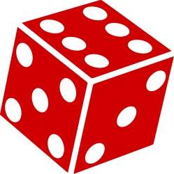
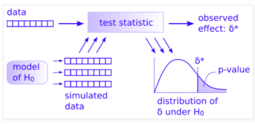

# Permutation

```{r,echo=FALSE}
set.seed(3625)
knitr::opts_chunk$set(echo = TRUE,fig.align="center")
```

## Big Picture
The data science approach to testing is so much easier than the way you have been taught statistics. Don't believe me? [This](https://www.youtube.com/watch?v=5Dnw46eC-0o) might convince you. It is the KEY to understanding the way we approaching permutation tests. Watch it with your coffee.

## Reading
Read through [this wonderful explanation](http://www.jwilber.me/permutationtest) of permutation tests using adorable alpacas. To go into a little more depth, read Allen Downey's fantastic posts [There is only one test!](http://allendowney.blogspot.com/2011/05/there-is-only-one-test.html) and  [There is still only one test](http://allendowney.blogspot.com/2016/06/there-is-still-only-one-test.html)

Wilber J. 2019. THE PERMUTATION TEST: A Visual Explanation of Statistical Testing. https://www.jwilber.me/permutationtest/ Accessed `r format(Sys.time(), '%d-%B-%Y %H:%M')`.

Downey A. 2016. There is still only one test. http://allendowney.blogspot.com/2011/05/there-is-only-one-test.html  Accessed `r format(Sys.time(), '%d-%B-%Y %H:%M')`.

Downey A. 2011. There is only one test! http://allendowney.blogspot.com/2011/05/there-is-only-one-test.html Accessed `r format(Sys.time(), '%d-%B-%Y %H:%M')`.


## Methods as Historical Artifacts

Statistical methods are not timeless truths. They are responses to the constraints under which they were developed.

Much of what we now call *classical statistical inference* took shape between the early 1900s and the mid-20th century, particularly through the work of Fisher, Neyman, and Pearson. This was a period in which repeated computation was effectively impossible. Inference had to be carried out with algebra, printed tables, and a small number of hand-calculated summaries of the data. These practical limits strongly shaped both the form and the philosophy of statistical methods.

Because repeated sampling from a population could not be simulated, statisticians focused on:
- Deriving closed-form sampling distributions (normal, t, chi-square, F)
- Assuming parametric models that made those derivations possible
- Using sufficient statistics to reduce calculation
- Relying on asymptotic results when exact finite-sample distributions were unavailable

These choices were not aesthetic preferences. They were pragmatic solutions to a real computational constraint.

Ideas that resemble modern resampling were not unknown. Fisher understood permutation tests, but they were only practical for very small problems. What was missing was the ability to carry out thousands of repetitions cheaply. That changed with the spread of digital computing in the second half of the 20th century.

By the 1970s, computational power had reached a point where repeated refitting and resampling were feasible. The bootstrap, introduced by Efron in 1979, made this shift explicit: uncertainty could be approximated by repeatedly reusing the observed data rather than by analytic approximation. Permutation tests, cross-validation, and other resampling-based methods followed naturally from the same computational turn.

This does **not** mean classical inference is obsolete or misguided. Under well-specified models and small sample sizes, parametric methods can be efficient and powerful. But their dominance reflects historical constraints as much as philosophical necessity.

A useful way to frame the contrast is:
- Classical inference asks: *What would happen if we repeatedly sampled from a known model?*
- Resampling asks: *What happens if this dataset stands in for the population?*

Both approaches make assumptions. They simply make different ones explicit.

Seen this way, modern resampling techniques are not a rejection of classical statistics. They are an alternative path that became viable once computation stopped being the limiting factor.


## Packages
```{r}
require(tidyverse)
require(ggridges)
```

I'll use a mix of tidy syntax and base syntax so we'll want `tidyverse`[@R-tidyverse]. We will also use `boot`[@R-ggridges] for some fun plots.

## Alpaca sim
Let's implement it. We start with the data of course. We have 24 alpacas and assigned them evenly into treatment and control groups. The alpacas that got the fancy shampoo with be in Group 1 and the control animals are in Group 2. After some time period, we measured the resulting wool quality. I'm not sure what the units are and it doesn't really matter -- we will call it Wool Quality. Given the Note that I didn't copy the data exactly as it is on Wilber's because they used a random number generator to make the groups. But this example is very close to the original.

### Data
```{r}
alpacas <- tibble(`Group 1` = c(4.1,7.1,6.2,4.8,4.3,4.3,7.7,8.3,7.4,7.2,5.8,4.4),
                  `Group 2` = c(5.1,4.4,3.9,5.4,2.8,4.6,4.6,4.1,5.6,4.2,5.8,3.8))
# make it long just to plot and keep in good mental shape for
# data wrangling!
alapcasLong <- alpacas %>% pivot_longer(cols = everything(),
                                        names_to = "group",
                                        values_to = "woolQuality")

alapcasLong %>% ggplot(mapping = aes(y=woolQuality,x=group,color=group)) +
  geom_jitter(width=0.2,size=3) +
  labs(x=NULL, 
       y = "Wool Quality") +
  theme(legend.position = "none")

```

We definitely see that the treatment has higher wool quality than the control group but now I'll walk through the permutation code from [Wilber's page](https://www.jwilber.me/permutationtest/#) that will allow us to test whether the mean wool quality is higher with the treatment. 


```{r, eval=FALSE, echo=FALSE}
# the parametric version
t.test(alpacas$`Group 1`, alpacas$`Group 2`,alternative = "greater")
```

### Test statistic
```{r}
# Calculate the observed difference in means
testStat <- mean(alpacas$`Group 1`) - mean(alpacas$`Group 2`)
testStat
```


### Randomize group membership
Now, shuffle the data so that groups are randomized and calculate the test statistic again. We will do this one time as an example.

```{r}
# here are the wool quality data alone broken into two random samples
allWQ <- alapcasLong$woolQuality
n <- length(allWQ)
samps2get <- sample(1:n,n/2)
group1Samp <- allWQ[samps2get]
group2Samp <- allWQ[-samps2get]
sampsPermute1 <- tibble(`Group 1`=group1Samp,`Group 2`=group2Samp) %>% 
  pivot_longer(cols = everything(),
               names_to = "group",
               values_to = "woolQuality")

sampsPermute1 %>% ggplot(mapping = aes(y=woolQuality,x=group,color=group)) +
  geom_jitter(width=0.2,size=3) +
  labs(title="Randomized Groups", 
       x=NULL, 
       y = "Wool Quality") +
  theme(legend.position = "none")
```

This plot shows all the original data but this time each alpaca has been assigned to a group randomly. This is the same data as in the prior figure but the group membership has been permuted. We can now calculate the test statistic on these random groups.

```{r}
testStatPermute1 <- mean(group1Samp)-mean(group2Samp)
testStatPermute1
```

Thus the test statistic, difference in the group means, is `r round(testStatPermute1,3)`. Let's do it again.

```{r}
samps2get <- sample(1:n,n/2)
group1Samp <- allWQ[samps2get]
group2Samp <- allWQ[-samps2get]
testStatPermute2 <- mean(group1Samp)-mean(group2Samp)
testStatPermute2
```

And three more times.

```{r}
samps2get <- sample(1:n,n/2)
group1Samp <- allWQ[samps2get]
group2Samp <- allWQ[-samps2get]
testStatPermute3 <- mean(group1Samp)-mean(group2Samp)

samps2get <- sample(1:n,n/2)
group1Samp <- allWQ[samps2get]
group2Samp <- allWQ[-samps2get]
testStatPermute4 <- mean(group1Samp)-mean(group2Samp)

samps2get <- sample(1:n,n/2)
group1Samp <- allWQ[samps2get]
group2Samp <- allWQ[-samps2get]
testStatPermute5 <- mean(group1Samp)-mean(group2Samp)
```

Here is a plot with the five values of the test statistic we've computed with the groups shuffled.

```{r}
ggplot() +
  geom_hline(yintercept = 0,linetype="dashed") + 
  geom_jitter(mapping = aes(x=testStatPermute1,y=0),size=3,
              height = 0, width=0.1) +
  geom_jitter(mapping = aes(x=testStatPermute2,y=0),size=3,
              height = 0, width=0.1) +
  geom_jitter(mapping = aes(x=testStatPermute3,y=0),size=3,
              height = 0, width=0.1) +
  geom_jitter(mapping = aes(x=testStatPermute4,y=0),size=3, 
              height = 0, width=0.1) +
  geom_jitter(mapping = aes(x=testStatPermute5,y=0),size=3, 
              height = 0, width=0.1) +
  labs(x="Test Statistic") + 
  theme(axis.line.y=element_blank(),
        axis.title.y=element_blank(),
        axis.text.y=element_blank(),
        axis.ticks.y =element_blank())
```


### Run many random permutations
We can repeat that as many times as we like. Here it is in a loop where we will save the test statistic in each iteration.

```{r}
m <- 1e3
testStatPermute <- numeric()

for(i in 1:m){
  n <- length(allWQ)
  samps2get <- sample(1:n,n/2)
  group1Samp <- allWQ[samps2get]
  group2Samp <- allWQ[-samps2get]
  testStatPermute[i] <- mean(group1Samp)-mean(group2Samp)
}
head(testStatPermute)
```

### Assess the results
The object `testStatPermute` now contains `m` realizations of the difference in means with randomized groups. We can view this distribution as a density plot and add in our observed test statistic in blue.

```{r}
ggplot() + 
  geom_density(aes(x=testStatPermute,fill="red"),alpha=0.2) + 
  geom_vline(xintercept = testStat,color="blue",linetype="dashed") + 
  geom_point(aes(x=testStat,y=0.01),size=4,shape=8,color="blue",stroke=2) + 
  labs(title = "Alpaca Wool Quality Example",y="Density",x="Test Statistic") + 
  theme(legend.position="none")
```

Wee see that the observed statistic is in the tail of the density plot and we can calculate the probability of this observation being a result of chance via:

```{r}
pval <- sum(testStatPermute > testStat) / m
pval
```

That is, of the `m` randomizations we did only `r sum(testStatPermute > testStat)` were greater than the observed test statistic. We can then divide that by `r m` (`m`) to get a probability of `r pval`.

Here is one more look at the density function with each realization shown inside the density plot. I toyed with the idea of animating this but haven't gotten around to doing it yet.
```{r}
ggplot() + 
  geom_density_ridges(aes(x=testStatPermute,y=rep("",m),fill="red"),
                      color=NA,
                      alpha=0.9, point_color="grey", point_shape=21,
                      point_fill="red",point_size=3,
                      jittered_points = TRUE) + 
  geom_vline(xintercept = testStat,color="blue",linetype="dashed") + 
  geom_point(aes(x=testStat,y=1),size=4,shape=8,color="blue",stroke=2) + 
  scale_y_discrete(expand=c(0,0.05)) + 
  labs(title = "Alpaca Wool Quality Example",x="Test Statistic") +
  theme(axis.line.y=element_blank(),
        axis.title.y=element_blank(),
        axis.text.y=element_blank(),
        axis.ticks.y =element_blank(),
        #axis.line.x=element_blank(),
        #axis.title.x=element_blank(),
        #axis.text.x=element_blank(),
        #axis.ticks.x =element_blank(),
        legend.position="none",
        panel.background=element_blank(),
        panel.border=element_blank(),
        panel.grid.major=element_blank(),
        panel.grid.minor=element_blank(),
        plot.background=element_blank())

```

## Your work
I'd like you to take a crack at coding up a classic problem well handled by permutation. The case of the possibly crooked die. 

I have a six sided die.




I rolled this die 60 times. Given that a fair die has a 1/6 chance for any outcome, I should get each value $60/6 = 10$ times. Here is what I got:

```{r} 
rollSummary <- tibble(value=1:6,
                      n = c(8,9,18,7,8,10)) 
rollSummary
```

So I rolled a `1` 8 times, a `2` 9 times, a `3` 18 times and so on. Does this look like a random expectation? Well, we can get a chi square statistic for that.

```{r}
# number of times I rolled the die
nRolls <- sum(rollSummary$n) #60
# the expected outcome for each value nRolls/6=10
Expected <- rep(10,6)
Observed <- rollSummary$n
# here is my test statistic. A chi sq in this case
obsXsq <- sum((Observed - Expected)^2 / Expected)
obsXsq
```

So here is the challenge I have for you. Can you do a permutation test and tell me the probability that my die is fair? To get you started I'll show you how to do 60 rolls of a fair die.

```{r}
possibleValues <- seq(1,6,by=1)
ranRolls <- tibble(value=sample(x = possibleValues,
                                size = nRolls,
                                replace = TRUE)) 
ranRollsSummary <- ranRolls %>% count(value)
ranRollsSummary
```

And here is the chi square value for that random roll table.

```{r}
randomXsq <- sum((ranRollsSummary$n - Expected)^2 / Expected)
randomXsq
```

Look carefully at Allen Downey's figure [here](http://allendowney.blogspot.com/2016/06/there-is-still-only-one-test.html):

 

You have most everything already done.

1.  The <span style="color:blue">data</span> are in `rollSummary`
2.  The <span style="color:blue">test statistic</span> is `sum((Observed - Expected)^2 / Expected)`
3. The <span style="color:blue">observed effect ($\delta^*$)</span> is `obsXsq`
4. The <span style="color:blue">model of H$_0$</span> is `Expected`
5. And I gave you one realization of the <span style="color:blue">simulated data</span> with `ranRollsSummary` and the resulting <span style="color:blue">$\delta$ value</span> as `randomXsq`

What you can do now is figure out how to simulate many (say `m=1000`) cases of the simulated data to make the <span style="color:blue">distribution of $\delta$ under H$_0$</span> and then a p-value. I did this in less than 10 lines of code given the objects above so it's not a huge job. Good luck. Work with a classmate if you can.

```{r,echo=FALSE,eval=FALSE}
nSims <- 1000
res <- numeric()
for(i in 1:nSims){
  # same ranRolls, ranRollsSummary, randomXsq as above
  ranRolls <- tibble(value=sample(x = possibleValues,
                                  size = nRolls,
                                  replace = TRUE))  
  ranRollsSummary <- ranRolls %>% count(value)
  randomXsq <- sum((ranRollsSummary$n - Expected)^2 / Expected)
  res[i] <- randomXsq
}
sum(obsXsq < res) / nSims
```
