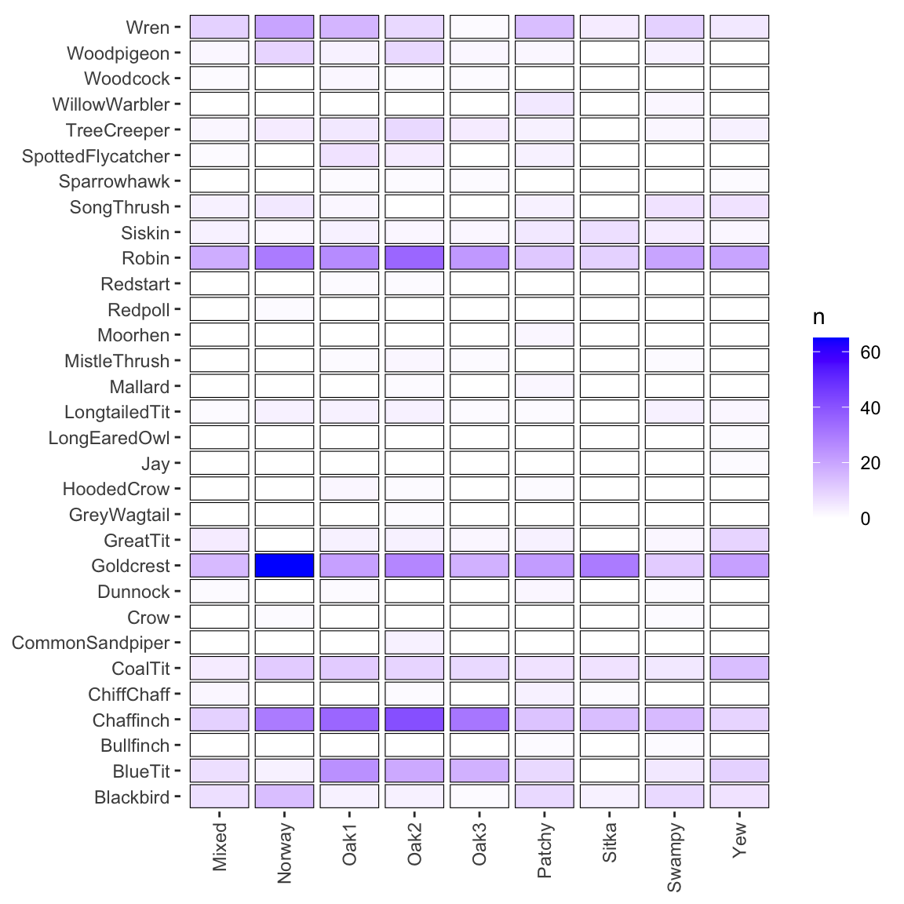
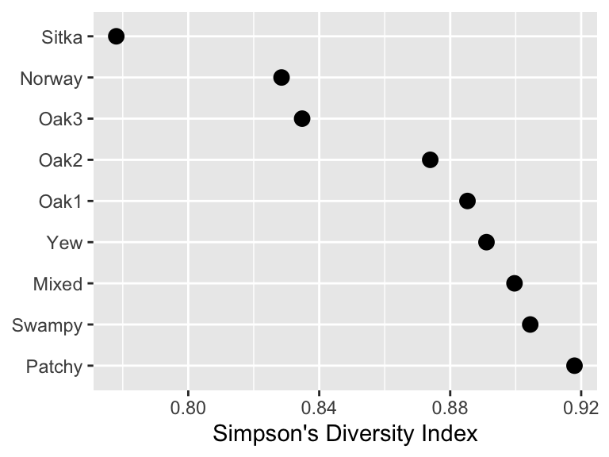
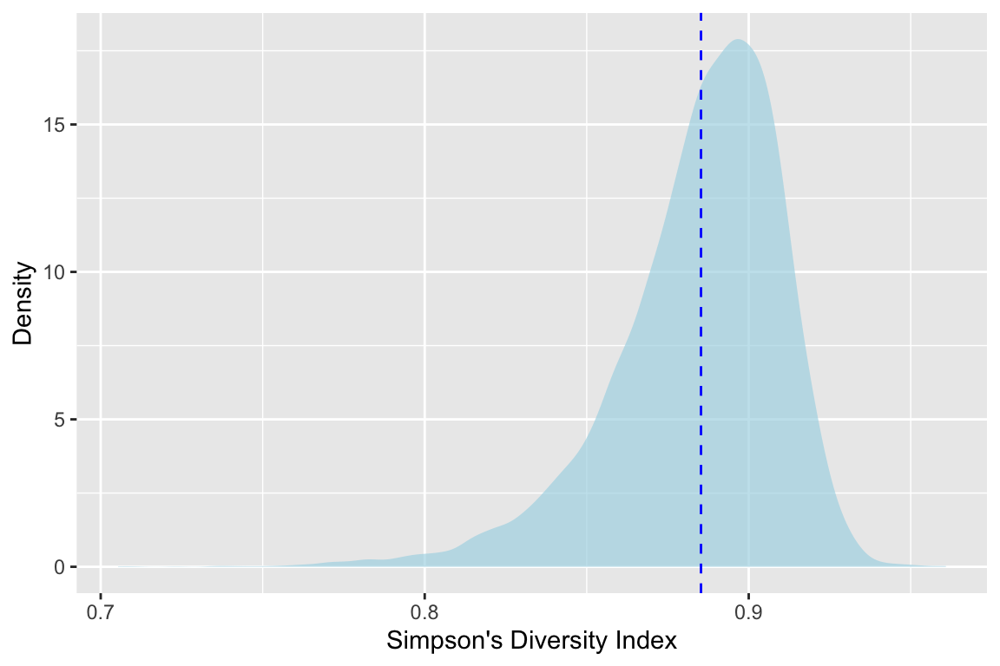
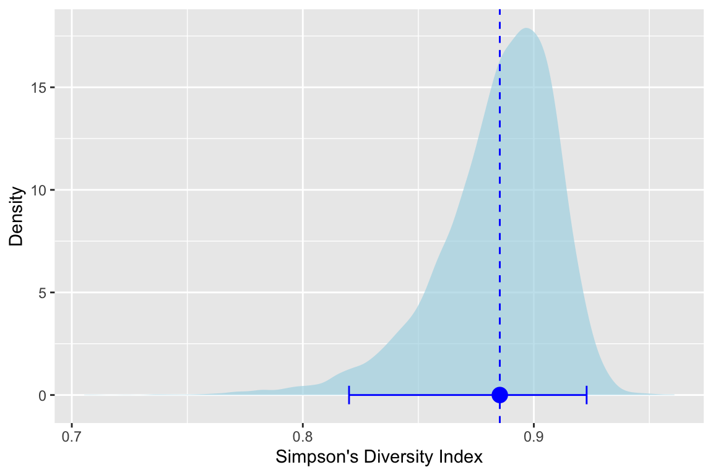
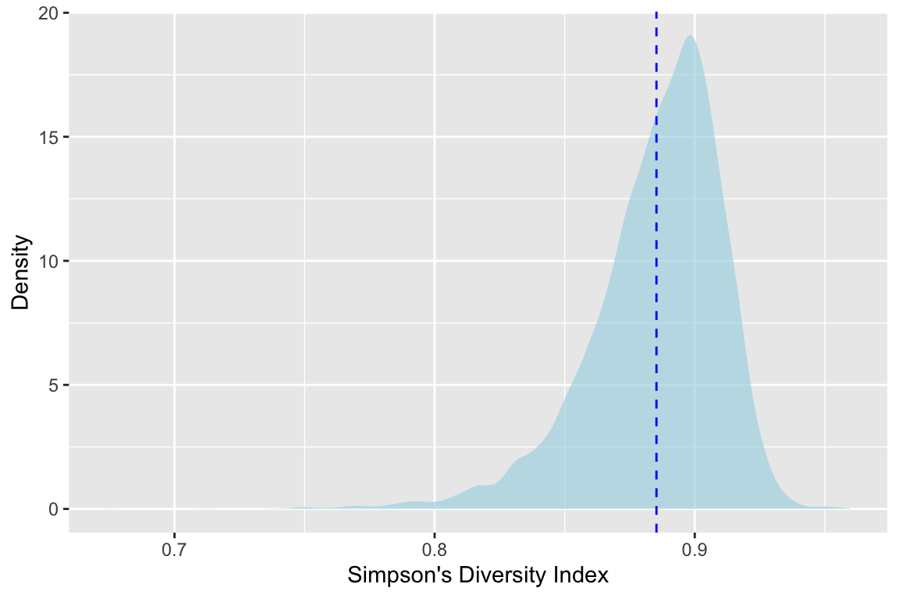

# Bootstrapping


## Big Idea

Bootstrapping is a resampling technique that allows for an empirical estimation of the sampling distribution of almost any statistic independent of mathematical theory. We typically use it to get a range for a statistic (e.g., mean, median, etc). With bootstrapping we can understand the variance as well as things like bias and confidence intervals. Bootstrapping can be used, therefore, as alternative to the traditional method of hypothesis testing.

## Reading

[This reading by Trist'n Joseph](https://towardsdatascience.com/bootstrapping-statistics-what-it-is-and-why-its-used-e2fa29577307) is quite good and a gentle introduction to bootstrapping. The idea that bootstrapping can be used as alternative to the traditional method of hypothesis testing as described in [this reading by Jim Frost](https://statisticsbyjim.com/hypothesis-testing/bootstrapping/)

Joseph T. 2017. Bootstrapping Statistics. What it is and why it's used. Towards data science. <https://towardsdatascience.com/bootstrapping-statistics-what-it-is-and-why-its-used-e2fa29577307>. Accessed: 05-March-2026 21:22.

Frost, J. "Introduction to Bootstrapping in Statistics with an Example". Statistics by Jim. <https://statisticsbyjim.com/hypothesis-testing/bootstrapping/>. Accessed: 05-March-2026 21:22.

## Methods as Historical Artifacts

Statistical methods are not timeless truths. They are responses to the constraints under which they were developed.

Much of what we now call *classical statistical inference* took shape between the early 1900s and the mid-20th century, particularly through the work of Fisher, Neyman, and Pearson. This was a period in which repeated computation was effectively impossible. Inference had to be carried out with algebra, printed tables, and a small number of hand-calculated summaries of the data. These practical limits strongly shaped both the form and the philosophy of statistical methods.

Because repeated sampling from a population could not be simulated, statisticians focused on:
- Deriving closed-form sampling distributions (normal, t, chi-square, F)
- Assuming parametric models that made those derivations possible
- Using sufficient statistics to reduce calculation
- Relying on asymptotic results when exact finite-sample distributions were unavailable

These choices were not aesthetic preferences. They were pragmatic solutions to a real computational constraint.

Ideas that resemble modern resampling were not unknown. Fisher understood permutation tests, but they were only practical for very small problems. What was missing was the ability to carry out thousands of repetitions cheaply. That changed with the spread of digital computing in the second half of the 20th century.

By the 1970s, computational power had reached a point where repeated refitting and resampling were feasible. The bootstrap, introduced by Efron in 1979, made this shift explicit: uncertainty could be approximated by repeatedly reusing the observed data rather than by analytic approximation. Permutation tests, cross-validation, and other resampling-based methods followed naturally from the same computational turn.

This does **not** mean classical inference is obsolete or misguided. Under well-specified models and small sample sizes, parametric methods can be efficient and powerful. But their dominance reflects historical constraints as much as philosophical necessity.

A useful way to frame the contrast is:
- Classical inference asks: *What would happen if we repeatedly sampled from a known model?*
- Resampling asks: *What happens if this dataset stands in for the population?*

Both approaches make assumptions. They simply make different ones explicit.

Seen this way, modern resampling techniques are not a rejection of classical statistics. They are an alternative path that became viable once computation stopped being the limiting factor.


## Packages


``` r
library(tidyverse)
```

```
## ── Attaching core tidyverse packages ──────────────────────── tidyverse 2.0.0 ──
## ✔ dplyr     1.1.4     ✔ readr     2.1.6
## ✔ forcats   1.0.1     ✔ stringr   1.6.0
## ✔ ggplot2   4.0.1     ✔ tibble    3.3.1
## ✔ lubridate 1.9.4     ✔ tidyr     1.3.2
## ✔ purrr     1.2.1     
## ── Conflicts ────────────────────────────────────────── tidyverse_conflicts() ──
## ✖ dplyr::filter() masks stats::filter()
## ✖ dplyr::lag()    masks stats::lag()
## ℹ Use the conflicted package (<http://conflicted.r-lib.org/>) to force all conflicts to become errors
```

``` r
library(boot)
```

## A Worked Example: Bootstrapping a Mean

We start with the simplest possible case: estimating the uncertainty of a mean by repeatedly sampling the observed data with replacement. This is the core idea of the bootstrap. Everything that follows is just variation on this theme.

We use a tiny dataset for illustration. In real applications, bootstrapping is typically applied to larger samples and repeated many times (a sample size of 100 or more is typically stable for basic uncertainty estimation).

### The (tiny) observed data


``` r
# A tiny dataset we can reason about
x <- c(2, 4, 7, 9, 10)

# The observed mean
mean(x)
```

```
## [1] 6.4
```

This mean is a single number computed from one observed dataset. By itself, it tells us nothing about uncertainty.

### Resampling with replacement

Now we take a few bootstrap resamples. Each resample has the same length as the original data (here that is `length(x)` or `r `length(x)) and is drawn **with replacement**. This means it might repeat some values and omit others.  

``` r
x_star1 <- sample(x, size = length(x), replace = TRUE)
# look at this data and compare to x
x_star1
```

```
## [1] 10  9  2  4  9
```

``` r
# here is the mean of this sample
mean(x_star1)
```

```
## [1] 6.8
```

``` r
x_star2 <- sample(x, size = length(x), replace = TRUE)
x_star2
```

```
## [1] 9 7 4 7 2
```

``` r
mean(x_star2)
```

```
## [1] 5.8
```

``` r
x_star3 <- sample(x, size = length(x), replace = TRUE)
x_star3
```

```
## [1]  4 10  2  2 10
```

``` r
mean(x_star3)
```

```
## [1] 5.6
```

Each of these means is calculated from a different resampled version of the same observed data. The variability among them comes entirely from sampling with replacement. We have not collected new data. We are reusing the data we already have.

## Why replacement matters

For contrast, here is what happens if we sample **without** replacement.


``` r
x_norep <- sample(x, size = length(x), replace = FALSE)
x_norep
```

```
## [1] 10  2  9  7  4
```

``` r
mean(x_norep)
```

```
## [1] 6.4
```

When sampling without replacement, the resampled data are just a permutation of the original values. The mean does not change. There is no variability to learn from, and therefore no bootstrap.

Sampling with replacement is what allows us to create many slightly different versions of the original dataset and use their variability to approximate the uncertainty of a statistic.

### What We Are Assuming When We Bootstrap

When we bootstrap, we are making a simple but strong assumption: the observed data are a reasonable stand-in for the population they came from. By sampling with replacement from the observed values, we are treating them as if they represent the range and relative frequency of outcomes we would see if we could repeatedly sample from the true population.

This assumption is not always correct, but it is often useful. When the observed sample captures the main structure of the population, resampling it allows us to approximate the variability of a statistic without relying on mathematical formulas or distributional assumptions.

In machine learning, the goal is typically not large-scale inference about an abstract population, but making good predictions for data that look like what we have already observed. From that perspective, reusing the observed data to assess uncertainty is often exactly the right thing to do. Bootstrapping aligns naturally with this goal, which is why resampling-based methods show up so often in applied machine learning workflows.

In the next section, we apply this same idea to a statistic whose uncertainty is not easy to derive analytically.

## Bird Diversity Data

Now we are going to look at some cool bird diversity data. The file `KillarneyBirds.csv` contains data on 31 species of birds across nine different habitats in County Killarney Ireland. The values are the number of territories held by breeding males in equal-sized blocks of woodland habitat. Here is the source:

Batten L. A. (1976) Bird communities of some Killarney woodlands. Proceedings of the Royal Irish Academy 76:285-313.

And the data.


``` r
birds <- read_csv("data/KillarneyBirds.csv")
```

```
## Rows: 31 Columns: 10
## ── Column specification ────────────────────────────────────────────────────────
## Delimiter: ","
## chr (1): Species
## dbl (9): Oak1, Oak2, Oak3, Yew, Sitka, Norway, Mixed, Patchy, Swampy
## 
## ℹ Use `spec()` to retrieve the full column specification for this data.
## ℹ Specify the column types or set `show_col_types = FALSE` to quiet this message.
```

``` r
birds
```

```
## # A tibble: 31 × 10
##    Species            Oak1  Oak2  Oak3   Yew Sitka Norway Mixed Patchy Swampy
##    <chr>             <dbl> <dbl> <dbl> <dbl> <dbl>  <dbl> <dbl>  <dbl>  <dbl>
##  1 Chaffinch            35    41    31     9    14     30    10     13     15
##  2 Robin                26    35    23    20    10     30    18     12     20
##  3 BlueTit              25    19    17    10     0      3     7      8      5
##  4 Goldcrest            21    27    17    21    30     65    15     22     11
##  5 Wren                 16     8     1     5     4     20    10     14     10
##  6 CoalTit              11     9     8    14     6     11     4      6      5
##  7 SpottedFlycatcher     6     4     0     0     0      0     1      3      0
##  8 TreeCreeper           5     8     4     3     0      4     2      3      2
##  9 Blackbird             3     3     1     6     3     14     7      8      8
## 10 Siskin                3     2     2     2     7      2     3      5      4
## # ℹ 21 more rows
```

A quick heatmap.


``` r
birdsLong <- birds %>% pivot_longer(cols=-1,names_to="Habitat",values_to="n")
ggplot(data=birdsLong,mapping = aes(y=Species,x=Habitat,fill=n)) +
  geom_tile(color="black", width=0.9, height=0.9) + 
  scale_fill_gradient(low="white", high="blue") +
  labs(x=NULL,y=NULL) +
  theme(axis.text.x = element_text(angle = 90, vjust = 0.5, hjust=1),
        panel.background = element_blank())
```



You can see on here that different species are associated with different habitats. Our question is, I guess, do the habitats differ in terms of diversity?

## Diversity

One of the most common and basic descriptions used in community ecology is diversity. Here we will look at using Simpson's Diversity Index (SDI) to describe the variation in bird species community by habitat. This is one of the most common statistics using in community ecology and takes into account both the total number of species present as well as their relative abundance. It ranges from zero to one with higher numbers indicating higher diversity. Simpson's $D$ is calculated as:

$$ D = 1 - \frac{\sum_{i=1} n_i(n_i-1)}{N(N-1)}$$ where $n$ is the number of individuals of each species ($i$) and $N$ is the total number of individuals of all species. Simpson's Diversity Index is not counting species directly. It is measuring evenness via pairwise probabilities. Richness matters only insofar as it affects how evenly individuals are distributed among species.

Let's look at the count of birds in habitat `oak1` as `n`


``` r
n <- birds$Oak1
n
```

```
##  [1] 35 26 25 21 16 11  6  5  3  3  3  3  3  2  2  2  1  1  1  1  0  0  0  0  0
## [26]  0  0  0  0  0  0
```

And the total of `n` as `N`.


``` r
N <- sum(n)
N
```

```
## [1] 170
```

From that we can calculate $D$.

$$ 1 - \frac{35(34)+26(25)+25(24)+21(20)+16(15)+11(10)+...}{170(169)} $$ Here is $D$ implemented.


``` r
D <- 1 - sum(n*(n-1)) / (N*(N-1))
D
```

```
## [1] 0.8852767
```

We can write a function to do this for any vector of species. I'll walk through how to write functions a bit in the video. It's a very useful skill.


``` r
sdiFunc <- function(x){
  N <- sum(x)
  D <- 1 - sum(x*(x-1)) / (N*(N-1))
  D
}
oak1Div <- sdiFunc(x=birds$Oak1)
oak1Div
```

```
## [1] 0.8852767
```

And if we want to, we can `apply` that function to all the columns (habitats) in `birds`.


``` r
sdiHabitat <- apply(birds[,-1], MARGIN = 2, FUN=sdiFunc)
sdiHabitat
```

```
##      Oak1      Oak2      Oak3       Yew     Sitka    Norway     Mixed    Patchy 
## 0.8852767 0.8738996 0.8347812 0.8910759 0.7780180 0.8284879 0.8996337 0.9179604 
##    Swampy 
## 0.9044444
```

Note that I dropped the first column of species names before applying the function and specified that I wanted to calculate over the columns with `MARGIN=2`.

Here is a quick visualization of bird diversity by habitat.


``` r
sdiHabitat <- sdiHabitat %>% as_tibble %>% add_column(Habitat = names(sdiHabitat))
ggplot(data = sdiHabitat, mapping = aes(x=value,y=reorder(Habitat,-value))) +
  geom_point(size=3) +
  labs(x="Simpson's Diversity Index",y=NULL)
```



Looking at this we see that the `Sitka` and `Norway` habitat are lowest in diversity -- poor spruce and pine. The `Mixed`, `Swampy`, and `Patchy` habitats are the highest. But we don't know from looking at this if the differences are substantial. We'd like to have a measure of variance of the diversity for each of these habitats and then infer if these differences are "meaningful" (for your definition of "meaningful") or even "significant" (shudder).

## Roll your own bootstrap for one habitat

We can get an idea of the shape of the distribution of diversity for each habitat with the bootstrap. Here we go with 10,000 bootstrap replicates (`R`) of the diversity for `oak1`. Note the `replace=TRUE` in `sample`. That is the key for this method. Refer back to the video for why and how that works.


``` r
R <- 1e4
# structure to hold results
sdiDistOak1 <- numeric()
for(i in 1:R){
  x <- birds$Oak1
  xSamp <- sample(x,size=length(x),replace=TRUE)
  sdiDistOak1[i] <- sdiFunc(xSamp)
}

ggplot() + geom_density(mapping=aes(x=sdiDistOak1),
                        fill="lightblue",color=NA,alpha=0.7) + 
  geom_vline(xintercept = oak1Div,color="blue",linetype="dashed") +
  labs(x="Simpson's Diversity Index",y="Density")
```



(Go ahead and rerun that with smaller values of `R` -- say 100 or 1000 -- and see how the shape of the density plots changes.)

Ok. This is cool We see the calculated value of $D_{oak1}$ with the dotted line at 0.885. But with the shaded density plot we can see the distribution. And further more we can see that it's not normal. The mean of that distribution is where our line is, but we have so much more information now.


``` r
mean(sdiDistOak1)
```

```
## [1] 0.8843674
```

For instance we can use the `quantile` method to get a confidence interval around that mean. By taking the 2.5% and the 97.5% percentiles we can see where the mean would fall in 95% of the bootstrap estimates ($\alpha/2$). Let's get that and plot it.


``` r
ci95Oak1 <- quantile(sdiDistOak1,probs = c(0.025,0.975))
names(ci95Oak1) <- c("lower","upper")
ci95Oak1
```

```
##     lower     upper 
## 0.8200148 0.9228559
```

``` r
ggplot() + geom_density(mapping=aes(x=sdiDistOak1),fill="lightblue",color=NA,alpha=0.7) + 
  geom_vline(xintercept = oak1Div,color="blue",linetype="dashed") +
  geom_errorbar(mapping=aes(xmin=ci95Oak1[1],xmax=ci95Oak1[2],y=0),
                color="blue",
                orientation = "y") +
  geom_point(mapping=aes(x = oak1Div,y=0),
             color="blue",size=4) +
  labs(x="Simpson's Diversity Index",y="Density")
```



We see the estimate and its variance and with this visualization we see how the skew of the bootstrapped estimates of $D_{oak1}$ lead to asymmetric lower and upper confidence intervals around the mean. Very cool.

You could now do this for all of the habitats and make some inference about whether the differences in diversity are "real" (or "meangingful" or "significant").

### Do it with `boot`

While writing loops is cool and makes you feel like a real programmer, there are loads of ways to do this in R using prefabricated functions. I'm being a little flip here -- I actually like writing my own functions and loops because I know exactly what's going on. But one should do that only to a point.

The `boot` library in R is one of the most commonly used tools for resampling. I've been using R for 20 years (seriously) and I still find the syntax confusing for `boot`. The idea makes sense though. Any function that you write with a test statistic can be passed into `boot` which will do the looping for you with much greater efficiency than the loops you write yourself. I'll try to explain why in the video.

So here is a function that replaces our `sdiFunc` in a way that `boot` understands. Basically it uses the `indices` argument to do the looping that we did with `sdiFunc` above.


``` r
# this is a function boot will understand
sdiBootFunc <- function(x, indicies) {
  y <- x[indicies]
  N <- sum(y)
  D <- 1 - sum(y*(y-1)) / (N*(N-1))
  D
}
# the actual bootstrapping with R replicates
sdiOakBoot <- boot(data = birds$Oak1, statistic = sdiBootFunc, R=1e4)
sdiOakBoot
```

```
## 
## ORDINARY NONPARAMETRIC BOOTSTRAP
## 
## 
## Call:
## boot(data = birds$Oak1, statistic = sdiBootFunc, R = 10000)
## 
## 
## Bootstrap Statistics :
##      original        bias    std. error
## t1* 0.8852767 -3.300638e-05  0.02548363
```

Take a look at `sdiOakBoot`. It is a `list` with many objects but the key ones are `t0` wihch is the original test statistic $D$ and `t` which contains all the bootstrapped estimates of $D$. Note that there are 10,000 of them corresponding to `R`.

With that we can replicate our plot above.


``` r
ggplot() + geom_density(mapping=aes(x=sdiOakBoot$t),
                        fill="lightblue",color=NA,alpha=0.7) + 
  geom_vline(xintercept = sdiOakBoot$t0,color="blue",linetype="dashed") +
  labs(x="Simpson's Diversity Index",y="Density")
```



And we can even use the `boot.ci` function to calculate several different flavors of confidence intervals.


``` r
boot.ci(sdiOakBoot)
```

```
## BOOTSTRAP CONFIDENCE INTERVAL CALCULATIONS
## Based on 10000 bootstrap replicates
## 
## CALL : 
## boot.ci(boot.out = sdiOakBoot)
## 
## Intervals : 
## Level      Normal              Basic         
## 95%   ( 0.8354,  0.9353 )   ( 0.8478,  0.9466 )  
## 
## Level     Percentile            BCa          
## 95%   ( 0.8239,  0.9228 )   ( 0.8126,  0.9189 )  
## Calculations and Intervals on Original Scale
```

I won't spoil the fun by describing all of them (`Normal` vs `Basic` vs `Percentile` vs `BCa`). Do some reading and experiment. Holler with questions.

## Your work

Go ahead and calculate bootstraps of $D$ for for each habitat (Norway, Sitka, etc.) either with your own loop or with `boot`. Report on which habitats are different from the others in terms of bird community diversity. You should calculate confidence intervals of some kinds and do some visualizations. Report on what you see. Include a reflection at the end. What worked? What didn't? What victory can you share?


