# Always Be Cross Validating (ABCv)


## Big Idea
Cross validation is arguably the most important and under-taught area of applied statistics. It is really important for you to understand. Cross validation is a family of techniques that allows you to understand how skillful a model is at making predictions. It makes the most of what is usually limited data and can be used to pick the right algorithm for a given task. It is used ubiquitously in machine learning and increasingly in environmental science.


## Packages

``` r
library(tidyverse)
```

```
## ── Attaching core tidyverse packages ──────────────────────── tidyverse 2.0.0 ──
## ✔ dplyr     1.2.0     ✔ readr     2.2.0
## ✔ forcats   1.0.1     ✔ stringr   1.6.0
## ✔ ggplot2   4.0.2     ✔ tibble    3.3.1
## ✔ lubridate 1.9.5     ✔ tidyr     1.3.2
## ✔ purrr     1.2.1     
## ── Conflicts ────────────────────────────────────────── tidyverse_conflicts() ──
## ✖ dplyr::filter() masks stats::filter()
## ✖ dplyr::lag()    masks stats::lag()
## ℹ Use the conflicted package (<http://conflicted.r-lib.org/>) to force all conflicts to become errors
```

``` r
library(caret)
```

```
## Loading required package: lattice
## 
## Attaching package: 'caret'
## 
## The following object is masked from 'package:purrr':
## 
##     lift
```

``` r
library(PNWColors)
```

As usual we'll want `tidyverse`[@R-tidyverse]. The big workhorse for cross validation is the `caret`[@R-caret] library. And we'd be remiss if we didn't use Jake Lawlor's great `PNWColors`[@R-PNWColors] resource.

## Reading
Read Starmer's chapter on cross validation.

Starmer J. 2022. The StatQuest Illustrated Guide To Machine Learning. ISBN 979-8811583607

There are an awful lot of great resources out there for learning about cross validation. I think [this intro](https://towardsdatascience.com/cross-validation-a-beginners-guide-5b8ca04962cd) from Neale et al. covers the key points nicely.

Neale C, Workman D, Dommalapati A. 2019. Cross Validation: A Beginner’s Guide. https://towardsdatascience.com/cross-validation-a-beginners-guide-5b8ca04962cd. Accessed on 12-March-2026 15:19


## Overfitting and Underfitting
Underfitting is when a model is too simple to capture the signal. For instance, you try to model $y=f(x)$ when $x$ isn't a great predictor of $y$ or the function you propose doesn't match the underlying process (maybe $y\approx \beta_0 + \beta_1 x + \beta_2 x^2$ and you tried to model $y \approx \beta_0 + \beta_1 x$). If the model is underfit we say it has high bias. 

Overfitting is when a model is fit to the noise in your data as well as the signal. When that happens the model is not generalizable. That is, the model wouldn't apply to new data very well and we say it has high variance. We might fit the observed data well (even optimally) but the model might not be very good at predicting data it hasn't seen yet. If your predictions correspond too closely to the observed data but fail to fit additional data your model might be overfit. This is extremely common with higher order models or the "black-box" prediction algorithms that are commonly used in machine learning and data science.

The trick is, of course to solve the Goldilocks problem and get it just right.


This conundrum in Machine Learning is sometimes called the [Bias-Variance Tradeoff](Bias–variance_tradeoff) and it is ubiquitous in modeling. In today's analytic world you can fit thousands of different models at the push of a button. And the word is increasingly data rich with many many covariates. How do you chose the most parsimonious model? If your model has parameters that might need tuning, how do you go about that?

Answer: There is no perfect way of course but cross validation gets us started.

The reading is more eloquent on this than I am but I'll show you here how we can implement model validation using these concepts below.

## A worked example


Let's start a worked example. 


``` r
dat <- read.csv("data/dat_cv.csv")
```

We have a `data.frame` called `dat` with 50 rows and two columns: `x` and `y`. Our goal will be to divide the data into training and test subsets and then test how well we can predict $y=f(x)$.


``` r
summary(dat)
```

```
##        x                 y         
##  Min.   :-3.9797   Min.   : 54.41  
##  1st Qu.:-2.3021   1st Qu.: 83.09  
##  Median :-0.1317   Median : 99.05  
##  Mean   : 0.1211   Mean   : 99.90  
##  3rd Qu.: 2.4912   3rd Qu.:116.32  
##  Max.   : 3.6947   Max.   :150.58
```

``` r
head(dat)
```

```
##            x         y
## 1  1.2406553 117.72119
## 2 -0.5935191 115.45229
## 3 -2.8802510  81.38414
## 4 -0.2133922 116.88047
## 5 -1.8396273  90.56090
## 6 -2.0029451  80.94719
```

``` r
p1 <- ggplot(dat,aes(x=x,y=y)) + geom_point(size=3)
p1
```

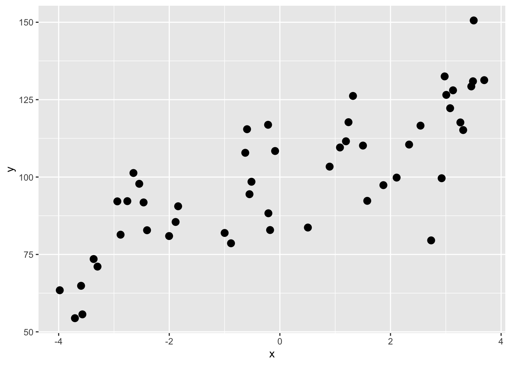

A first step might be to use a linear model and see how much variance we can explain. E.g.,


``` r
lm1 <- lm(y~x,data=dat)
summary(lm1)
```

```
## 
## Call:
## lm(formula = y ~ x, data = dat)
## 
## Residuals:
##     Min      1Q  Median      3Q     Max 
## -38.667  -8.682   0.593   9.332  26.982 
## 
## Coefficients:
##             Estimate Std. Error t value Pr(>|t|)    
## (Intercept)  99.0513     1.8706  52.952  < 2e-16 ***
## x             7.0050     0.7662   9.143 4.37e-12 ***
## ---
## Signif. codes:  0 '***' 0.001 '**' 0.01 '*' 0.05 '.' 0.1 ' ' 1
## 
## Residual standard error: 13.21 on 48 degrees of freedom
## Multiple R-squared:  0.6352,	Adjusted R-squared:  0.6276 
## F-statistic: 83.59 on 1 and 48 DF,  p-value: 4.373e-12
```

``` r
p1 + geom_smooth(method="lm")
```

```
## `geom_smooth()` using formula = 'y ~ x'
```

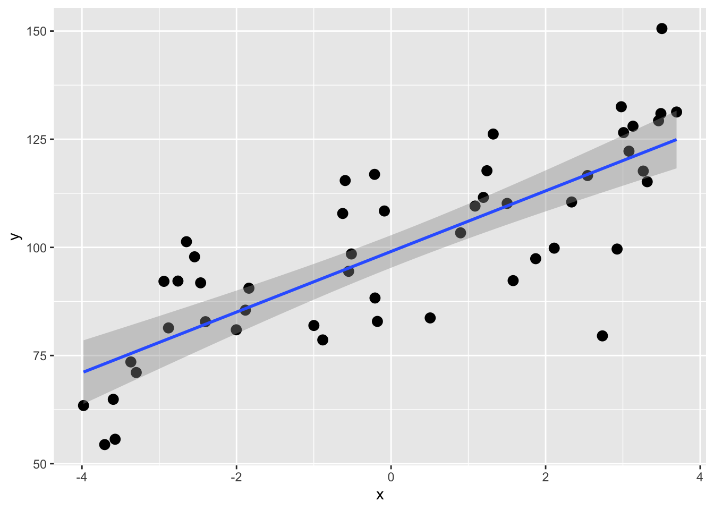

OK, the coefficient of determination (R$^2$) for the $y=\beta_0 + \beta_1 x$ model is 0.635. That's all well and good but recall that this is using all of the data for the model so we get a **point** estimate of R$^2$. We don't know how much that can vary with out-of-sample testing data. We can use cross validation is a really simple way to get R$^2$ as an **interval** estimate of expected out-of-sample predictive performance, conditional on the observed data and the chosen model. This is not a classical population parameter in the inferential statistics sense, but an estimate of how well this modeling approach is expected to perform on new data.

## Holdouts, divide and conquer, train and test
Before we start on true cross validation let's start with simple validation. The standard advice is (or used to be when we did statistics on legal pads) to withhold 1/3 of your data to validate your model. You could then build or **train** the model using the first 2/3 of the data and then have 1/3 of the samples as independent data to **test** the model. You'd then be able to evaluate the out-of-sample error one time.


Let's train a model on 2/3 of the data and then test it on the remaining 1/3. Here is how we can randomly designate some of the points to be **training** and others to be **testing**.


``` r
n <- nrow(dat)
rows2test <- sample(1:n,size = n * 1/3)
dat$Test <- FALSE
dat$Test[rows2test] <- TRUE
head(dat,20)
```

```
##             x         y  Test
## 1   1.2406553 117.72119 FALSE
## 2  -0.5935191 115.45229 FALSE
## 3  -2.8802510  81.38414 FALSE
## 4  -0.2133922 116.88047  TRUE
## 5  -1.8396273  90.56090 FALSE
## 6  -2.0029451  80.94719  TRUE
## 7  -3.2974312  71.07423 FALSE
## 8   1.8715842  97.38329 FALSE
## 9   3.1305105 128.01530 FALSE
## 10 -0.1768353  82.88575 FALSE
## 11 -3.5945386  64.87419  TRUE
## 12  3.0784048 122.23627 FALSE
## 13 -2.7580102  92.21703 FALSE
## 14 -2.5427072  97.82129  TRUE
## 15 -3.7057072  54.41273 FALSE
## 16  2.5427025 116.60760 FALSE
## 17  3.2636735 117.64169  TRUE
## 18 -0.5135446  98.47971 FALSE
## 19  2.9249040  99.61774  TRUE
## 20 -3.5706221  55.64744 FALSE
```

Note that we have a ~1/3 the data to Test

``` r
table(dat$Test)
```

```
## 
## FALSE  TRUE 
##    34    16
```

Here is the same plot above to visualize the split. The TRUE points will be withheld from the model building.


``` r
anem7 <- pnw_palette(name="Anemone",n=7,type="discrete")
p1 <- ggplot(dat,aes(x=x,y=y,color=Test))+ geom_point(size=3) +
  scale_color_manual(values=c(anem7[1],anem7[7]))
p1
```

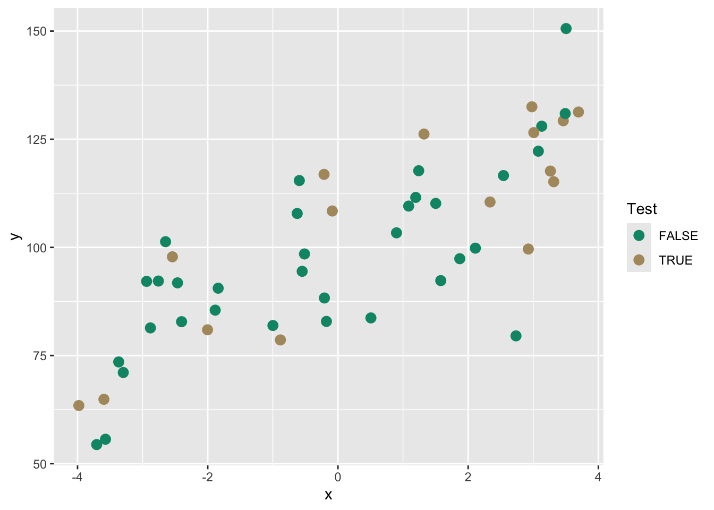

From here we could build a model on the training data and then test it to get out-of-sample skill or error.


``` r
testing <- dat[dat$Test,]
training <- dat[!dat$Test,]

lm1 <- lm(y~x,data=training)
summary(lm1)
```

```
## 
## Call:
## lm(formula = y ~ x, data = training)
## 
## Residuals:
##     Min      1Q  Median      3Q     Max 
## -36.978  -9.407   1.618   9.242  28.930 
## 
## Coefficients:
##             Estimate Std. Error t value Pr(>|t|)    
## (Intercept)   98.281      2.386  41.182  < 2e-16 ***
## x              6.669      1.046   6.376 3.67e-07 ***
## ---
## Signif. codes:  0 '***' 0.001 '**' 0.01 '*' 0.05 '.' 0.1 ' ' 1
## 
## Residual standard error: 13.86 on 32 degrees of freedom
## Multiple R-squared:  0.5596,	Adjusted R-squared:  0.5458 
## F-statistic: 40.66 on 1 and 32 DF,  p-value: 3.669e-07
```

``` r
p1 + geom_abline(intercept = coef(lm1)[1], slope = coef(lm1)[2],
                 color = anem7[1])
```

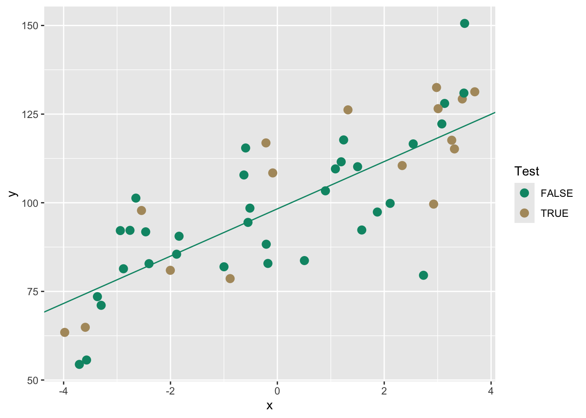


We can use the training model to predict the withheld testing data. Then we will get some idea of how well the model works on this unknown data using R$^2$. We will also calculate two other common validation statistics Mean Absolute Error (MAE) and Root Mean Squared Error (RMSE). These are very closely related.

$$MAE= \frac{\sum_{i=1}^n |\hat y_i - y_i|}{n} $$
where $\hat y$ is the model prediction of the observed value ($y$), $i$ is the observation and $n$ is the total number of observations. Thus, it is the mean of the absolute errors. 

$$RMSE= \sqrt \frac{\sum_{i=1}^n (\hat y_i - y_i)^2}{n} $$
These are both positive numbers in the units of $y$ and  lowers values indicate a better fit. A value of zero (never achieved in practice) would indicate a perfect fit to the data. Which to use? You can read a little more about the differences between them [here](https://stats.stackexchange.com/questions/48267/mean-absolute-error-or-root-mean-squared-error). Honestly, I'm happy to let the stats geeks fight about [this](https://en.wikipedia.org/wiki/Mean_absolute_error#Related_measures) but in general I prefer MAE because it's simpler. 

Let's look at these measures of skill (accuracy) on our withheld data.

First we can add the predictions to the `testing` data.

``` r
testing$yhat <- predict(lm1,newdata=testing)
ggplot(testing,aes(x=y,y=yhat)) + geom_point(size=3,color=anem7[7]) + 
  geom_abline(intercept = 0, slope = 1) +
  labs(title="Testing Data",x="Observed", y="Predicted") +
  coord_equal()
```

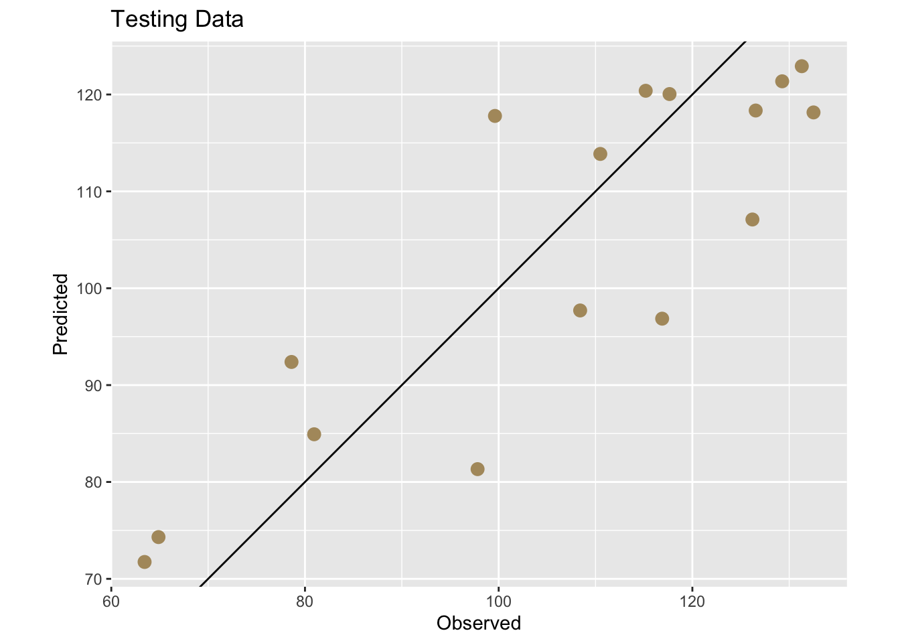

And now get some numbers.


``` r
rsq <- cor(testing$yhat,testing$y)^2
mae <- mean(abs(testing$yhat - testing$y))
rmse <- sqrt(mean((testing$yhat - testing$y)^2))
rsq
```

```
## [1] 0.7337835
```

``` r
mae
```

```
## [1] 10.61353
```

``` r
rmse
```

```
## [1] 11.98126
```

This is great. It gave us a one time test on out-of-sample data and we plotted it and saw that the R$^2$=0.734, the MAE=10.614, and the RMSE=11.981. An easy way to think about these is that R$^2$ provides a scale-free measure of explained variance, MAE reflects typical absolute prediction error, and RMSE penalizes large errors more strongly. See links above for details. These skill metrics are an improvement over using the entire data sat `dat` to assess the skill of our linear model because we are exposing the model to data it hasn't seen before. But this was a one time shot and still gives us a point estimate. We have an independent skill check but no idea of how much that might vary with different testing data.

## Doing k-fold cross validation
A better approach than the one-off train and test split **validation** we did above is to to let the computer repeat this several times and create multiple test sets and average the out-of-sample error. This is generally called **cross validation** because we are **validating** a**cross** many subsets. This will give us a more precise estimate of true out-of-sample error. We will in fact get a distribution of out-of-sample errors if we are diligent enough. This will move us from point estimates to an interval estimates. 

The most common approach for this kind of multiple test set approaches is called $k$-fold cross validation. 

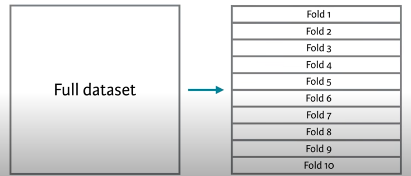

In this method, we split the data into $k$ folds or subsets and make the training and testing splits that way. The figure above shows a 10-fold schematic ($k=10$). With this, we'd create the folds so that each row of the data occurs in exactly one test set. So following the above, the first time we ran the comparison we'd train the model on folds 2 to 10 and test it on fold 1. The second time we ran it we'd train on folds 1, 3, 4, 5, 6, 7, 8, 9 and 10 and test it on fold 2. And so on.

This gives us 10 test sets and assures us that every point gets to be in a test set once. So, we get a test set that is the same size as our training set, but is composed of out-of-sample predictions. We assign each row to its single test set randomly, to avoid any kind of systemic biases in how our data are laid out. 

This is one of the best and simplest ways to estimate out-of-sample error for predictive models.


``` r
# Create a new data.frame, drop the test column we added above,
# then randomly shuffle the data to remove any systematic ordering 
# of the rows.
dat2 <- dat[,1:2]
dat2 <- dat2[sample(n),]

# Create k equally size folds
k <- 10
dat2$fold <- cut(seq(1,n),breaks=k,labels=FALSE)
# Take a peek -- note the fold column
head(dat2,20)
```

```
##             x         y fold
## 7  -3.2974312  71.07423    1
## 46  2.1110922  99.82447    1
## 30  1.3218005 126.20120    1
## 32  0.5063895  83.69236    1
## 22  1.5797374  92.31556    1
## 9   3.1305105 128.01530    2
## 5  -1.8396273  90.56090    2
## 10 -0.1768353  82.88575    2
## 50  1.0865615 109.55272    2
## 23  3.6947242 131.29794    2
## 6  -2.0029451  80.94719    3
## 8   1.8715842  97.38329    3
## 41 -2.4642067  91.80013    3
## 19  2.9249040  99.61774    3
## 40 -1.8851663  85.49068    3
## 43 -0.2078126  88.30130    4
## 28 -2.6478092 101.31099    4
## 37 -3.9797427  63.43873    4
## 44 -2.4018186  82.82204    4
## 31 -0.8836568  78.60771    4
```

``` r
# plot
ggplot(dat2,aes(x=x,y=y,color=factor(fold))) + 
  geom_point(size=3) +
  scale_color_viridis_d()
```

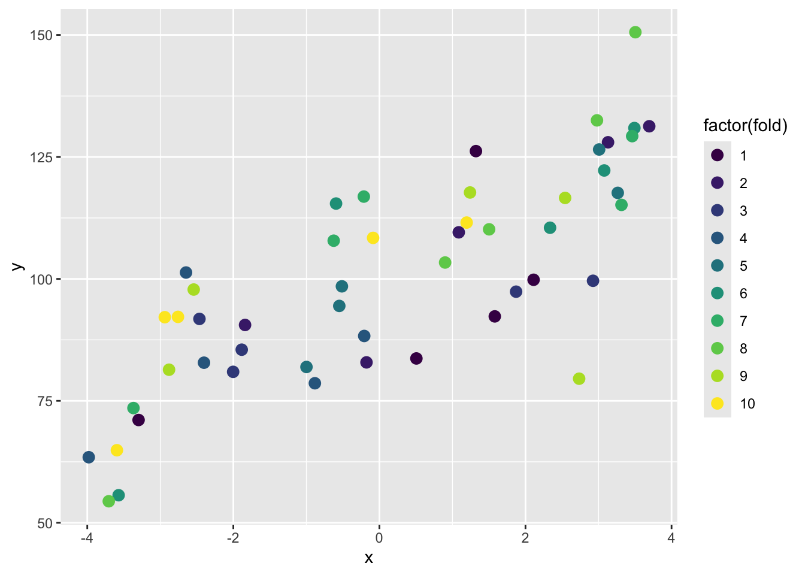

Because the assignment of rows to folds is random, the results of k-fold cross validation will vary slightly each time it is run. In practice, cross validation is often repeated multiple times with different random fold assignments to stabilize estimates of out-of-sample performance. See below for a quick diatribe on repeating k-fold.

Here is a better look at just fold 1:

``` r
dat2 %>% mutate(fold1Only = ifelse(fold==1,"Fold one","All other folds")) %>%
  ggplot(aes(x=x,y=y,color=fold1Only)) + 
  geom_point(size=3,alpha=0.8) +
  scale_color_manual(values = c("grey60","darkblue")) +
  theme_minimal()
```

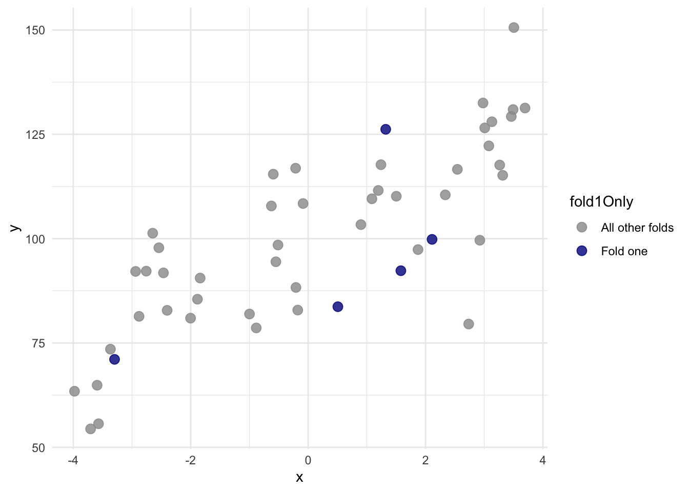


With that new variable `fold` we can do a proper cross validation.


``` r
# object to store results
lm1Results <- data.frame(rsq=rep(NA,k), 
                         mae=rep(NA,k),
                         rmse=rep(NA,k))

# loop through each fold
for(i in 1:k){
  testing <- dat2[dat2$fold==i,]
  training <- dat2[dat2$fold!=i,]
  
  lm1 <- lm(y~x,data=training)
  testing$yhat <- predict(lm1,newdata=testing)
  lm1Results$rsq[i] <- cor(testing$yhat,testing$y)^2
  lm1Results$mae[i] <- mean(abs(testing$yhat - testing$y))
  lm1Results$rmse[i] <- sqrt(mean((testing$yhat - testing$y)^2))
}
# Here is the mean rsq for lm1 
mean(lm1Results$rsq)
```

```
## [1] 0.6429923
```

``` r
# and the SE on that mean
sd(lm1Results$rsq)/sqrt(k)
```

```
## [1] 0.095515
```

Note that we have `k` instances of the metrics. Here are all the $R^2$ values


``` r
ggplot(lm1Results, aes(x = "", y = rsq)) +
  geom_boxplot(
    width = 0.25,
    fill = anem7[2],
    outlier.shape = NA
  ) +
  geom_jitter(
    width = 0.08,
    size = 4, alpha=0.8,
    color = anem7[7]
  ) +
  labs(
    title = "Cross-validated R² across folds",
    x = NULL,
    y = expression(R^2)
  ) +
  theme_minimal(base_size = 13) +
  theme(
    panel.grid.minor = element_blank()
  )
```

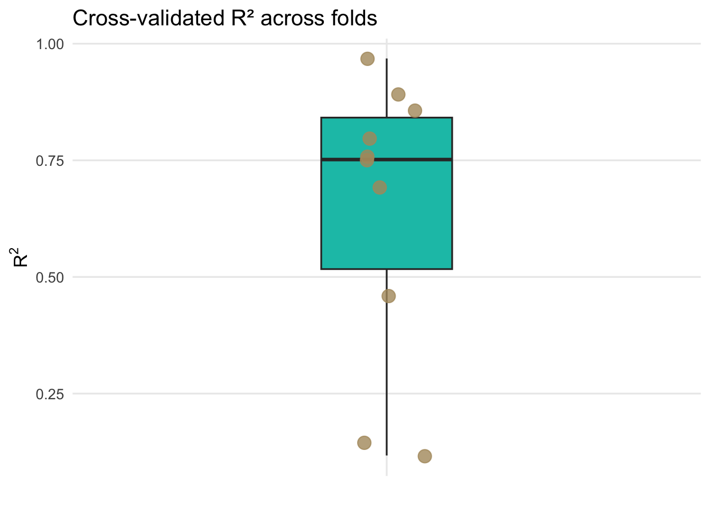

Each point represents the out-of-sample R$^2$ from a single cross-validation fold, while the boxplot summarizes the distribution of predictive performance across folds, highlighting the variability introduced by different training and test splits.

We now have an interval estimate and can say that using 10-fold cross validation the mean for R$^2$ is 0.643 along with the standard error of that mean as 0.096. Similarly, we can say the MAE is 10.799 with a standard error of 1.005. This is calculated using held-out test folds samples and a far better estimate of R$^2$ and MAE than we started with before cross validation. Because the folds are not independent of one another, this standard error should be viewed as an approximate measure of variability across folds rather than a formal inferential standard error.

In reality, you will almost never have to write a single loop to do cross validation. I dragged you through it because it's good for you to see how you might implement it yourself. There are many packages and functions out there for doing cross validation.

It is important to distinguish cross validation from classical statistical inference. Cross validation is designed to estimate predictive performance, not to test hypotheses about model parameters or determine whether coefficients differ from zero.

### Aside: Is this the same as bootstrapping? Or permutation?
Answer? No. But they are all resampling methods! And if you are feeling like they are very similar you aren't alone. [Here](https://datascience.stackexchange.com/questions/32264/what-is-the-difference-between-bootstrapping-and-cross-validation) is a great thread on how they are similar and how they differ.

## Doing LOOCV?
Leave one out cross validation (LOOCV) is an extreme form of k-fold where $k=n$. That is one observation is left out each time. So, if in k-fold we estimate the performance of a model trained on a subset that uses $100 \frac{k-1}{k}$ percent of the available data, in LOOCV we'd use $100 \frac{n-1}{n}$ of the data to build the model. This can be prohibitively expensive for large data sets but is simple enough with the toy data above.


``` r
loocvResults <- data.frame(y=rep(NA,n), yhat=rep(NA,n ))

# loop n times and leave one out each time
for(i in 1:n){
  testing <- dat[i,]
  training <- dat[-i,]
  
  lm1 <- lm(y~x,data=training)
  testing$yhat <- predict(lm1,newdata=testing)
  loocvResults$y[i] <- testing$y
  loocvResults$yhat[i] <- testing$yhat
}
#rsq2
cor(loocvResults$yhat,loocvResults$y)^2
```

```
## [1] 0.6037989
```

``` r
#mae
mean(abs(loocvResults$yhat - loocvResults$y))
```

```
## [1] 10.71293
```

The reading discusses a bit about when LOOCV is preferable to k-fold in terms of variance and bias in the results. And you can find loads more discussion about it if you look. E.g., [here](https://stats.stackexchange.com/questions/61783/bias-and-variance-in-leave-one-out-vs-k-fold-cross-validation/357749#357749) and [here](https://stats.stackexchange.com/questions/280665/variance-of-k-fold-cross-validation-estimates-as-fk-what-is-the-role-of). I'm not conversant enough with the arguments to make an argument one way or another but in my experience the differences are small in resampling methods in general.

## What about repeating k-fold?
Heck yes! You can go as crazy as time and computer memory allow. You can repeat your k-fold procedure as many times are you like. I won't drag you through it with loops but the idea is that you can do a k-fold cross validation then reshuffle the data and repeat. This way you are getting a new suite of folds for your training and testing. This is really helpful to assess how stable a model is. I'll explain more in the video.

## `caret`: Classification And REgression Training
At the moment the `caret` package is the go-to resource for improving prediction from classification and regression models. [This is an excellent intro to it](http://topepo.github.io/caret/index.html). The strength of the `caret` implementation is that any almost algorithm with a `predict` method can be wrapped up and used in a really slick cross validation schema that includes model tuning and comparing different models. There are literally 100's of models you can use. [Here is a visualization of them](http://topepo.github.io/caret/models-clustered-by-tag-similarity.html).

As a really simple example of `caret` I'll show how we can use `caret` for repeated k-fold cross validation on the toy data $y=f(x)$ that we started with and compare a Generalized Linear Model (`glm`) to a Generalized Additive Model using Splines (`gamSpline`) which allows for the response function to be non linear.


``` r
library(caret)
## 10-fold CV with 10 repeats
fitControl <- trainControl(
  method = "repeatedcv",
  number = 10,
  repeats = 10)

glm1 <- train(y ~ x, data = dat, 
              method = "glm", 
              trControl = fitControl)
glm1
```

```
## Generalized Linear Model 
## 
## 50 samples
##  1 predictor
## 
## No pre-processing
## Resampling: Cross-Validated (10 fold, repeated 10 times) 
## Summary of sample sizes: 44, 43, 46, 45, 44, 46, ... 
## Resampling results:
## 
##   RMSE      Rsquared   MAE     
##   12.86057  0.6944658  10.56652
```

``` r
# Note that if you run this, you might be prompted 
# to install the `gam` library.
# install.packages("gam")
gam1 <- train(y ~ x, data = dat2, 
              method = "gamSpline", 
              trControl = fitControl)
gam1
```

```
## Generalized Additive Model using Splines 
## 
## 50 samples
##  1 predictor
## 
## No pre-processing
## Resampling: Cross-Validated (10 fold, repeated 10 times) 
## Summary of sample sizes: 46, 46, 45, 44, 46, 45, ... 
## Resampling results across tuning parameters:
## 
##   df  RMSE      Rsquared   MAE     
##   1   12.87164  0.6812382  10.63245
##   2   12.74338  0.6858391  10.51561
##   3   12.39209  0.6962180  10.17219
## 
## RMSE was used to select the optimal model using the smallest value.
## The final value used for the model was df = 3.
```
The cross validated GAM outperforms the linear model. And if we look at the predicted function we can indeed see the non-linear response from the GAM fit.


``` r
newDat <- data.frame(x=seq(-4,4,by=0.1))
newDat$yhat <- predict(gam1,newdata = newDat)

ggplot() + 
  geom_point(data = dat,aes(x=x,y=y),size=3,
             shape=21,fill="darkred",alpha=0.7) + 
  geom_line(data = newDat,aes(x=x,y=yhat),linewidth=1.1)
```

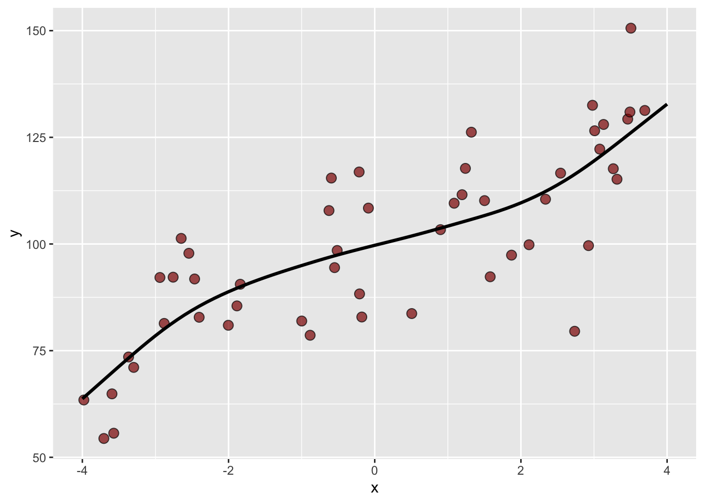

Because of the cross validation, we can be at least somewhat confident that this model isn't overfit and that the black line does describe $y=f(x)$. Note that I essentially choose the `gamSpline` at random from the 100's of possible prediction methods. If I were really interested in these data (like for a thesis), I'd spend a lot more time learning which methods work best with the data and especially how they might work well (or not) with the underlying processes. 

## Final thoughts: ABCv

That's all for now on cross validation. It's a powerful idea and, despite how central it is to modern modeling, it still tends to slip through the cracks of many statistics sequences. I tried to use graphics and explicit code above so you could step through the mechanics and see how cross validation actually works, rather than treating it as a black box.

One reason cross validation matters so much is that it makes uncertainty visible. A single train–test split can give a very misleading impression of model performance, simply because of how the data happened to be divided. By repeatedly training and testing across multiple folds, cross validation forces us to confront the variability in predictive performance and moves us away from relying on a single point estimate.

Cross validation is also something that should be taught earlier. Many of you were trained to think first about coefficients, p-values, and hypothesis tests, long before being asked to think seriously about prediction. That can create the impression that a model with statistically significant terms is necessarily a good model, even if it performs poorly on new data. Cross validation shifts the focus to a different question: how well should we expect this model to perform on data we have not yet seen?

At the same time, it is important to keep the goal straight. Cross validation is about prediction, not inference. It does not test hypotheses or tell us whether parameters differ from zero. Instead, it gives us an empirical way to evaluate and compare models based on their out-of-sample behavior.

I'm only scratching the surface here. Some of you will embrace, and perhaps build careers in, machine learning and data science. If so, you'll encounter many variations on these ideas, including different resampling schemes, repeated cross validation, and cross validation for model tuning and selection.

But get this into your head when doing modeling: **ABCv**. Always be cross validating.

Until the revolution comes, computers are happy to do repetitive resampling as many times as we like. Take advantage of it.

## Your Work
Let's use the adorable penguin data from the [Palmer Penguin library](https://allisonhorst.github.io/palmerpenguins/). And let's do something simple like ask if we can predict body mass ($y$) as a function of bill length ($x_1$) and species ($x_2$). 


``` r
data(penguins)
penguins <- penguins %>% na.omit()
ggplot(data=penguins,mapping = aes(x=bill_len, y=body_mass,color=species)) +
  geom_point() + geom_smooth(method="lm") +
  labs(x="Bill length (mm)", y="Body mass (g)")
```

```
## `geom_smooth()` using formula = 'y ~ x'
```

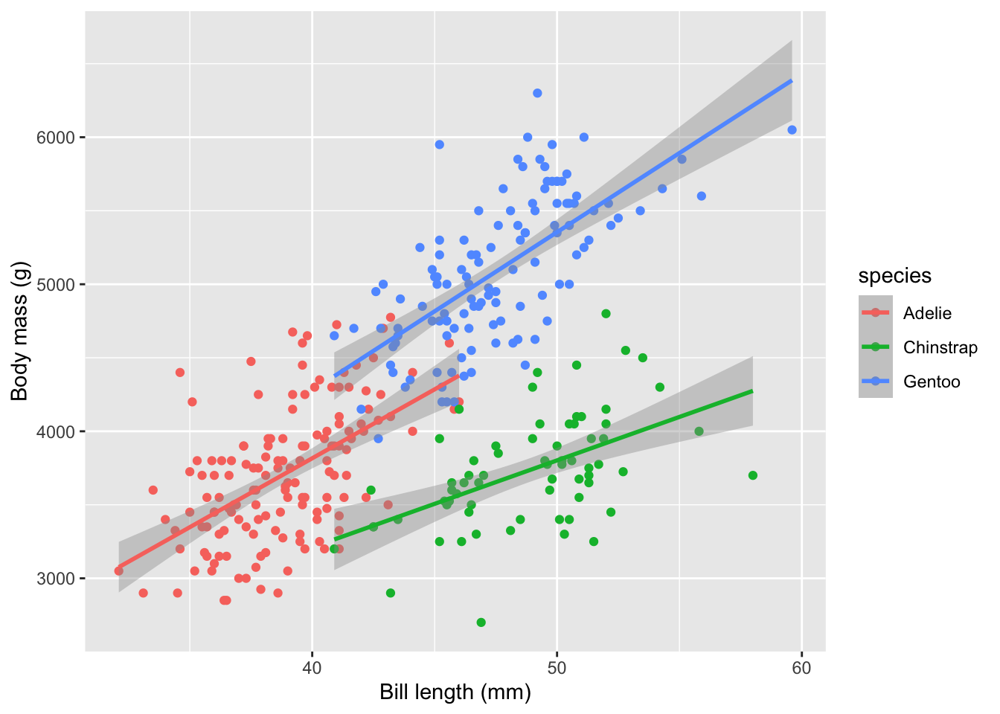


Here is a non-validated model using all the data.

``` r
lmMass <- lm(body_mass ~ bill_len + species , data = penguins)
summary(lmMass)
```

```
## 
## Call:
## lm(formula = body_mass ~ bill_len + species, data = penguins)
## 
## Residuals:
##     Min      1Q  Median      3Q     Max 
## -860.77 -244.79    4.36  215.73 1075.25 
## 
## Coefficients:
##                  Estimate Std. Error t value Pr(>|t|)    
## (Intercept)       200.453    271.646   0.738    0.461    
## bill_len           90.298      6.951  12.991  < 2e-16 ***
## speciesChinstrap -876.942     88.744  -9.882  < 2e-16 ***
## speciesGentoo     596.702     76.429   7.807 7.88e-14 ***
## ---
## Signif. codes:  0 '***' 0.001 '**' 0.01 '*' 0.05 '.' 0.1 ' ' 1
## 
## Residual standard error: 375.2 on 329 degrees of freedom
## Multiple R-squared:  0.7848,	Adjusted R-squared:  0.7829 
## F-statistic:   400 on 3 and 329 DF,  p-value: < 2.2e-16
```


The R$^2$ for this unvalidated model is 0.785 and the MAE is 296.923. 

For your work this module, cross validate a model of body mass as a function of bill length and species. Do the cross validation how you see fit and report the mean R$^2$ and MAE. Be aware that there are a few `NA` values in the data. You should be able to do this "by hand" with a loop as well as use `caret`. Be aware of what the output structure from `caret::train` looks like. What is it actually returning?


