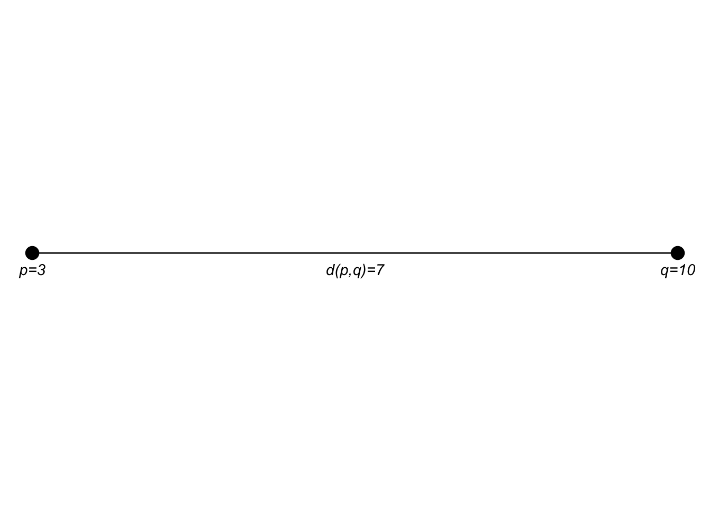
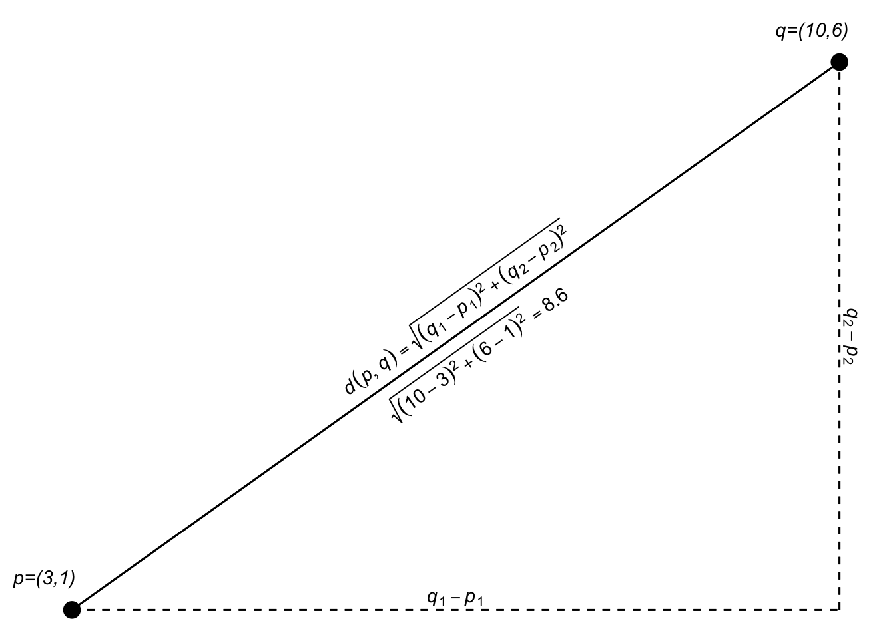
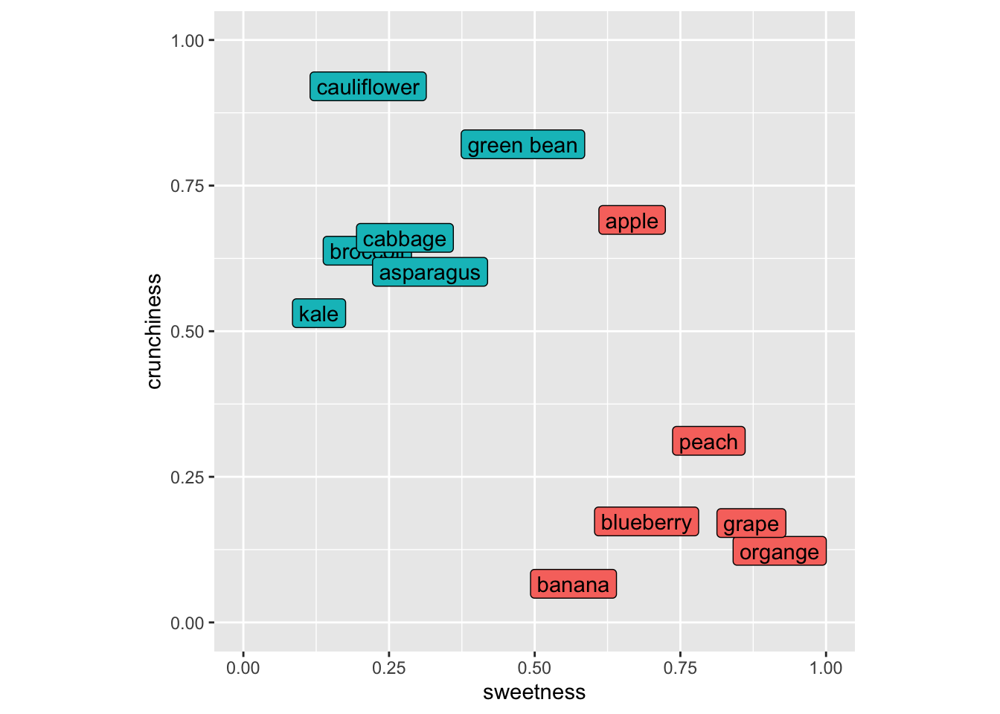
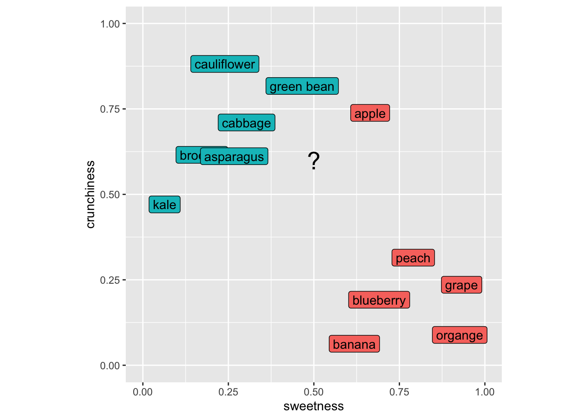

# Classifying with kNN


## Big Idea
Predicting categorical class membership is one of two big areas of machine learning (the other being predicting a continuous response -- e.g., regression). The idea behind kNN is simple. For an unclassified sample, the algorithm finds some number ($k$) of samples that are close by in a parameter space and classifies the unknown sample by the class membership of the nearest neighbors. It's an appealing and intuitive approach. 

## Packages

``` r
library(tidyverse)
```

```
## ── Attaching core tidyverse packages ──────────────────────── tidyverse 2.0.0 ──
## ✔ dplyr     1.2.0     ✔ readr     2.2.0
## ✔ forcats   1.0.1     ✔ stringr   1.6.0
## ✔ ggplot2   4.0.2     ✔ tibble    3.3.1
## ✔ lubridate 1.9.5     ✔ tidyr     1.3.2
## ✔ purrr     1.2.1     
## ── Conflicts ────────────────────────────────────────── tidyverse_conflicts() ──
## ✖ dplyr::filter() masks stats::filter()
## ✖ dplyr::lag()    masks stats::lag()
## ℹ Use the conflicted package (<http://conflicted.r-lib.org/>) to force all conflicts to become errors
```

``` r
library(scales)
```

```
## 
## Attaching package: 'scales'
## 
## The following object is masked from 'package:purrr':
## 
##     discard
## 
## The following object is masked from 'package:readr':
## 
##     col_factor
```

``` r
library(class)
library(caret)
```

```
## Loading required package: lattice
## 
## Attaching package: 'caret'
## 
## The following object is masked from 'package:purrr':
## 
##     lift
```

As usual we'll want `tidyverse`[@R-tidyverse] and `caret`[@R-caret] for cross validation. We'll be scalining with `scales`[@R-scales] and running kNN with `class`[@R-class]. 


## Reading
Chapter 3: Lazy Learning -- Classification Using Nearest Neighbors in Machine Learning with R: Expert techniques for predictive modeling, 3rd Edition. Link on Canvas.

## Classification Voting by Distance
Most machine learning tasks come down to prediction, right? When the response variable (the left hand side of the equation) is categorical we call this classification. The kNN algorithm is a very simple but effective classifier that goes back to the 1950s and assigns membership to an unknown sample based on its proximity to known samples. It's used quite a bit because of its simplicity and often seen as a "recommender" algorithm (e.g., Netflix, Spotify, Amazon). We will learn more about other (slicker?) methods like  neural nets later on but kNN is still a workhorse in the classification game.

## High Dimensional Space
In ML, we spend a lot of time and effort thinking about the relationships between samples as described by many (maybe related, maybe independent) variables. In the classic Palmer Penguin data we've used there is categorical data on species, sex, and island for each bird. And we have continuous measurements of bill length, bill depth, flipper length, body mass. That is, for the continuous data, we have a four dimensional space in which we can characterize each bird. In ML applications we will deal with high dimensional space all the time. In fact we often have so many dimensions that we reduce them to more manageable sizes using tools like PCA. 

Algorithms like kNN work just fine in high dimensional space. But that doesn't mean you can just chuck variables in without thinking about what they are because they all get weighted equally. As the number of dimensions increases, distances between points tend to become more similar to one another. This means that the idea of a "nearest" neighbor can start to break down - a common issue referred to as the curse of dimensionality. Adding predictors does not automatically improve kNN performance. 

Let's review Euclidean distance which will help make sense of how you think about variables.

### Euclidean Distance 
Between your coursework here, in ESCI 503, and in ESCI 505 you'll have had a bellyful of Euclidean distance (and other distance measures in ESCI 503) by the time June rolls around.  But just to cover all the bases, here is a quick example of how we get distances in 1D (one dimension), 2D, 3D, and then $n$D. The key point is that distance is computed across all predictors simultaneously, with each contributing equally once variables are on the same scale.

One dimension is easy, right? If we have two points ($p$ and $q$) at $p=3$ and $q=10$ we know that the distance between them is $d(p,q) = \sqrt{(q - p)^2} = 7$, right? 


``` r
p <- 3
q <- 10
sqrt((q-p)^2)
```

```
## [1] 7
```




If the points $p$ and $q$ are in a two dimensional plane we extend that as:
$$d(p,q)=\sqrt{(q_1-p_1)^2 + (q_2-p_2)^2}$$

``` r
p <- c(3,1)
q <- c(10,6)
sqrt((q[1] - p[1])^2 + (q[2] - p[2])^2)
```

```
## [1] 8.602325
```


I think I encountered this first as finding the hypotenuse of a right triangle in middle school.


Since we are just adding the two dimensions together, we can generalize that expression a bit as:
$$d(p,q)=\sqrt{(q_1-p_1)^2 + (q_2-p_2)^2} = \sqrt{\sum_{i=1}^n(q_i-p_i)^2}$$
where $n$ is the total number of dimensions. 


``` r
sqrt(sum((q-p)^2))
```

```
## [1] 8.602325
```

In 3D space (like measuring the distance from where you are now to the upper left-hand corner of the room), $n=3$. Let's add a third dimension to $p$ and $q$ and calculate the distance.


``` r
p <- c(3,1,5)
q <- c(10,6,7)
sqrt((q[1] - p[1])^2 + (q[2] - p[2])^2 + (q[3] - p[3])^2)
```

```
## [1] 8.831761
```

Here is an attempt at a 3D plot.


```{=html}
<div class="plotly html-widget html-fill-item" id="htmlwidget-8c4d9b60d14b65263b72" style="width:672px;height:480px;"></div>
<script type="application/json" data-for="htmlwidget-8c4d9b60d14b65263b72">{"x":{"visdat":{"1406ea1a3fa6":["function () ","plotlyVisDat"]},"cur_data":"1406ea1a3fa6","attrs":{"1406ea1a3fa6":{"x":{},"y":{},"z":{},"alpha_stroke":1,"sizes":[10,100],"spans":[1,20],"type":"scatter3d","mode":"markers","marker":{"color":"black"},"inherit":true},"1406ea1a3fa6.1":{"x":{},"y":{},"z":{},"alpha_stroke":1,"sizes":[10,100],"spans":[1,20],"type":"scatter3d","mode":"lines","line":{"color":"black"},"inherit":true}},"layout":{"margin":{"b":40,"l":60,"t":25,"r":10},"scene":{"xaxis":{"title":"x","range":[0,12]},"yaxis":{"title":"y","range":[0,12]},"zaxis":{"title":"z","range":[0,12]},"aspectmode":"cube"},"showlegend":false,"hovermode":"closest"},"source":"A","config":{"modeBarButtonsToAdd":["hoverclosest","hovercompare"],"showSendToCloud":false},"data":[{"x":[3,10],"y":[1,6],"z":[5,7],"type":"scatter3d","mode":"markers","marker":{"color":"black","line":{"color":"rgba(31,119,180,1)"}},"error_y":{"color":"rgba(31,119,180,1)"},"error_x":{"color":"rgba(31,119,180,1)"},"line":{"color":"rgba(31,119,180,1)"},"frame":null},{"x":[3,10],"y":[1,6],"z":[5,7],"type":"scatter3d","mode":"lines","line":{"color":"black"},"marker":{"color":"rgba(255,127,14,1)","line":{"color":"rgba(255,127,14,1)"}},"error_y":{"color":"rgba(255,127,14,1)"},"error_x":{"color":"rgba(255,127,14,1)"},"frame":null}],"highlight":{"on":"plotly_click","persistent":false,"dynamic":false,"selectize":false,"opacityDim":0.20000000000000001,"selected":{"opacity":1},"debounce":0},"shinyEvents":["plotly_hover","plotly_click","plotly_selected","plotly_relayout","plotly_brushed","plotly_brushing","plotly_clickannotation","plotly_doubleclick","plotly_deselect","plotly_afterplot","plotly_sunburstclick"],"base_url":"https://plot.ly"},"evals":[],"jsHooks":[]}</script>
```

Of course, we can use the generalized equation as well:
$$d(p,q)=\sqrt{\sum_{i=1}^n(q_i-p_i)^2}$$

Implemented the same as above using `sum`:


``` r
sqrt(sum((q-p)^2))
```

```
## [1] 8.831761
```

We just did a 3D example and I tried to visualize it. But we can do as many dimensions as we want. Our brains break after 3D but we can add as many dimensions as we like. Here is the 5D Euclidean distance between two points:


``` r
p <- c(3,1,5,7,2)
q <- c(10,6,7,13,1)
sqrt((q[1] - p[1])^2 + (q[2] - p[2])^2 + (q[3] - p[3])^2 + (q[4] - p[4])^2 + (q[5] - p[5])^2)
```

```
## [1] 10.72381
```

Or:

``` r
sqrt(sum((q-p)^2))
```

```
## [1] 10.72381
```

High-dimensional spaces occur all the time in science. Have four variables to describe something? You have a 4D space and can calculate the Euclidean distance between your observations. Six variables? 6D space and so on. N variables? nD space. It'll be important as we continue on that you are comfortable with the idea of distances in high-dimensional spaces.

### Space in kNN
The kNN algorithm uses space explicitly as each variable becomes an equally weighted axis in the $n$ dimensional space. Because the algorithm for kNN doesn't teach itself to recognize which variables might be more important than others it's up to the analyst (that's you) to build a model sensibly.

## The kNN Algorithm
The kNN is a dirt simple classifier the assigns membership based on the membership of points that are close by in the parameter space. Typically, the distance is Euclidean as we saw above. The text and materials linked on Canvas explain it all pretty well but I'll walk through an example based on the fruits and veggies examples in the reading real quick.

### Eat Your Fruits and Veggies


``` r
foodStuffs <- tibble(culinaryUse = c("vegetable","vegetable","vegetable",
                                     "vegetable","vegetable","vegetable",
                                     "fruit", "fruit", "fruit",
                                     "fruit", "fruit", "fruit"),
                     item =  c("green bean","broccoli","cauliflower",
                               "cabbage","asparagus","kale",
                               "apple","organge", "grape",
                               "banana","peach","blueberry"),
                     sweetness = c(0.5,0.2,0.2,
                                   0.3,0.3,0.1,
                                   0.7,0.9,0.9,
                                   0.6,0.8,0.7),
                     crunchiness = c(0.8,0.6,0.9,
                                     0.7,0.6,0.5,
                                     0.7,0.1,0.2,
                                     0.1,0.3,0.2))

foodPlot <- ggplot(data=foodStuffs, mapping = aes(x=sweetness, y = crunchiness)) +
  geom_label(aes(label=item,fill=culinaryUse),position = "jitter") + 
  lims(x=c(0,1),y=c(0,1)) + coord_fixed() + theme(legend.position = "none")
foodPlot
```


As many of you with botany training know that the fruit/veggie dichotomy is quite different in terms of culinary classification as opposed to biological classification (e.g., green beans, cucumbers, green bears, etc. are all fruits botanically but we use mostly use them as vegetables around these parts at least). So let's think about these in terms of culinary uses.

Imagine putting in a new item like a strawberry into this space. It's sweet and not crunchy and we'd call it a fruit using kNN because its nearest neighbors would all be fruits. Let's do this kNN calculation for, I dunno, eggplant (technically a fruit as well!). Here is my scoring for eggplant and I'll add it to the plot with a "?".


``` r
eggplant <- tibble(sweetness=0.5, crunchiness = 0.6)
foodPlot + geom_point(data=eggplant, mapping = aes(x=sweetness,y=crunchiness),shape="?",size=7)
```



Our first step is to get the distances from our unknown item to all the known items. So here is the distance between green beans and eggplant. Note that this is a 2D space but this approach would work in as many dimensions as we might care to assign to our foods.


``` r
p <- foodStuffs %>% filter(item == "green bean") %>%
  select(sweetness,crunchiness)
q <- eggplant %>% select(sweetness,crunchiness)
# distance from eggplant to green bean
sqrt(sum((q-p)^2))
```

```
## [1] 0.2
```

And eggplant to blueberry.

``` r
p <- foodStuffs %>% filter(item == "blueberry") %>%
  select(sweetness,crunchiness)
q <- eggplant %>% select(sweetness,crunchiness)
# distance from eggplant to blueberry
sqrt(sum((q-p)^2))
```

```
## [1] 0.4472136
```

We can use `apply` to look at the distance from eggplant to all the rows in
the `foodStuffs` data.


``` r
p <- foodStuffs %>% select(sweetness,crunchiness)
q <- eggplant %>% select(sweetness,crunchiness)
# distance from eggplant to all the items
dist2all <- apply(p,1,function(x){sqrt(sum((q-x)^2))})
tibble(culinaryUse = foodStuffs$culinaryUse, d = dist2all) %>%
  arrange(d)
```

```
## # A tibble: 12 × 2
##    culinaryUse     d
##    <chr>       <dbl>
##  1 vegetable   0.2  
##  2 vegetable   0.2  
##  3 fruit       0.224
##  4 vegetable   0.224
##  5 vegetable   0.3  
##  6 vegetable   0.412
##  7 vegetable   0.424
##  8 fruit       0.424
##  9 fruit       0.447
## 10 fruit       0.510
## 11 fruit       0.566
## 12 fruit       0.640
```

Now, to classify the eggplant we'd ask for a vote based on $k$. If we asked for the three closest neighbors ($k=3$) the vote would be two veggie and one fruit (that crunchy but sweet apple is the minority vote) So we'd call the eggplant a vegetable. The choice of $k$ controls a tradeoff. Small values of $k$ lead to very local decisions that can be sensitive to noise (high variance). Larger values of $k$ produce smoother decision boundaries but can blur meaningful local structure (higher bias).

Make sense? Now this is a trivial example but I will note that ML is being used in cooking and cuisine! Imagine you wanted an ingredient to contrast with your others and had a big database of flavor profiles. You could end up with something really cool (think "curry ice cream" which is awesome) if a ML algorithm helped you find a pattern that you hadn't thought about before. Google [Chef Watson](https://www.google.com/search?q=chef+watson) for this in real life.

## Other Tidbits
### Rescaling
The reading describes why variables used in kNN have to be on the same scale. I won't belabor that point here but this is a critical idea. When working in a parameter space that includes many different kinds of variables (length, width, number, whatever) they all need to be scaled to the same frame of reference before you can think about distance. The book uses a min|max normalization from 0 to 1 for all the variables and also talks about transforming to z-scores. In practice, scaling parameters should be computed using the training data only, and then applied to the test data. Computing scaling parameters on the full dataset can leak information from the test set into the model. 

### Categorical Predictors
You can use categorical data in kNN but that doesn't mean that you should. Categorical data (e.g., `sex` in the penguin data) can be used in kNN but would have to be converted into numbers (e.g., 0 and 1) before being used to calculate distance. If you have multiple categories (e.g., `island` in the penguin data) it's not clear how you transform those into distance because coding them as integers won’t work. One possibility in that case is to put the categories as numbers equally spaced around a circle -- that way the distance between any pair of them is the same but that starts getting complicated fast. kNN might not be the best choice if you have a lot of categorical data that you want to use as predictors.

## Worked Example

### Diagnostic Wisconsin Breast Cancer Database
We are going to follow along with the book and look at the Diagnostic Wisconsin Breast Cancer Database. The data are archived [here](https://archive.ics.uci.edu/ml/datasets/Breast+Cancer+Wisconsin+%28Diagnostic%29) and I've put the csv file on Canvas. As you can read, there are 569 rows (samples) and 30 explanatory variables for the diagnosis (malignant or benign). There is also an id column that we will ignore (never use ID to predict!). The 30 explanatory variables are the mean, standard error, and largest (worst) value for 10 different characteristics of the digitized cell nuclei.

I'm not going to retype the textbook. Read the book along with the code below.

Let's read the data, shuffle the rows to make sure they are random, drop the id column, and recode the diagnosis column to be a factor. 

As you work through the code below, focus on three things:

1.	How the data are split into training and test sets
2.	How the choice of $k$ affects predictions
3.	How to interpret the confusion matrix rather than the raw accuracy alone


``` r
wbcd <- read_csv("data/wisc_bc_data.csv")
rowShuffle <- sample(x = 1:nrow(wbcd),size = nrow(wbcd),replace = FALSE)
wbcd <- wbcd[rowShuffle,] %>% select(-id) %>% 
  mutate(diagnosis = factor(diagnosis, 
                            levels = c("B","M"), 
                            labels =  c("Benign","Malignant")))
```

And get a count of the response (diagnosis).


``` r
wbcd %>% count(diagnosis) %>% mutate(freq = n / sum(n))
```

```
## # A tibble: 2 × 3
##   diagnosis     n  freq
##   <fct>     <int> <dbl>
## 1 Benign      357 0.627
## 2 Malignant   212 0.373
```
So far we are following along with the book but I'm using tidy syntax. The next step is to normalize the predictor variables to get them on the same scale. The book shows you how to write your own function `normalize` to get each variable on a scale from zero to one. While I applaud rolling your own functions, I'll use the `rescale` function in the `scales` library which does the same thing. Note that the `scales` library has all kinds of cool and useful transformations in it.


``` r
wbcd_n <- wbcd %>% mutate(across(2:31, rescale))
```

Look at `area_mean` in the normalized data.

``` r
wbcd_n %>% select(area_mean) %>% summary()
```

```
##    area_mean     
##  Min.   :0.0000  
##  1st Qu.:0.1174  
##  Median :0.1729  
##  Mean   :0.2169  
##  3rd Qu.:0.2711  
##  Max.   :1.0000
```

All systems go. Note that one difference here as compared to the book is that I've kept the `diagnosis` column in the data so far. I prefer keeping data together as long as possible but because the books pulls the diagnosis column out, I will bow to pressure and make the labels a separate object here.


``` r
wbcd_labels <- wbcd_n %>% pull(diagnosis)
wbcd_n <- wbcd_n %>% select(-diagnosis)
```

### Train/Test

Let's get training and test data. Because the rows have already been shuffled, we can divide using row indices. The book, somewhat arbitrarily, uses 100 rows for the testing data. Because I've shuffled the data above (and you will have your own random shuffle), the results will be slightly different between the book, what I have below, and what you get when you run it. But they should be very similar. If they aren't, that tells you a lot about the stability of the approach.


``` r
wbcd_train <- wbcd_n[1:469,]
wbcd_train_labels <- wbcd_labels[1:469]

wbcd_test <- wbcd_n[470:569,]
wbcd_test_labels <- wbcd_labels[470:569]
```

### Run kNN
And now we will do the classification using `knn`.


``` r
wbcd_test_pred <- knn(train = wbcd_train, 
                      test = wbcd_test,
                      cl=wbcd_train_labels,
                      k=21)
```

Let's take a look at that object of predictions. 


``` r
table(wbcd_test_pred)
```

```
## wbcd_test_pred
##    Benign Malignant 
##        67        33
```

There are 100 predictions and 64 times the case was classified as Benign and 36 times as Malignant. Because these are the test data we know the real answers for each of these cases. E.g.,:


``` r
tibble(preds = wbcd_test_pred, truth = wbcd_test_labels)
```

```
## # A tibble: 100 × 2
##    preds     truth    
##    <fct>     <fct>    
##  1 Benign    Benign   
##  2 Benign    Benign   
##  3 Benign    Benign   
##  4 Benign    Benign   
##  5 Benign    Benign   
##  6 Benign    Benign   
##  7 Benign    Benign   
##  8 Malignant Malignant
##  9 Malignant Malignant
## 10 Benign    Benign   
## # ℹ 90 more rows
```
This is the predicted values from `knn` and the observed (aka truth aka reference) values. They are mostly the same (that's good!) but sometimes we have a misclassification (that's bad).

### The Confusion Matrix

We can evaluate the fit with the aptly named [confusion matrix](https://en.wikipedia.org/wiki/Confusion_matrix) (i.e., which classes are confused with each other). The book uses the `CrossTable` function from the `gmodels` library. That's fine and has all the information you need (run `gmodels::CrossTable(x=wbcd_test_labels,y = wbcd_test_pred)`) to get the output the book shows. I'm going to show you the output using `confusionMatrix` function from `caret` which I see more commonly in the wild. 


``` r
cm <- confusionMatrix(data = wbcd_test_pred,reference = wbcd_test_labels)
cm
```

```
## Confusion Matrix and Statistics
## 
##            Reference
## Prediction  Benign Malignant
##   Benign        65         2
##   Malignant      1        32
##                                           
##                Accuracy : 0.97            
##                  95% CI : (0.9148, 0.9938)
##     No Information Rate : 0.66            
##     P-Value [Acc > NIR] : 2.113e-14       
##                                           
##                   Kappa : 0.9327          
##                                           
##  Mcnemar's Test P-Value : 1               
##                                           
##             Sensitivity : 0.9848          
##             Specificity : 0.9412          
##          Pos Pred Value : 0.9701          
##          Neg Pred Value : 0.9697          
##              Prevalence : 0.6600          
##          Detection Rate : 0.6500          
##    Detection Prevalence : 0.6700          
##       Balanced Accuracy : 0.9630          
##                                           
##        'Positive' Class : Benign          
## 
```

Don't freak out at all that information, we will walk through the most important parts. The key part being the table itself (`cm$table`). It's just four numbers and look at all we can infer from it!

The predictions from `knn` are in rows. The truth (aka observed, aka reference) are in the columns. Thus, the top-left corner and the bottom-right corner are the cases that are classified correctly. The lower-left and upper-right corners are misclassifications. In this table we say that a result of "Benign" is a positive result and thus then the lower left shows that there is one false negative (aka type II error) and the upper right shows that there are two false positives (aka type I error).

These errors are summarized in the "Sensitivity" and "Specificity" (those of you that follow the COVID test and vaccine development will be familiar with those terms already). Sensitivity is the proportion of positives ("Benign") that are correctly identified while Specificity is the proportion of negatives ("Malignant") that are correctly identified.

The other statistic in that sea that I'll break down a bit for you is kappa ($\kappa$). This is pretty much always reported when you see a classification. The kappa statistic is a number less than one that tells you how much better your classification is performing as compared to a random expectation. It's calculated as:

$$ \kappa = \frac{p_o - p_e}{1-p_e}$$

where $p_o$ is the is the observed agreement, and $p_e$ is the expected agreement. There isn't a p-value for kappa but you can loosely think about it as a value < 0 means no agreement between the classes, 0–0.20 as slight agreement, 0.21–0.40 as fair, 0.41–0.60 as moderate, 0.61–0.80 as substantial, and 0.81–1 as excellent agreement. A pretty no nonsense but very thorough write up is on [stackexchange](https://stats.stackexchange.com/questions/82162/cohens-kappa-in-plain-english).

There is a lot more in the `confusionMatrix` output but that's enough for now I think. For details on interpreting all the numbers in this function look at the help page. It's pretty clean: `?confusionMatrix`.

### Some Interp
The book walks through some of the important aspects and trade offs as you interpret this classification. Is it better for an analyst to worry about false positives or false negatives in terms of patient care? How does changing $k$ affect this classification? What about the variable normalization? What about the "right" number of predictors to use? I'll talk about each of these in the video but they are all important considerations.

## Your Work
Let's use a cool data set of fish caught in Finland in 1917. There are 159 fish from seven species caught from [lake Laengelmavesi](https://www.google.com/maps/place/L%C3%A4ngelm%C3%A4vesi/@61.5563738,24.2872989,11z/). In addition to the species there are columns for the weight of the fish (in grams), three measurements of length: 1. Length from the nose to the beginning of the tail, 2. Length from the nose to the notch of the tail, and 3. Length from the nose to the end of the tail. All of the length measurements are in cm. There is also the width of the fish and its height (in cm) as well as the ratio of height to total length and the ratio of width to total length (in percent). The raw data are archived [here](http://jse.amstat.org/jse_data_archive.htm) and formatted nicely in the `fishcatch.csv` file.

I'm going to read in the file and do some wrangling and cleaning. I'll drop all the `NA` values first. I'll limit the species we are going to classify to just three species. Then I select just four of the variables to predict species (weight, total length, height, and width) which are rescaled from zero to one. 


``` r
fish <- read_csv("data/fishcatch.csv")
```

```
## Rows: 159 Columns: 11
## ── Column specification ────────────────────────────────────────────────────────
## Delimiter: ","
## chr (3): std_name, common_name, sex
## dbl (8): weight_g, length_nose2tail_base_cm, length_nose2tail_notch_cm, leng...
## 
## ℹ Use `spec()` to retrieve the full column specification for this data.
## ℹ Specify the column types or set `show_col_types = FALSE` to quiet this message.
```

``` r
fishFiltered <- fish %>% select(-std_name,-sex) %>%
  mutate(common_name = factor(common_name)) %>%
  filter(common_name %in% c("bream","perch","pike")) %>%
  mutate(common_name = factor(common_name)) %>%
  select(common_name,
         weight_g,
         length_nose2tail_end_cm,
         height_cm,
         width_cm) %>%
  drop_na() %>%
  mutate(across(2:5, rescale))
```

Let's try a 3d view (have to leave out weight for this plot).


``` r
library(plotly)
plot_ly(fishFiltered, 
        x = ~length_nose2tail_end_cm,
        y = ~height_cm,
        z = ~width_cm, 
        color = ~common_name) %>%
  add_markers() %>% 
  layout(scene = list(xaxis = list(title = 'Length'),
                      yaxis = list(title = 'Height'),
                      zaxis = list(title = 'Width'))) %>%
  layout(showlegend = FALSE)
```

```{=html}
<div class="plotly html-widget html-fill-item" id="htmlwidget-b6565f515210d1576420" style="width:672px;height:480px;"></div>
<script type="application/json" data-for="htmlwidget-b6565f515210d1576420">{"x":{"visdat":{"1406e3e2efd44":["function () ","plotlyVisDat"]},"cur_data":"1406e3e2efd44","attrs":{"1406e3e2efd44":{"x":{},"y":{},"z":{},"color":{},"alpha_stroke":1,"sizes":[10,100],"spans":[1,20],"type":"scatter3d","mode":"markers","inherit":true}},"layout":{"margin":{"b":40,"l":60,"t":25,"r":10},"scene":{"xaxis":{"title":"Length"},"yaxis":{"title":"Height"},"zaxis":{"title":"Width"}},"showlegend":false,"hovermode":"closest"},"source":"A","config":{"modeBarButtonsToAdd":["hoverclosest","hovercompare"],"showSendToCloud":false},"data":[{"x":[0.35810810810810806,0.37837837837837834,0.3766891891891892,0.41722972972972971,0.42567567567567566,0.4375,0.4341216216216216,0.44256756756756754,0.44425675675675674,0.46283783783783783,0.46283783783783783,0.46283783783783783,0.46621621621621617,0.47972972972972977,0.47972972972972977,0.49831081081081074,0.50168918918918914,0.5033783783783784,0.50506756756756754,0.51858108108108103,0.51351351351351349,0.52195945945945943,0.53716216216216217,0.53547297297297292,0.5422297297297296,0.53716216216216217,0.55236486486486491,0.55405405405405395,0.57094594594594583,0.59628378378378366,0.59459459459459463,0.61655405405405406,0.62668918918918903,0.63682432432432434],"y":[0.55621301775147935,0.61538461538461542,0.60946745562130189,0.62721893491124259,0.60946745562130189,0.68047337278106512,0.71597633136094674,0.62721893491124259,0.70414201183431957,0.71597633136094674,0.72189349112426049,0.72781065088757402,0.6923076923076924,0.76331360946745574,0.78698224852071019,0.75739644970414211,0.75739644970414211,0.79881656804733736,0.73372781065088766,0.76923076923076927,0.82248520710059181,0.79289940828402372,0.79289940828402372,0.83431952662721898,0.84615384615384615,0.84615384615384615,0.8520710059171599,0.87573964497041423,1,0.94082840236686405,0.94674556213017758,0.98816568047337283,0.97633136094674566,0.9171597633136096],"z":[0.38805970149253738,0.43283582089552242,0.49253731343283591,0.46268656716417916,0.55223880597014929,0.52238805970149271,0.58208955223880599,0.49253731343283591,0.5074626865671642,0.537313432835821,0.55223880597014929,0.5074626865671642,0.44776119402985087,0.56716417910447769,0.62686567164179097,0.58208955223880599,0.56716417910447769,0.55223880597014929,0.64179104477611959,0.62686567164179097,0.59701492537313439,0.58208955223880599,0.70149253731343275,0.62686567164179097,0.70149253731343275,0.70149253731343275,0.67164179104477617,0.71641791044776137,0.77611940298507465,0.73134328358208966,0.73134328358208966,0.79104477611940316,0.79104477611940316,0.74626865671641796],"type":"scatter3d","mode":"markers","name":"bream","marker":{"color":"rgba(102,194,165,1)","line":{"color":"rgba(102,194,165,1)"}},"textfont":{"color":"rgba(102,194,165,1)"},"error_y":{"color":"rgba(102,194,165,1)"},"error_x":{"color":"rgba(102,194,165,1)"},"line":{"color":"rgba(102,194,165,1)"},"frame":null},{"x":[0,0.09966216216216213,0.1216216216216216,0.14189189189189186,0.16385135135135134,0.17567567567567563,0.179054054054054,0.19256756756756754,0.20270270270270269,0.20608108108108106,0.23141891891891889,0.23141891891891889,0.23141891891891889,0.23648648648648649,0.2483108108108108,0.2483108108108108,0.2483108108108108,0.2483108108108108,0.2483108108108108,0.25675675675675674,0.25675675675675674,0.26013513513513509,0.26520270270270269,0.27364864864864863,0.28209459459459457,0.28209459459459457,0.29391891891891886,0.29898648648648646,0.3074324324324324,0.32432432432432429,0.33614864864864863,0.33952702702702697,0.33952702702702697,0.33952702702702697,0.34797297297297292,0.35979729729729731,0.38513513513513514,0.42567567567567566,0.46790540540540537,0.48141891891891886,0.51013513513513509,0.49831081081081074,0.51689189189189189,0.51520270270270263,0.55067567567567555,0.55067567567567555,0.54898648648648651,0.5658783783783784,0.5692567567567568,0.56756756756756743,0.5692567567567568,0.6047297297297296,0.61486486486486491,0.61993243243243246,0.6283783783783784,0.63851351351351349],"y":[0,0.082840236686390539,0.10059171597633135,0.14792899408284022,0.14792899408284022,0.18343195266272191,0.18343195266272191,0.20710059171597633,0.17751479289940827,0.17751479289940827,0.21301775147928997,0.2248520710059172,0.21301775147928997,0.25443786982248529,0.23668639053254437,0.20710059171597633,0.23668639053254437,0.2248520710059172,0.20118343195266272,0.2248520710059172,0.27810650887573962,0.23076923076923078,0.18343195266272191,0.24852071005917159,0.30769230769230765,0.25443786982248529,0.27218934911242604,0.25443786982248529,0.26627218934911245,0.30177514792899407,0.36686390532544388,0.30177514792899407,0.29585798816568049,0.30769230769230765,0.33727810650887574,0.32544378698224857,0.32544378698224857,0.4674556213017752,0.48520710059171607,0.55621301775147935,0.52071005917159774,0.50295857988165682,0.5147928994082841,0.50295857988165682,0.53254437869822491,0.53254437869822491,0.60946745562130189,0.5798816568047338,0.56804733727810652,0.60946745562130189,0.53254437869822491,0.63313609467455634,0.5798816568047338,0.61538461538461542,0.62130177514792906,0.61538461538461542],"z":[0,0.089552238805970172,0.1492537313432836,0.17910447761194034,0.22388059701492541,0.28358208955223885,0.25373134328358216,0.25373134328358216,0.23880597014925378,0.20895522388059704,0.32835820895522394,0.28358208955223885,0.34328358208955234,0.31343283582089559,0.29850746268656719,0.31343283582089559,0.31343283582089559,0.31343283582089559,0.38805970149253738,0.32835820895522394,0.32835820895522394,0.32835820895522394,0.32835820895522394,0.34328358208955234,0.34328358208955234,0.35820895522388063,0.41791044776119413,0.34328358208955234,0.41791044776119413,0.40298507462686567,0.55223880597014929,0.43283582089552242,0.43283582089552242,0.47761194029850745,0.41791044776119413,0.47761194029850745,0.5074626865671642,0.68656716417910446,0.74626865671641796,0.95522388059701513,0.82089552238805974,0.79104477611940316,0.73134328358208966,0.74626865671641796,0.91044776119402993,0.68656716417910446,0.89552238805970164,0.85074626865671643,0.86567164179104494,0.91044776119402993,0.77611940298507465,0.82089552238805974,0.88059701492537323,0.89552238805970164,1,0.92537313432835822],"type":"scatter3d","mode":"markers","name":"perch","marker":{"color":"rgba(252,141,98,1)","line":{"color":"rgba(252,141,98,1)"}},"textfont":{"color":"rgba(252,141,98,1)"},"error_y":{"color":"rgba(252,141,98,1)"},"error_x":{"color":"rgba(252,141,98,1)"},"line":{"color":"rgba(252,141,98,1)"},"frame":null},{"x":[0.43918918918918909,0.4898648648648648,0.50675675675675669,0.52364864864864857,0.53547297297297292,0.54391891891891897,0.61993243243243246,0.61993243243243246,0.625,0.66216216216216217,0.67398648648648651,0.71621621621621623,0.78209459459459452,0.85979729729729737,0.93243243243243246,0.93243243243243246,1],"y":[0.20710059171597633,0.21301775147928997,0.2248520710059172,0.24852071005917159,0.30769230769230765,0.25443786982248529,0.30769230769230765,0.27810650887573962,0.33727810650887574,0.2899408284023669,0.33727810650887574,0.33136094674556216,0.4023668639053255,0.50887573964497046,0.44378698224852076,0.44378698224852076,0.5147928994082841],"z":[0.29850746268656719,0.41791044776119413,0.44776119402985087,0.38805970149253738,0.47761194029850745,0.38805970149253738,0.43283582089552242,0.46268656716417916,0.55223880597014929,0.52238805970149271,0.52238805970149271,0.59701492537313439,0.71641791044776137,0.83582089552238814,0.70149253731343275,0.70149253731343275,0.91044776119402993],"type":"scatter3d","mode":"markers","name":"pike","marker":{"color":"rgba(141,160,203,1)","line":{"color":"rgba(141,160,203,1)"}},"textfont":{"color":"rgba(141,160,203,1)"},"error_y":{"color":"rgba(141,160,203,1)"},"error_x":{"color":"rgba(141,160,203,1)"},"line":{"color":"rgba(141,160,203,1)"},"frame":null}],"highlight":{"on":"plotly_click","persistent":false,"dynamic":false,"selectize":false,"opacityDim":0.20000000000000001,"selected":{"opacity":1},"debounce":0},"shinyEvents":["plotly_hover","plotly_click","plotly_selected","plotly_relayout","plotly_brushed","plotly_brushing","plotly_clickannotation","plotly_doubleclick","plotly_deselect","plotly_afterplot","plotly_sunburstclick"],"base_url":"https://plot.ly"},"evals":[],"jsHooks":[]}</script>
```

What I want you to do is use `knn` in `fishFiltered` to classify species using the four variables. You'll have to specify $k$ obviously as well as come up with some kind of `train` and `test` scheme. You can use `knn` as above or use the `train` function in `caret` if you are feeling ambitious. No matter what, you need to do some cross validation. Summarize your findings. Feel free to expand the species, variables used, or the rescaling as well for those that really like to color outside the lines.


