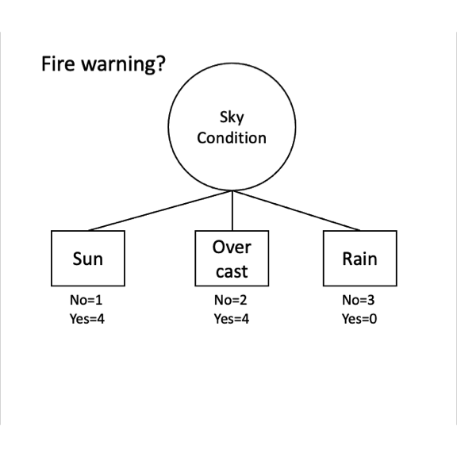
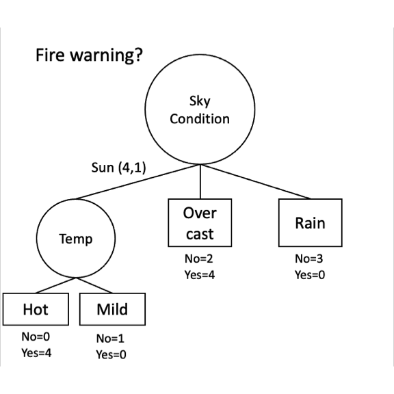
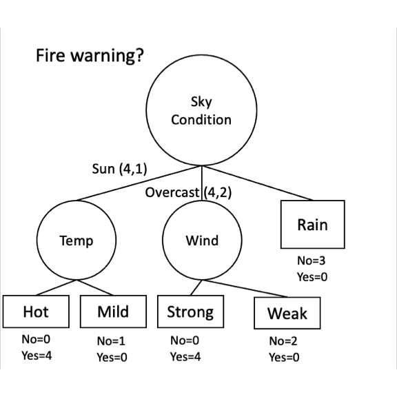
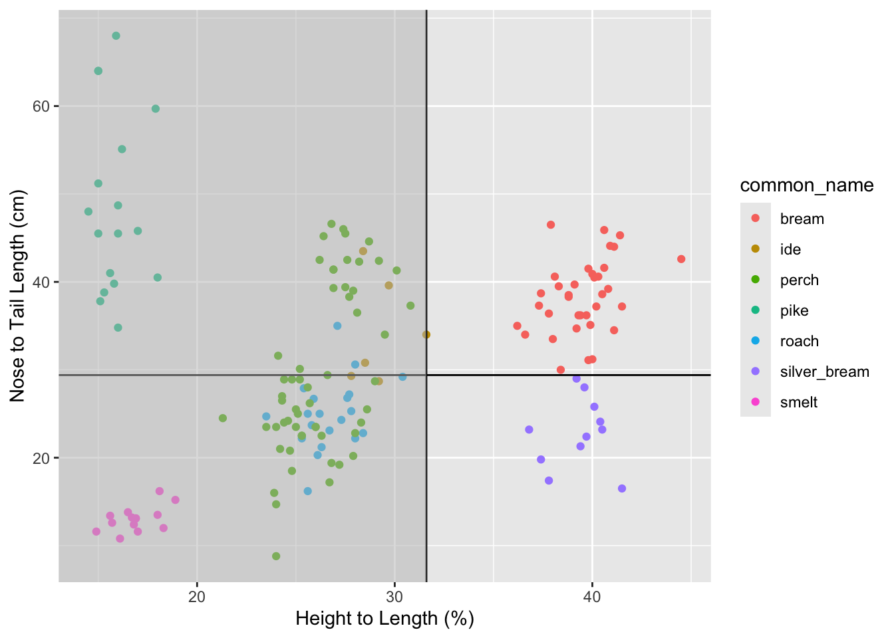
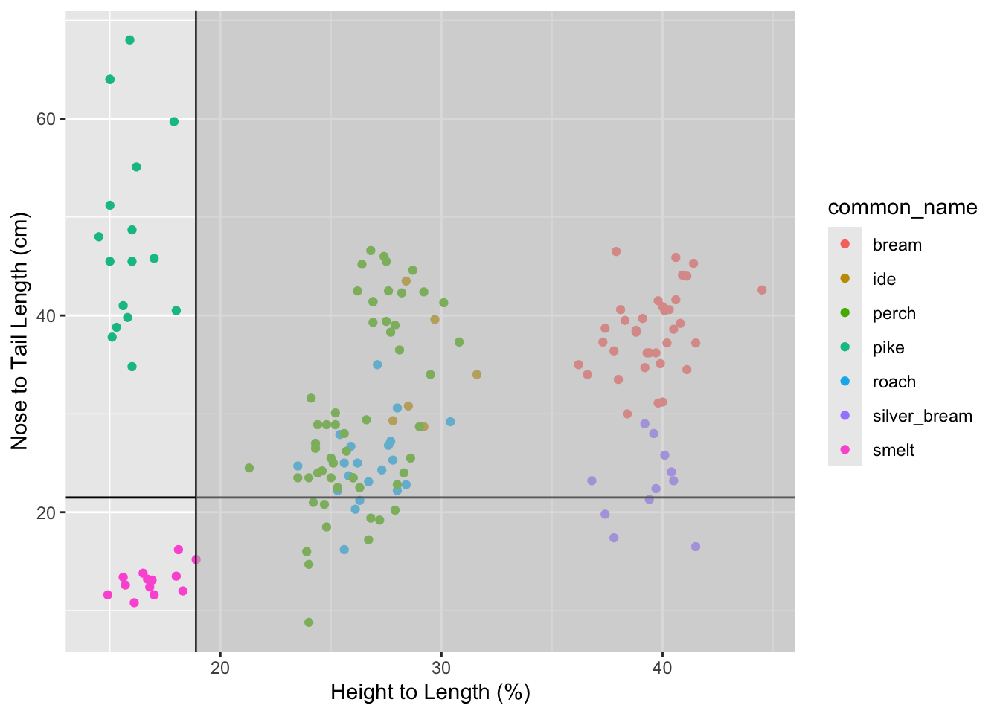

# Classifying with Decision Trees


## Big Idea
Predicting categorical class membership is one of two big areas of machine learning (the other being predicting a continuous response -- e.g., regression). Decision trees make rules that isolate each class in the data. These rules come from partitioning the data over and over to get the purest splits possible. It's a computationally intensive method but its very effective and very appealing and intuitive. And unlike kNN the tree that is produced can help shed light on processes or mechanisms that create the patterns. kNN predicts without producing a model you can inspect. Trees give you an explicit, inspectable model.


## Packages

``` r
library(tidyverse)
```

```
## ── Attaching core tidyverse packages ──────────────────────── tidyverse 2.0.0 ──
## ✔ dplyr     1.1.4     ✔ readr     2.1.6
## ✔ forcats   1.0.1     ✔ stringr   1.6.0
## ✔ ggplot2   4.0.1     ✔ tibble    3.3.1
## ✔ lubridate 1.9.4     ✔ tidyr     1.3.2
## ✔ purrr     1.2.1     
## ── Conflicts ────────────────────────────────────────── tidyverse_conflicts() ──
## ✖ dplyr::filter() masks stats::filter()
## ✖ dplyr::lag()    masks stats::lag()
## ℹ Use the conflicted package (<http://conflicted.r-lib.org/>) to force all conflicts to become errors
```

``` r
library(caret)
```

```
## Loading required package: lattice
## 
## Attaching package: 'caret'
## 
## The following object is masked from 'package:purrr':
## 
##     lift
```

``` r
library(C50)
```

As usual we'll want `tidyverse`[@R-tidyverse] and `caret`[@R-caret] for cross validation. The main function for the classification tree we will be using is in `C50`[@R-C50].

## Reading
Chapter 5: Divide and Conquer -- Classification Using Decision Trees and Rules in Machine Learning with R: Expert techniques for predictive modeling, 3rd Edition.

For this reading focus on pages 125-135. We are going to cover the C5.0 algorithm in this module. You might want to skim the rest but learning this algorithm is good for our purposes here. There are roughly a zillion ways to make decision trees and I want you to get the idea of how they are applied. We will look under the hood at the C5.0 algorithm but not wade through the gory details of the others.

Chapter 10: Decision Trees!!! in The StatQuest Illustrated Guide to Machine Learning!!! Focus on part one.

## Growing and Pruning
You have the idea from the reading that there are two jobs that take place when making a decision tree. First, you grow the tree by partitioning the data according to some splitting algorithm. That's what we will focus on here. The "problem" with these algorithms is that they are very effective at partitioning data and prone to overfitting. That is, they can accurately classify a training data set but make so many fine splits that the data aren't generalizable to testing data. So the trees have to be pruned by some set of rules to make them more generally applicable. Just like a garden or an orchard, you cultivate growth and then have to weed and prune to get what you want.

We will focus mostly on the growing of the trees in this module.

## Entropy and Information Gain
The reading is a blend of nitty gritty details about classification and big picture concepts on how and why trees are useful. There is a lot of ink spent on the ideas of entropy and information gain. For our decision tree splits we are going to make splits on variables that create an orderly partitioning of the data based on entropy and information gain.

I'll be frank here. If you want to hum the details of the splitting and skip to the example at the bottom go ahead. I think working through this is valuable but sometimes you have to know when it's OK to skim and this is one of those times. You can use decision trees and not fully understand the entropy splitting. But it's cool and pretty simple!

With that said...

Entropy is something you've mostly encountered before in terms of the second law of thermodynamics where you might have been taught to think about it as disorder. That's a good metaphor. In terms of information theory, entropy quantifies the amount of knowledge we have about a given set of things. Higher entropy means less certainty about class membership. So for a classification problem like classifying a species of a fish, "knowledge" means how certain we are of what species we would draw at random from the set. Entropy is inversely related to knowledge: the more knowledge we have, the lower the entropy. When we have an equal chance of choosing one species over another (pike vs bream) entropy is high. If we were pretty sure we'd choose pike and not smelt, entropy would be low. With regards to classification, entropy is a measure of purity. [This is a nice YouTube video](https://www.youtube.com/watch?v=9r7FIXEAGvs&feature=emb_logo&ab_channel=LuisSerrano) that walks through the derivation and application of entropy in information theory.

We will use entropy in order to make decisions about which partitions of the data will give us a good classification.  Information gain can determine which variable to split on by measuring how much information a feature (variable) gives us about a class (target). The idea is to reduce the entropy of our original data pool by segmenting it into smaller pools. If we have several variables to choose from, we pick the one that reduces entropy the most and segment (or split) on that one. 

We will walk through these with an example.

## Toy Example
For an example I'll show you some data that looks at whether a wildfire warning was issued based on the sky condition (sunny, overcast, rain) the temperature (hot, mild, cool), the humidity (high, low, normal) and the wind conditions (strong, weak, etc). We are going to try to classify what conditions lead to a fire warning being issued.


```{=html}
<div class="datatables html-widget html-fill-item" id="htmlwidget-86e1fa590078c9cc24ce" style="width:100%;height:auto;"></div>
<script type="application/json" data-for="htmlwidget-86e1fa590078c9cc24ce">{"x":{"filter":"none","vertical":false,"data":[["1","2","3","4","5","6","7","8","9","10","11","12","13","14"],["D01","D02","D03","D04","D05","D06","D07","D08","D09","D10","D11","D12","D13","D14"],["Yes","Yes","Yes","No","Yes","No","Yes","Yes","Yes","No","No","No","No","Yes"],["Sun","Sun","Overcast","Rain","Overcast","Rain","Overcast","Sun","Sun","Rain","Sun","Overcast","Overcast","Overcast"],["Hot","Hot","Hot","Mild","Mild","Cool","Cool","Hot","Hot","Mild","Mild","Mild","Hot","Mild"],["High","Low","Low","High","Low","Normal","Normal","Low","Low","Normal","Low","High","Normal","Low"],["Strong","Strong","Strong","Weak","Strong","Strong","Strong","Strong","Weak","Weak","Strong","Weak","Weak","Strong"]],"container":"<table class=\"display\">\n  <thead>\n    <tr>\n      <th> <\/th>\n      <th>Day<\/th>\n      <th>FireWarning<\/th>\n      <th>SkyCondition<\/th>\n      <th>Temp<\/th>\n      <th>Humidity<\/th>\n      <th>Wind<\/th>\n    <\/tr>\n  <\/thead>\n<\/table>","options":{"pageLength":14,"columnDefs":[{"orderable":false,"targets":0},{"name":" ","targets":0},{"name":"Day","targets":1},{"name":"FireWarning","targets":2},{"name":"SkyCondition","targets":3},{"name":"Temp","targets":4},{"name":"Humidity","targets":5},{"name":"Wind","targets":6}],"order":[],"autoWidth":false,"orderClasses":false,"lengthMenu":[10,14,25,50,100]}},"evals":[],"jsHooks":[]}</script>
```

Do some sorting on various columns and start to build a decision tree in your head. Which variables are the most important do you think?

### Entropy
Let's calculate entropy ($S$) with following the formula:

$$ S = \sum_{i=1}^{c}-p_i \times \log_2(p_i)$$
where $c$ is the number of classes and $p$ is the proportion of cases in class $i$ (e.g., `FireWarning` has two classes: "Yes" and "No").

Looking at the `FireWarning` column we can see that there are 8 instances of "Yes" and 6 instances of "No". Or about 57% "Yes" and 43% "No". This is pretty balanced, so we know going in that the entropy level is high (it'll be near one, right? See Figure 5.6 in the reading).

$$ S = -p_{Yes} \times \log_2(p_{Yes}) - p_{No} \times log_2(p_{No})$$
$$ S = -\frac{8}{14} \times \log_2(\frac{8}{14}) - \frac{6}{14} \times \log_2(\frac{6}{14})$$
Here is how can calculate it "by hand" in R.


``` r
pYes <- 8/14
pNo <- 6/14
-1 * pYes * log2(pYes) - pNo * log2(pNo)
```

```
## [1] 0.9852281
```

Slightly more elegantly with a few variables.


``` r
n <- length(dat$FireWarning)
pYes <- sum(dat$FireWarning=="Yes") / n
pNo <- sum(dat$FireWarning=="No") / n
-1 * pYes * log2(pYes) - pNo * log2(pNo)
```

```
## [1] 0.9852281
```

And here is how we can implement it using tidy syntax for any factor.


``` r
dat %>% count(FireWarning) %>% 
  mutate(prop = n / sum(n)) %>%
  summarise(S = sum(-1 * prop * log2(prop))) %>% pull(S)
```

```
## [1] 0.9852281
```

We are going to be calculating entropy many times with different subsets of the data, so let's make the calculation into a function and still use tidy syntax.


``` r
entropy <- function(data, target) {
  data %>% count( {{target}} ) %>% 
    mutate(prop = n / sum(n)) %>%
    summarise(S = sum(-1 * prop * log2(prop))) %>%  
    pull(S)
}
```

Let's use the function.


``` r
dat %>% entropy(FireWarning)
```

```
## [1] 0.9852281
```

``` r
dat %>% entropy(SkyCondition)
```

```
## [1] 1.530619
```

### Getting to Information Gain
Let's go from entropy to information gain (IG).

Here is the information gain when we look at the change in homogeneity if we split `FireWarning` by the sky condition (`SkyCondition`). This is the change of the original entropy we calculated above for `FireWarning` (0.985) subtracted from the entropy resulting from splitting on `SkyCondition`. The only wrinkle is that we have to weight the entropy by the proportion of the records falling into that position.


``` r
S1 <- dat %>% entropy(FireWarning)
S_by_SkyCondition <- dat %>% group_by(SkyCondition) %>% 
  entropy(FireWarning)
# get weights as proportions
n_SkyCondition <- dat %>% count(across(SkyCondition))  %>% pull(n)
prop_SkyCondition <- n_SkyCondition / sum(n_SkyCondition)
S2 <- sum(prop_SkyCondition*S_by_SkyCondition) 
#compute IG
S1-S2
```

```
## [1] 0.3338413
```

Let's walk through how that is calculated. First we have `S1`. That is the same entropy we calculated above for `FireWarning`. 

$$ S_1 = -\frac{8}{14} \times \log_2(\frac{8}{14}) - \frac{6}{14} \times \log_2(\frac{6}{14}) = 0.985$$
Now to get `S2` we will use the same entropy formula but multiply by some weights when we are done. First, let's look at how `FireWarning` breaks down by `SkyCondition`. Go back up to the table above and sort first by `FireWarning` and then by `SkyCondition`. For overcast conditions there are six days and four have fire warnings. So we would get the entropy for this subset of the data as:


$$ S_{Overcast} = -\frac{4}{6} \times \log_2(\frac{4}{6}) - \frac{2}{6} \times \log_2(\frac{2}{6}) = 0.918$$ 

Rainy days are even easier. There are no fire warnings on the three rainy days so we know that the entropy is zero (look at the formula if you need reassurance!)


$$ S_{Rain} = -\frac{0}{3} \times \log_2(\frac{0}{3}) - \frac{3}{3} \times \log_2(\frac{3}{3}) = 0$$ 
And for sunny days? There are five and four of them have fire warnings.


$$ S_{Sun} = -\frac{4}{5} \times \log_2(\frac{4}{5}) - \frac{1}{5} \times \log_2(\frac{1}{5}) = 0.722$$ 
Take a look at the object `S_by_SkyCondition` that we calculated above and we will see those numbers.


``` r
S_by_SkyCondition
```

```
## [1] 0.7219281 0.9182958 0.0000000
```

Because the denominator in each of those equations differs by the number of observations we have to weight each of those entropy values before we sum them. The weight is the proportion that each one contributes to the whole. There are 14 days and six of them are sunny? The entropy value for sunny days will be weighted by $6/14=0.423$. These weights are in `prop_SkyCondition`.


``` r
prop_SkyCondition
```

```
## [1] 0.3571429 0.4285714 0.2142857
```

The final entropy then for this case is


``` r
sum(prop_SkyCondition * S_by_SkyCondition)
```

```
## [1] 0.6513868
```

and the information gain is the reduction in entropy as $S_1 - S_2$.


``` r
S1-S2
```

```
## [1] 0.3338413
```

### Deciding on a Split
The feature (variable) used for the first split is going to be whichever one maximizes the information gain. Because we are going to have to do this a lot, here is a function to get information gain.


``` r
IG <- function(data,target,feature){
  # parent (target) entropy aka s1
  s1 <- data %>% entropy( {{target}})
  # feature entropy (target entropy by each feature )
  sTmp <- data %>% group_by( {{feature}} ) %>% entropy( {{target}} )
  # number in each feature
  n_feature <- data %>% count(across( {{feature}} ))  %>% pull(n)
  # proportion (frequency) in each feature for weights
  p_feature <- n_feature / sum(n_feature)
  s2 <- sum(p_feature*sTmp)
  #compute IG
  s1-s2
}
```

We can use it for each feature.


``` r
dat %>% IG(target = FireWarning, feature = SkyCondition)
```

```
## [1] 0.3338413
```

``` r
dat %>% IG(target = FireWarning, feature = Temp)
```

```
## [1] 0.1702346
```

``` r
dat %>% IG(target = FireWarning, feature = Humidity)
```

```
## [1] 0.2608203
```

``` r
dat %>% IG(target = FireWarning, feature = Wind)
```

```
## [1] 0.2361223
```

Given this we have our first split on `SkyCondition`. Here is the state of the classification at this point.


``` r
dat %>% group_by(SkyCondition) %>% 
  count(FireWarning)
```

```
## # A tibble: 5 × 3
## # Groups:   SkyCondition [3]
##   SkyCondition FireWarning     n
##   <fct>        <fct>       <int>
## 1 Sun          Yes             4
## 2 Sun          No              1
## 3 Overcast     Yes             4
## 4 Overcast     No              2
## 5 Rain         No              3
```

And a plot.



Note that rain is a pure node. There is no need to keep going down that path. So let's look at how we can split the `Sun` node.


``` r
dat %>% filter(SkyCondition == "Sun") %>% 
  IG(target = FireWarning, feature = Temp)
```

```
## [1] 0.7219281
```

``` r
dat %>% filter(SkyCondition == "Sun") %>% 
  IG(target = FireWarning, feature = Humidity)
```

```
## [1] 0.0729056
```

``` r
dat %>% filter(SkyCondition == "Sun") %>% 
  IG(target = FireWarning, feature = Wind)
```

```
## [1] 0.0729056
```

For the next split, `Temp` has the highest gain.


``` r
dat %>% filter(SkyCondition == "Sun") %>% group_by(Temp) %>% 
  count(FireWarning)
```

```
## # A tibble: 2 × 3
## # Groups:   Temp [2]
##   Temp  FireWarning     n
##   <fct> <fct>       <int>
## 1 Hot   Yes             4
## 2 Mild  No              1
```



For the next split, we'd go to overcast skies.


``` r
dat %>% filter(SkyCondition == "Overcast") %>% 
  IG(target = FireWarning, feature = Temp)
```

```
## [1] 0.1258146
```

``` r
dat %>% filter(SkyCondition == "Overcast") %>% 
  IG(target = FireWarning, feature = Humidity)
```

```
## [1] 0.5849625
```

``` r
dat %>% filter(SkyCondition == "Overcast") %>% 
  IG(target = FireWarning, feature = Wind)
```

```
## [1] 0.9182958
```
Based on the information gain, for overcast skies we'd split on `Wind` next. 


``` r
dat %>% filter(SkyCondition == "Overcast") %>% group_by(Wind) %>% 
  count(FireWarning)
```

```
## # A tibble: 2 × 3
## # Groups:   Wind [2]
##   Wind   FireWarning     n
##   <fct>  <fct>       <int>
## 1 Strong Yes             4
## 2 Weak   No              2
```


And we are done! We now have a perfect classifier. Fire warnings are issued on sunny, hot days and overcast, windy days. That classified our `Yes` data perfectly and the `No` data came out perfectly too. No fire warnings issues on rainy days or overcast days with weak wind. Good job information gain!

This classifier is pretty clearly a way oversimplified example, right? It's perfect and simple and just unambiguous. This never happens with real-world data. There is no need to prune this tree, or think about stopping rules, etc. But what we did above is just what the C5.0 algorithm does when assigning splits. 


### Information Gain Splits on Continuous Data
The data above are all categorical. But we can use information gain for continuous data too. In kind of a sneaky way. The algorithm just bins the continuous data (e.g., using `cut`) to make it categorical and goes from there. It kind of seems like cheating I know! But like we've said before, ML is often clever rather than smart.

## A Real Example

### Go Fish
We classified the fish data from last week. Remember? Let's imagine a world where there was a good reason to classify the species based on variables you could extract from images -- e.g., length, width, height. This is a classic kind of machine learning and big data scenario. Can the machine find patterns in a data cloud that we couldn't determine *a priori*? Can the machine do this in a way that is generalizable to a test data set?


``` r
fish <- read_csv("data/fishcatch.csv")
```

```
## Rows: 159 Columns: 11
## ── Column specification ────────────────────────────────────────────────────────
## Delimiter: ","
## chr (3): std_name, common_name, sex
## dbl (8): weight_g, length_nose2tail_base_cm, length_nose2tail_notch_cm, leng...
## 
## ℹ Use `spec()` to retrieve the full column specification for this data.
## ℹ Specify the column types or set `show_col_types = FALSE` to quiet this message.
```

``` r
fishFiltered <- fish %>% select(-std_name, -weight_g, -sex) %>%
  drop_na() %>%
  mutate(common_name = factor(common_name))
head(fishFiltered)
```

```
## # A tibble: 6 × 8
##   common_name length_nose2tail_base_cm length_nose2tail_notch_cm
##   <fct>                          <dbl>                     <dbl>
## 1 bream                           23.2                      25.4
## 2 bream                           24                        26.3
## 3 bream                           23.9                      26.5
## 4 bream                           26.3                      29  
## 5 bream                           26.5                      29  
## 6 bream                           26.8                      29.7
## # ℹ 5 more variables: length_nose2tail_end_cm <dbl>, height_cm <dbl>,
## #   width_cm <dbl>, height2length_pct <dbl>, width2length_pct <dbl>
```

Before classifying, I'd encourage you to open this up in Rstudio by clicking on it and spend some time sorting and looking at the data. Can you see a way to classifying by species? The last time we fussed with these data we just tried to classify the three most common species. Can you figure out the pattern for all of them?


``` r
library(plotly)
plot_ly(fishFiltered, 
        x = ~length_nose2tail_end_cm,
        y = ~height_cm,
        z = ~width_cm, 
        color = ~common_name) %>%
  add_markers() %>% 
  layout(scene = list(xaxis = list(title = 'Length'),
                      yaxis = list(title = 'Height'),
                      zaxis = list(title = 'Width'))) %>%
  layout(showlegend = FALSE)
```

```{=html}
<div class="plotly html-widget html-fill-item" id="htmlwidget-87ddf903237f1e2c18bb" style="width:672px;height:480px;"></div>
<script type="application/json" data-for="htmlwidget-87ddf903237f1e2c18bb">{"x":{"visdat":{"cf12184cd213":["function () ","plotlyVisDat"]},"cur_data":"cf12184cd213","attrs":{"cf12184cd213":{"x":{},"y":{},"z":{},"color":{},"alpha_stroke":1,"sizes":[10,100],"spans":[1,20],"type":"scatter3d","mode":"markers","inherit":true}},"layout":{"margin":{"b":40,"l":60,"t":25,"r":10},"scene":{"xaxis":{"title":"Length"},"yaxis":{"title":"Height"},"zaxis":{"title":"Width"}},"showlegend":false,"hovermode":"closest"},"source":"A","config":{"modeBarButtonsToAdd":["hoverclosest","hovercompare"],"showSendToCloud":false},"data":[{"x":[30,31.199999999999999,31.100000000000001,33.5,34,34.700000000000003,34.5,35,35.100000000000001,36.200000000000003,36.200000000000003,36.200000000000003,36.399999999999999,37.299999999999997,37.200000000000003,37.200000000000003,38.299999999999997,38.5,38.600000000000001,38.700000000000003,39.5,39.200000000000003,39.700000000000003,40.600000000000001,40.5,40.899999999999999,40.600000000000001,41.5,41.600000000000001,42.600000000000001,44.100000000000001,44,45.299999999999997,45.899999999999999,46.5],"y":[11.5,12.5,12.4,12.699999999999999,12.4,13.6,14.199999999999999,12.699999999999999,14,14.199999999999999,14.300000000000001,14.4,13.800000000000001,13.9,15,15.4,14.9,14.9,15.6,14.5,15.1,16,15.5,15.5,16.199999999999999,16.399999999999999,16.399999999999999,16.5,16.899999999999999,19,18,18.100000000000001,18.800000000000001,18.600000000000001,17.600000000000001],"z":[4,4.2999999999999998,4.7000000000000002,4.5,5.0999999999999996,4.9000000000000004,5.2999999999999998,4.7000000000000002,4.7999999999999998,5,5.0999999999999996,4.7999999999999998,4.4000000000000004,5.0999999999999996,5.2000000000000002,5.5999999999999996,5.2999999999999998,5.2000000000000002,5.0999999999999996,5.7000000000000002,5.5999999999999996,5.4000000000000004,5.2999999999999998,6.0999999999999996,5.5999999999999996,6.0999999999999996,6.0999999999999996,5.9000000000000004,6.2000000000000002,6.5999999999999996,6.2999999999999998,6.2999999999999998,6.7000000000000002,6.7000000000000002,6.4000000000000004],"type":"scatter3d","mode":"markers","name":"bream","marker":{"color":"rgba(102,194,165,1)","line":{"color":"rgba(102,194,165,1)"}},"textfont":{"color":"rgba(102,194,165,1)"},"error_y":{"color":"rgba(102,194,165,1)"},"error_x":{"color":"rgba(102,194,165,1)"},"line":{"color":"rgba(102,194,165,1)"},"frame":null},{"x":[28.699999999999999,29.300000000000001,30.800000000000001,34,39.600000000000001,43.5],"y":[8.4000000000000004,8.0999999999999996,8.8000000000000007,10.699999999999999,11.800000000000001,12.4],"z":[4.2000000000000002,4.2000000000000002,4.7000000000000002,6.5999999999999996,6.5999999999999996,6.5],"type":"scatter3d","mode":"markers","name":"ide","marker":{"color":"rgba(252,141,98,1)","line":{"color":"rgba(252,141,98,1)"}},"textfont":{"color":"rgba(252,141,98,1)"},"error_y":{"color":"rgba(252,141,98,1)"},"error_x":{"color":"rgba(252,141,98,1)"},"line":{"color":"rgba(252,141,98,1)"},"frame":null},{"x":[8.8000000000000007,14.699999999999999,16,17.199999999999999,18.5,19.199999999999999,19.399999999999999,20.199999999999999,20.800000000000001,21,22.5,22.5,22.5,22.800000000000001,23.5,23.5,23.5,23.5,23.5,24,24,24.199999999999999,24.5,25,25.5,25.5,26.199999999999999,26.5,27,28,28.699999999999999,28.899999999999999,28.899999999999999,28.899999999999999,29.399999999999999,30.100000000000001,31.600000000000001,34,36.5,37.299999999999997,39,38.299999999999997,39.399999999999999,39.299999999999997,41.399999999999999,41.399999999999999,41.299999999999997,42.299999999999997,42.5,42.399999999999999,42.5,44.600000000000001,45.200000000000003,45.5,46,46.600000000000001],"y":[2.1000000000000001,3.5,3.7999999999999998,4.5999999999999996,4.5999999999999996,5.2000000000000002,5.2000000000000002,5.5999999999999996,5.0999999999999996,5.0999999999999996,5.7000000000000002,5.9000000000000004,5.7000000000000002,6.4000000000000004,6.0999999999999996,5.5999999999999996,6.0999999999999996,5.9000000000000004,5.5,5.9000000000000004,6.7999999999999998,6,5.2000000000000002,6.2999999999999998,7.2999999999999998,6.4000000000000004,6.7000000000000002,6.4000000000000004,6.5999999999999996,7.2000000000000002,8.3000000000000007,7.2000000000000002,7.0999999999999996,7.2999999999999998,7.7999999999999998,7.5999999999999996,7.5999999999999996,10,10.300000000000001,11.5,10.9,10.6,10.800000000000001,10.6,11.1,11.1,12.4,11.9,11.699999999999999,12.4,11.1,12.800000000000001,11.9,12.5,12.6,12.5],"z":[1.3999999999999999,2,2.3999999999999999,2.6000000000000001,2.8999999999999999,3.2999999999999998,3.1000000000000001,3.1000000000000001,3,2.7999999999999998,3.6000000000000001,3.2999999999999998,3.7000000000000002,3.5,3.3999999999999999,3.5,3.5,3.5,4,3.6000000000000001,3.6000000000000001,3.6000000000000001,3.6000000000000001,3.7000000000000002,3.7000000000000002,3.7999999999999998,4.2000000000000002,3.7000000000000002,4.2000000000000002,4.0999999999999996,5.0999999999999996,4.2999999999999998,4.2999999999999998,4.5999999999999996,4.2000000000000002,4.5999999999999996,4.7999999999999998,6,6.4000000000000004,7.7999999999999998,6.9000000000000004,6.7000000000000002,6.2999999999999998,6.4000000000000004,7.5,6,7.4000000000000004,7.0999999999999996,7.2000000000000002,7.5,6.5999999999999996,6.9000000000000004,7.2999999999999998,7.4000000000000004,8.0999999999999996,7.5999999999999996],"type":"scatter3d","mode":"markers","name":"perch","marker":{"color":"rgba(141,160,203,1)","line":{"color":"rgba(141,160,203,1)"}},"textfont":{"color":"rgba(141,160,203,1)"},"error_y":{"color":"rgba(141,160,203,1)"},"error_x":{"color":"rgba(141,160,203,1)"},"line":{"color":"rgba(141,160,203,1)"},"frame":null},{"x":[34.799999999999997,37.799999999999997,38.799999999999997,39.799999999999997,40.5,41,45.5,45.5,45.799999999999997,48,48.700000000000003,51.200000000000003,55.100000000000001,59.700000000000003,64,64,68],"y":[5.5999999999999996,5.7000000000000002,5.9000000000000004,6.2999999999999998,7.2999999999999998,6.4000000000000004,7.2999999999999998,6.7999999999999998,7.7999999999999998,7,7.7999999999999998,7.7000000000000002,8.9000000000000004,10.699999999999999,9.5999999999999996,9.5999999999999996,10.800000000000001],"z":[3.3999999999999999,4.2000000000000002,4.4000000000000004,4,4.5999999999999996,4,4.2999999999999998,4.5,5.0999999999999996,4.9000000000000004,4.9000000000000004,5.4000000000000004,6.2000000000000002,7,6.0999999999999996,6.0999999999999996,7.5],"type":"scatter3d","mode":"markers","name":"pike","marker":{"color":"rgba(231,138,195,1)","line":{"color":"rgba(231,138,195,1)"}},"textfont":{"color":"rgba(231,138,195,1)"},"error_y":{"color":"rgba(231,138,195,1)"},"error_x":{"color":"rgba(231,138,195,1)"},"line":{"color":"rgba(231,138,195,1)"},"frame":null},{"x":[16.199999999999999,20.300000000000001,21.199999999999999,22.199999999999999,22.199999999999999,22.800000000000001,23.100000000000001,23.699999999999999,24.699999999999999,24.300000000000001,25.300000000000001,25,25,27.199999999999999,26.699999999999999,26.800000000000001,27.899999999999999,29.199999999999999,30.600000000000001,35],"y":[4.0999999999999996,5.2999999999999998,5.5999999999999996,5.5999999999999996,6.2000000000000002,6.5,6.2000000000000002,6.0999999999999996,5.7999999999999998,6.5999999999999996,7,6.5999999999999996,6.4000000000000004,7.5,6.9000000000000004,7.4000000000000004,7.0999999999999996,8.9000000000000004,8.5999999999999996,9.5],"z":[2.2999999999999998,2.7999999999999998,2.8999999999999999,3.2000000000000002,3.6000000000000001,3.3999999999999999,3.3999999999999999,3.2999999999999998,3.7999999999999998,3.5,3.7999999999999998,3.2999999999999998,3.7999999999999998,3.7999999999999998,3.6000000000000001,4.0999999999999996,3.8999999999999999,4.5,4.7999999999999998,5.4000000000000004],"type":"scatter3d","mode":"markers","name":"roach","marker":{"color":"rgba(166,216,84,1)","line":{"color":"rgba(166,216,84,1)"}},"textfont":{"color":"rgba(166,216,84,1)"},"error_y":{"color":"rgba(166,216,84,1)"},"error_x":{"color":"rgba(166,216,84,1)"},"line":{"color":"rgba(166,216,84,1)"},"frame":null},{"x":[16.5,17.399999999999999,19.800000000000001,21.300000000000001,22.399999999999999,23.199999999999999,23.199999999999999,24.100000000000001,25.800000000000001,28,29],"y":[6.7999999999999998,6.5999999999999996,7.4000000000000004,8.4000000000000004,8.9000000000000004,8.5,9.4000000000000004,9.6999999999999993,10.300000000000001,11.1,11.4],"z":[2.2999999999999998,2.2999999999999998,2.7000000000000002,2.8999999999999999,3.2999999999999998,3.2999999999999998,3.3999999999999999,3.2000000000000002,3.7000000000000002,4.0999999999999996,4.2000000000000002],"type":"scatter3d","mode":"markers","name":"silver_bream","marker":{"color":"rgba(255,217,47,1)","line":{"color":"rgba(255,217,47,1)"}},"textfont":{"color":"rgba(255,217,47,1)"},"error_y":{"color":"rgba(255,217,47,1)"},"error_x":{"color":"rgba(255,217,47,1)"},"line":{"color":"rgba(255,217,47,1)"},"frame":null},{"x":[10.800000000000001,11.6,11.6,12,12.4,12.6,13.1,13.1,13.199999999999999,13.4,13.5,13.800000000000001,15.199999999999999,16.199999999999999],"y":[1.7,2,1.7,2.2000000000000002,2.1000000000000001,2,2.2000000000000002,2.2000000000000002,2.2000000000000002,2.1000000000000001,2.3999999999999999,2.2999999999999998,2.8999999999999999,2.8999999999999999],"z":[1,1.2,1.1000000000000001,1.3999999999999999,1.3,1.3,1.3,1.2,1.1000000000000001,1.3999999999999999,1.3,1.3,2.1000000000000001,1.8999999999999999],"type":"scatter3d","mode":"markers","name":"smelt","marker":{"color":"rgba(229,196,148,1)","line":{"color":"rgba(229,196,148,1)"}},"textfont":{"color":"rgba(229,196,148,1)"},"error_y":{"color":"rgba(229,196,148,1)"},"error_x":{"color":"rgba(229,196,148,1)"},"line":{"color":"rgba(229,196,148,1)"},"frame":null}],"highlight":{"on":"plotly_click","persistent":false,"dynamic":false,"selectize":false,"opacityDim":0.20000000000000001,"selected":{"opacity":1},"debounce":0},"shinyEvents":["plotly_hover","plotly_click","plotly_selected","plotly_relayout","plotly_brushed","plotly_brushing","plotly_clickannotation","plotly_doubleclick","plotly_deselect","plotly_afterplot","plotly_sunburstclick"],"base_url":"https://plot.ly"},"evals":[],"jsHooks":[]}</script>
```


### Fish Finder
In `fishFiltered' we have seven species to predict and seven variables that we can measure non-invasively. Can we predict the species from these (often highly correlated) variables?

Note that the predictor variables are continuous, so the algorithm will have to bin them all in a clever way.


``` r
treeModel <- C5.0(common_name~., data=fishFiltered)
summary(treeModel) 
```

```
## 
## Call:
## C5.0.formula(formula = common_name ~ ., data = fishFiltered)
## 
## 
## C5.0 [Release 2.07 GPL Edition]  	Fri Mar  6 11:41:37 2026
## -------------------------------
## 
## Class specified by attribute `outcome'
## 
## Read 159 cases (8 attributes) from undefined.data
## 
## Decision tree:
## 
## height2length_pct > 31.6:
## :...length_nose2tail_end_cm <= 29.4: silver_bream (11)
## :   length_nose2tail_end_cm > 29.4: bream (35)
## height2length_pct <= 31.6:
## :...height2length_pct <= 18.9:
##     :...length_nose2tail_base_cm <= 21.5: smelt (14)
##     :   length_nose2tail_base_cm > 21.5: pike (17)
##     height2length_pct > 18.9:
##     :...width_cm > 4.1:
##         :...height2length_pct <= 27.7: perch (20/1)
##         :   height2length_pct > 27.7:
##         :   :...width_cm <= 4.9:
##         :       :...width2length_pct <= 15.2: ide (3)
##         :       :   width2length_pct > 15.2: roach (2)
##         :       width_cm > 4.9:
##         :       :...width_cm > 6.7: perch (6)
##         :           width_cm <= 6.7:
##         :           :...height_cm <= 10.3: perch (3)
##         :               height_cm > 10.3: ide (3)
##         width_cm <= 4.1:
##         :...height2length_pct <= 25.2: perch (16/1)
##             height2length_pct > 25.2:
##             :...width2length_pct <= 14.3: roach (9)
##                 width2length_pct > 14.3:
##                 :...height_cm <= 6.1: perch (9)
##                     height_cm > 6.1:
##                     :...length_nose2tail_notch_cm > 23.5: perch (2)
##                         length_nose2tail_notch_cm <= 23.5:
##                         :...height2length_pct <= 27.9: roach (5)
##                             height2length_pct > 27.9:
##                             :...length_nose2tail_base_cm <= 19.1: roach (2)
##                                 length_nose2tail_base_cm > 19.1: perch (2)
## 
## 
## Evaluation on training data (159 cases):
## 
## 	    Decision Tree   
## 	  ----------------  
## 	  Size      Errors  
## 
## 	    17    2( 1.3%)   <<
## 
## 
## 	   (a)   (b)   (c)   (d)   (e)   (f)   (g)    <-classified as
## 	  ----  ----  ----  ----  ----  ----  ----
## 	    35                                        (a): class bream
## 	           6                                  (b): class ide
## 	                56                            (c): class perch
## 	                      17                      (d): class pike
## 	                 2          18                (e): class roach
## 	                                  11          (f): class silver_bream
## 	                                        14    (g): class smelt
## 
## 
## 	Attribute usage:
## 
## 	100.00%	height2length_pct
## 	 51.57%	width_cm
## 	 28.93%	length_nose2tail_end_cm
## 	 22.01%	length_nose2tail_base_cm
## 	 21.38%	width2length_pct
## 	 16.35%	height_cm
## 	  6.92%	length_nose2tail_notch_cm
## 
## 
## Time: 0.0 secs
```

Wow. The algorithm did a fantastic job. The accuracy is very good, as is the confusion matrix. Note how the tree split off the two bream species right away using  the height to length ratio (bream are pretty tall relative to their length I guess) and then separated the silver bream from the common bream by the total length variable. Let's visualize this first and second split in the tree.

Also, this is important, unlike kNN we see which variables are useful here which gives us understanding of the system. It's not a blind classifier.


``` r
ggplot() +
  geom_point(data=fishFiltered,
             mapping = aes(x=height2length_pct,
                           y=length_nose2tail_end_cm,
                           color=common_name)) +
  geom_vline(xintercept=31.6) + geom_hline(yintercept=29.4) + 
  annotate("rect", xmin = -Inf, xmax = 31.6, ymin = -Inf, ymax = Inf,
           alpha = 0.5,fill = "grey") +
  labs(x="Height to Length (%)",y="Nose to Tail Length (cm)")
```



That does an admirable job of pulling out the two bream species. The next split continues along these lines deftly separating smelt from pike.


``` r
ggplot() +
  geom_point(data=fishFiltered,
             mapping = aes(x=height2length_pct,
                           y=length_nose2tail_end_cm,
                           color=common_name)) +
  geom_vline(xintercept=18.9) + geom_hline(yintercept=21.5) + 
  annotate("rect", xmin = 18.9, xmax = Inf, ymin = -Inf, ymax = Inf,
           alpha = 0.5,fill = "grey") +
  labs(x="Height to Length (%)",y="Nose to Tail Length (cm)")
```


After that? The mess in the middle requires a different approach trying to pull apart species with a `height2length_pct` more than 18.9 and  less than 31.6. The tree gets pretty deep. Is it overfit? 

### Visualizing the Tree
The plotting support for `C5.0` is not great. You can use the default plot option but it's a little clunky. The code is below for the whole tree and then a subtree but I'm not including them here because they are too big and ugly. Run them if you like.


``` r
## Not shown
plot(treeModel)
plot(treeModel,subtree = 2)
```

There are some amazing visualizations out there for decision trees. E.g., [visNetwork](https://datastorm-open.github.io/visNetwork/) and [collapsibleTree](https://adeelk93.github.io/collapsibleTree/) but none of those packages use the `C5.0` objects natively. I could figure out how to coerce it all if I spent some time on it but I haven't gotten around to it yet. When we start using `rpart` in the next module I'll show you some cool visualizations.

### Train and Test
Let's apply a training and testing data set to see how well the model works on an independent data set.


``` r
n <- nrow(fishFiltered)
rows2test <- sample(n,0.3*n)
testing <- fishFiltered[rows2test,]
training <- fishFiltered[-rows2test,]

treeModel <- C5.0(common_name~.,data=training)

fits <- predict(treeModel,testing)
confusionMatrix(fits,testing$common_name)
```

```
## Confusion Matrix and Statistics
## 
##               Reference
## Prediction     bream ide perch pike roach silver_bream smelt
##   bream           11   0     0    0     0            0     0
##   ide              0   0     0    0     0            0     0
##   perch            0   2    12    0     4            0     0
##   pike             0   0     0    6     0            0     0
##   roach            0   1     2    0     3            0     0
##   silver_bream     1   0     0    0     0            1     0
##   smelt            0   0     0    0     0            0     4
## 
## Overall Statistics
##                                          
##                Accuracy : 0.7872         
##                  95% CI : (0.6434, 0.893)
##     No Information Rate : 0.2979         
##     P-Value [Acc > NIR] : 5.862e-12      
##                                          
##                   Kappa : 0.7282         
##                                          
##  Mcnemar's Test P-Value : NA             
## 
## Statistics by Class:
## 
##                      Class: bream Class: ide Class: perch Class: pike
## Sensitivity                0.9167    0.00000       0.8571      1.0000
## Specificity                1.0000    1.00000       0.8182      1.0000
## Pos Pred Value             1.0000        NaN       0.6667      1.0000
## Neg Pred Value             0.9722    0.93617       0.9310      1.0000
## Prevalence                 0.2553    0.06383       0.2979      0.1277
## Detection Rate             0.2340    0.00000       0.2553      0.1277
## Detection Prevalence       0.2340    0.00000       0.3830      0.1277
## Balanced Accuracy          0.9583    0.50000       0.8377      1.0000
##                      Class: roach Class: silver_bream Class: smelt
## Sensitivity               0.42857             1.00000      1.00000
## Specificity               0.92500             0.97826      1.00000
## Pos Pred Value            0.50000             0.50000      1.00000
## Neg Pred Value            0.90244             1.00000      1.00000
## Prevalence                0.14894             0.02128      0.08511
## Detection Rate            0.06383             0.02128      0.08511
## Detection Prevalence      0.12766             0.04255      0.08511
## Balanced Accuracy         0.67679             0.98913      1.00000
```

How did this algorithm do with a testing sample? There are a few more wrinkles but quite well overall. Let's look at it.

In this confusion matrix, the overall accuracy is about 79%, which is far higher than the No Information Rate (NIR) of roughly 30%, indicating that the model is doing substantially better than always predicting the most common species (perch). The Kappa value (~0.73) supports this, showing strong agreement beyond chance despite class imbalance. However, class-level performance varies widely. Some species, such as pike and smelt, are classified perfectly in this test set, while others show clear problems. In particular, the model never predicts ide at all, giving a sensitivity of 0 for that class despite nonzero prevalence, and roach also has low sensitivity with many misclassified as perch or ide. Specificity is high for nearly all classes, meaning the model is generally good at ruling out species, but this comes at the cost of missing certain classes entirely. It is also important to remember that this matrix comes from a single train/test split; a truly cross-validated model would provide a more reliable picture of performance and class-specific uncertainty across many resampled splits.

## Your Work

Let's get some new data. This is a subset of the mushroom data found at the [UCI Machine Learning Repository](https://archive.ics.uci.edu/ml/datasets/mushroom). I've cleaned it up and made the labels more readable. Go ahead and read it in and look at it a bit.


``` r
mushrooms <- read_csv("data/mushroomsClean.csv")
mushrooms <- mushrooms %>% mutate(across(where(is_character),as_factor))
head(mushrooms)
```

```
## # A tibble: 6 × 21
##   toxicity cap_shape cap_surface cap_color bruises gill_attach gill_spacing
##   <fct>    <fct>     <fct>       <fct>     <fct>   <fct>       <fct>       
## 1 poison   convex    smooth      brown     yes     free        close       
## 2 edible   convex    smooth      yellow    yes     free        close       
## 3 edible   sunken    smooth      white     yes     free        close       
## 4 poison   convex    scaly       white     yes     free        close       
## 5 edible   convex    smooth      gray      no      free        crowded     
## 6 edible   convex    scaly       yellow    yes     free        close       
## # ℹ 14 more variables: gill_size <fct>, gill_color <fct>, stalk_shape <fct>,
## #   stalk_root <fct>, stalk_surface_above <fct>, stalk_surface_below <fct>,
## #   stalk_color_above <fct>, stalk_color_below <fct>, veil_color <fct>,
## #   ring_number <fct>, ring_type <fct>, spore_print_color <fct>,
## #   population <fct>, habitat <fct>
```

Can you predict whether or not a mushroom is edible using the C5.0 algorithm? You can throw the kitchen sink at it with something like `toxicity~.` or build a model with variables you think would be best. Importantly, would you eat a mushroom it classifies as edible? The cost of confusing a smelt for a pike seems small. How can you judge the cost of making a mistake here? You can try to fuss with the `costs` argument if you want.

In the example above with the fish, we saw how we can understand the system a bit. E.g., we can get an idea about how different fish have different shapes that relate to ways of making a living. But the mushroom covariates are all pretty opaque to me. What does gill spacing or the number of rings "mean"? In ML problems are often solved without understanding mechanism. That's unsatisfying but if it works, does it matter?     

Make sure you do some testing and training. You can go full cross validation with `caret` of course but that is up to you. I'm going to save the discussion around boosting and the growing of "random forests" for the second to last module on meta learning. We will get there, don't you worry.


