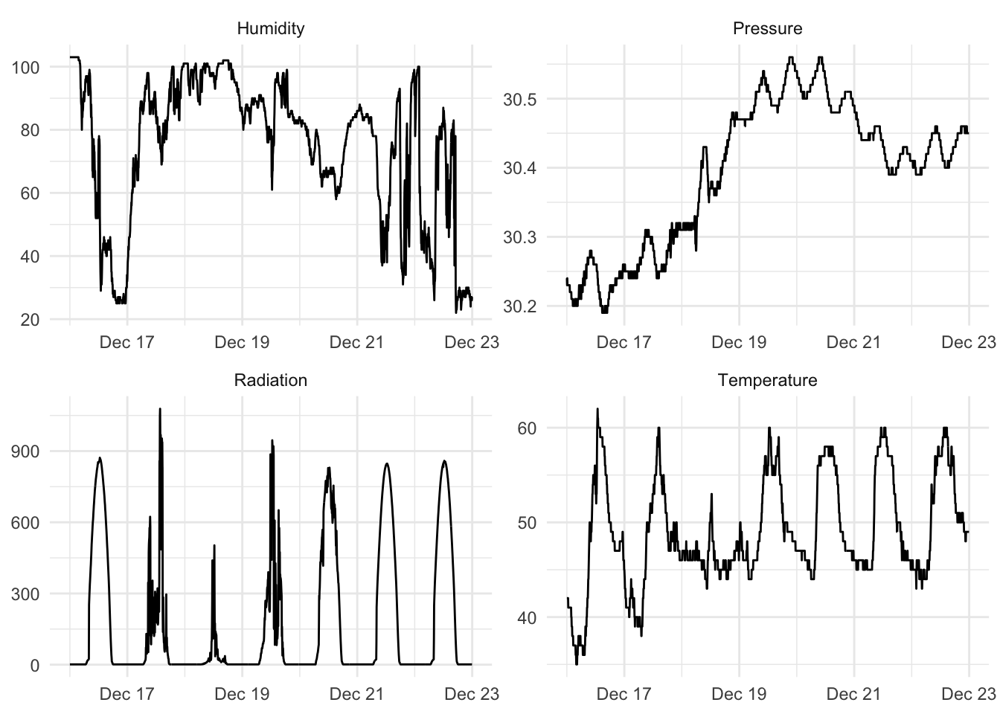
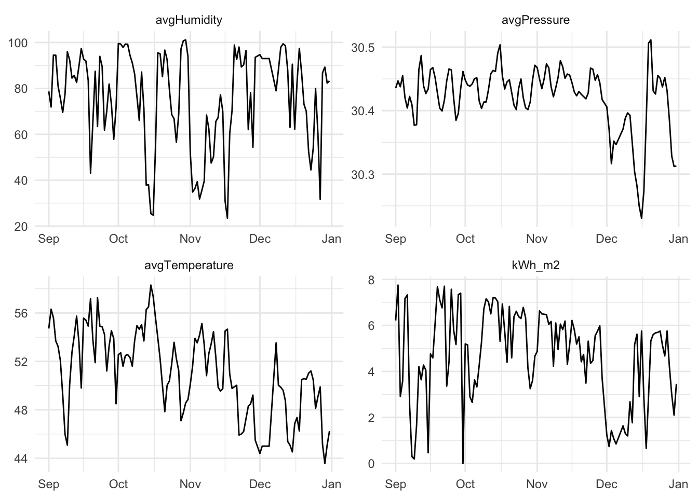
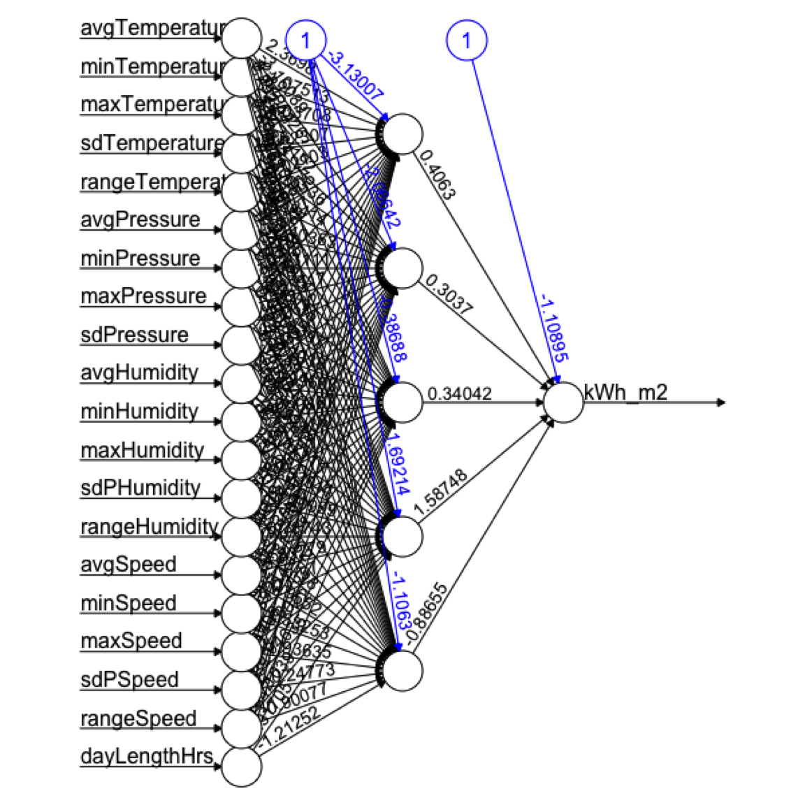

# Neural Nets


## Big Idea
There are algorithms for doing prediction that are often called "[black boxes](https://en.wikipedia.org/wiki/Black_box)." This means that the input data go in one side and predictions come out of the other side and the analyst doesn't know what happened inside of the box. Neural networks are one of the classic black-box algorithms. They are harder (but not impossible) to understand compared to the other methods we've been using but can have tremendous prediction skill and as such are used widely.

## Packages

``` r
library(tidyverse)
```

```
## ── Attaching core tidyverse packages ──────────────────────── tidyverse 2.0.0 ──
## ✔ dplyr     1.1.4     ✔ readr     2.1.6
## ✔ forcats   1.0.1     ✔ stringr   1.6.0
## ✔ ggplot2   4.0.1     ✔ tibble    3.3.1
## ✔ lubridate 1.9.4     ✔ tidyr     1.3.2
## ✔ purrr     1.2.1     
## ── Conflicts ────────────────────────────────────────── tidyverse_conflicts() ──
## ✖ dplyr::filter() masks stats::filter()
## ✖ dplyr::lag()    masks stats::lag()
## ℹ Use the conflicted package (<http://conflicted.r-lib.org/>) to force all conflicts to become errors
```

``` r
library(caret)
```

```
## Loading required package: lattice
## 
## Attaching package: 'caret'
## 
## The following object is masked from 'package:purrr':
## 
##     lift
```

``` r
library(neuralnet)
```

```
## 
## Attaching package: 'neuralnet'
## 
## The following object is masked from 'package:dplyr':
## 
##     compute
```

``` r
library(rpart)
library(visNetwork)
library(sparkline) # visNetwork might need this loaded
```

As usual we'll want `tidyverse`[@R-tidyverse] and `caret`[@R-caret] for cross validation. The main function for the NN we will be using is in `neuralnet`[@R-neuralnet]. We'll use`rpart`[@R-rpart] and do some visualization in `visNetwork`[@R-visNetwork] and `sparkline`[@R-sparkline].

## Reading
Chapter 7: Black Box Methods -- Neural Networks and Support Vector Machines in Machine Learning with R: Expert techniques for predictive modeling, 3rd Edition. Link on Canvas.

We are just going to cover neural networks in this module. So you can read the first half of the chapter. I'll let you tackle SVM on your own.

Chapter 12: Neural Networks!!! in The StatQuest Illustrated Guide to Machine Learning!!!

## Punting
Do you, dear reader, have the brain power to understand what happens in a neural network? Yes. Absolutely. Is it worth us spending the hours needed to cover all we'd need to cover to make the black box a transparent box? No. Should we split the difference and spend hours with the initial steps of the math and still not really understand the process anyways? I don't think so. So what do we do? I think we read the text, look at a few videos, and use neural networks carefully. 


First,  [this silly five minute video](https://www.youtube.com/watch?v=bfmFfD2RIcg&ab_channel=Simplilearn) is pretty good with the idea of building a network and then using front propagation and back propagation to tune the network. That's all in the first four minutes actually. 

Second, do the reading and don't just jump to the example. It's pretty straight forward and at a good level for our purposes.

Third, the most in depth thing I think you should look at is the [StatQuest video](https://www.youtube.com/watch?v=CqOfi41LfDw&ab_channel=StatQuestwithJoshStarmer) (also linked from Canvas). I think it is worth watching all the way through to give you an idea of the architecture of a neural network. That's just the first of four videos -- I watched them all and they are excellent but might be more than you want to tackle. I definitely agree with the StatQuest guy. I like "Big Fancy Squiggle Fitting Machines" as a name more than "Neural Networks."

## Example: Here Comes the Sun
Let's go ahead and implement a neural network using `neuralnet` and do so using some data on solar radiation (sunlight) and weather. 

Here is the scenario: You are also considering putting solar panels on your house and wondering what kind of power you might get out of them. You have a weather station in your yard that has been collecting data every five minutes on sunlight, temperature, wind, etc. for the past four months. You figure you can use that as test data to model what kind of power output you might get from your new solar panels. 

Here are the data. The units, in case you are curious are watts per square meter for Radiation, Temperature is in degrees Fahrenheit, Humidity is in percent, Barometric pressure is in inches of Hg, and Wind speed is in miles per hour.


``` r
solar <- readRDS("data/solarPrediction.rds")
```

Ok. This is only four months of data but it's still a lot with observations every five minutes. Let's look at a random week.


``` r
aWeek <- solar %>% 
  filter(DateTime > ymd("2016-12-16") & DateTime < ymd("2016-12-23"))

aWeekLong <- aWeek %>% select(DateTime,Radiation,
                              Temperature,Humidity,
                              Pressure) %>%
  pivot_longer(cols = -DateTime)
ggplot(aWeekLong, aes(x=DateTime,y=value)) + geom_line() +
  facet_wrap(~name,scales="free",ncol = 2) +
  labs(x=element_blank(),y=element_blank()) +
  theme_minimal()
```

```
## Warning: `label` cannot be a <ggplot2::element_blank> object.
## `label` cannot be a <ggplot2::element_blank> object.
```



Ok. If you wanted to know if your solar array would be able to power your home, you'd be able to model radiation with weather data. You could look at historical weather info to then decide how big your array should be. And you could look at weather forecasts for the week to figure out if you could invite people over to charge their Tesla Trucks.

But, let's clean up the data some. There is too much for us to use in class. We can convert the data to daily resolution. When we do that, we can change the radiation from W/m$^2$/5 min to something marginally more useful like kWh/m$^2$/day. We can then take the fine-scale weather data and calculate all kinds of summary statistics. E.g., min daily temperature, the range of daily wind speeds, the standard deviation of pressure. Because neural nets are pretty resilient to correlated predictors and because I'm not sure what variables are going to be important I'm just going to throw a bunch of variables at the problem. This makes the scientist in me a little squeamish but if I just want a good prediction...

Here we go.


``` r
solarDay <- solar %>% 
  group_by(Date = date(DateTime)) %>% 
  summarise(kWh_m2 = sum(Radiation * 60 * 5) * 2.77778e-7,
            avgTemperature = mean(Temperature),
            minTemperature = min(Temperature),
            maxTemperature = max(Temperature),
            sdTemperature = sd(Temperature),
            rangeTemperature = maxTemperature-minTemperature,
            avgPressure = mean(Pressure),
            minPressure = min(Pressure),
            maxPressure = max(Pressure),
            sdPressure = sd(Pressure),
            rangePressure = maxPressure-minPressure,
            avgHumidity = mean(Humidity),
            minHumidity = min(Humidity),
            maxHumidity = max(Humidity),
            sdPHumidity = sd(Humidity),
            rangeHumidity = maxHumidity-minHumidity,
            avgSpeed = mean(Speed),
            minSpeed = min(Speed),
            maxSpeed = max(Speed),
            sdPSpeed = sd(Speed),
            rangeSpeed = maxSpeed-minSpeed,
            dayLengthHrs = as.numeric(((max(TimeSunSet)-min(TimeSunRise))/60/60)))
```

That's a silly number of predictors. But let's look at a few.


``` r
# make a few variables long for plotting
solarDayLong <- solarDay %>% 
  select(Date,kWh_m2,
         avgTemperature,avgHumidity,
         avgPressure) %>%
  pivot_longer(cols = -Date)

ggplot(solarDayLong, aes(x=Date,y=value)) + geom_line() +
  facet_wrap(~name,scales="free",ncol = 2) +
  labs(x=NULL,y=NULL) +
  theme_minimal()
```



## Train and Test
We start our model building, as usual, with a data split. I'm going to ask you to do a full cross validation with `caret` later but let's start small.


``` r
# Set the seed for reproducibility
set.seed(5321) 

# We won't need the date for prediction. 
solarDay$Date <- NULL

# Make the splits
rows2test <- sample(nrow(solarDay),nrow(solarDay)*0.3)
testing <- solarDay[rows2test,]
training <- solarDay[-rows2test,]
```

## Regression Tree
Before we go nuts with the black box, let's look at a regression tree and see how it does with these data. This does give us an idea of what variables are important.


``` r
rp1 <- rpart(formula = kWh_m2~.,
             data = training)
visTree(rp1)
```

```{=html}
<div id="htmlwidget-301bc9f7f02cb3b1d782" style="width:100%;height:600px;" class="visNetwork html-widget"></div>
<script type="application/json" data-for="htmlwidget-301bc9f7f02cb3b1d782">{"x":{"nodes":{"id":[1,2,4,5,10,11,22,23,3,6,7,14,15],"label":["avgHumidity","minPressure","2.029","avgSpeed","3.229","maxTemperature","4.089","5.301","avgTemperature","5.216","dayLengthHrs","6.14","7.183"],"level":[1,2,3,3,4,4,5,5,2,3,3,4,4],"color":["#F1B8C2","#E1C1A1","#E6E0F8","#BECC9B","#D0ACE7","#96D4B5","#C088DB","#AA54CA","#8DD2D8","#AC57CC","#B4C7ED","#9B30BF","#8904B1"],"value":[84,48,17,31,7,24,11,13,36,16,20,10,10],"shape":["dot","dot","square","dot","square","dot","square","square","dot","square","dot","square","square"],"title":["<div style=\"text-align:center;\">N : <b>100%<\/b> (84)<br>Complexity : <b>0.399<\/b><br>Mean : <b>4.615<\/b><br>Variance : <b>3.747<\/b><\/div>","<div style=\"text-align:center;\">N : <b>57.1%<\/b> (48)<br>Complexity : <b>0.199<\/b><br>Mean : <b>3.562<\/b><br>Variance : <b>3.168<\/b><hr class = \"rPartvisNetwork\">\n<div class =\"showOnMe2\"><div style=\"text-align:center;\"><U style=\"color:blue;\"  onmouseover=\"this.style.cursor='pointer';\" onmouseout=\"this.style.cursor='default';\">Rules<\/U><\/div>\n<div class=\"showMeRpartTTp2\" style=\"display:none;\">\n<b> avgHumidity <\/b> >= 76.933<\/script><script type=\"text/javascript\">$(document).ready(function(){\n$(\".showOnMe2\").click(function(){\n$(\".showMeRpartTTp2\").toggle();\n$.sparkline_display_visible();\n});\n  });<\/script><\/div><\/div>\n\n<\/div>","<div style=\"text-align:center;\">N : <b>20.2%<\/b> (17)<br>Complexity : <b>0.01<\/b><br>Mean : <b>2.029<\/b><br>Variance : <b>1.855<\/b><hr class = \"rPartvisNetwork\">\n<div class =\"showOnMe2\"><div style=\"text-align:center;\"><U style=\"color:blue;\"  onmouseover=\"this.style.cursor='pointer';\" onmouseout=\"this.style.cursor='default';\">Rules<\/U><\/div>\n<div class=\"showMeRpartTTp2\" style=\"display:none;\">\n<b> avgHumidity <\/b> >= 76.933<br><b> minPressure <\/b> < 30.365<\/script><script type=\"text/javascript\">$(document).ready(function(){\n$(\".showOnMe2\").click(function(){\n$(\".showMeRpartTTp2\").toggle();\n$.sparkline_display_visible();\n});\n  });<\/script><\/div><\/div>\n\n<\/div>","<div style=\"text-align:center;\">N : <b>36.9%<\/b> (31)<br>Complexity : <b>0.04<\/b><br>Mean : <b>4.403<\/b><br>Variance : <b>1.912<\/b><hr class = \"rPartvisNetwork\">\n<div class =\"showOnMe2\"><div style=\"text-align:center;\"><U style=\"color:blue;\"  onmouseover=\"this.style.cursor='pointer';\" onmouseout=\"this.style.cursor='default';\">Rules<\/U><\/div>\n<div class=\"showMeRpartTTp2\" style=\"display:none;\">\n<b> avgHumidity <\/b> >= 76.933<br><b> minPressure <\/b> >= 30.365<\/script><script type=\"text/javascript\">$(document).ready(function(){\n$(\".showOnMe2\").click(function(){\n$(\".showMeRpartTTp2\").toggle();\n$.sparkline_display_visible();\n});\n  });<\/script><\/div><\/div>\n\n<\/div>","<div style=\"text-align:center;\">N : <b>8.3%<\/b> (7)<br>Complexity : <b>0.01<\/b><br>Mean : <b>3.229<\/b><br>Variance : <b>2.329<\/b><hr class = \"rPartvisNetwork\">\n<div class =\"showOnMe2\"><div style=\"text-align:center;\"><U style=\"color:blue;\"  onmouseover=\"this.style.cursor='pointer';\" onmouseout=\"this.style.cursor='default';\">Rules<\/U><\/div>\n<div class=\"showMeRpartTTp2\" style=\"display:none;\">\n<b> avgHumidity <\/b> >= 76.933<br><b> minPressure <\/b> >= 30.365<br><b> avgSpeed <\/b> < 5.03<\/script><script type=\"text/javascript\">$(document).ready(function(){\n$(\".showOnMe2\").click(function(){\n$(\".showMeRpartTTp2\").toggle();\n$.sparkline_display_visible();\n});\n  });<\/script><\/div><\/div>\n\n<\/div>","<div style=\"text-align:center;\">N : <b>28.6%<\/b> (24)<br>Complexity : <b>0.028<\/b><br>Mean : <b>4.745<\/b><br>Variance : <b>1.345<\/b><hr class = \"rPartvisNetwork\">\n<div class =\"showOnMe2\"><div style=\"text-align:center;\"><U style=\"color:blue;\"  onmouseover=\"this.style.cursor='pointer';\" onmouseout=\"this.style.cursor='default';\">Rules<\/U><\/div>\n<div class=\"showMeRpartTTp2\" style=\"display:none;\">\n<b> avgHumidity <\/b> >= 76.933<br><b> minPressure <\/b> >= 30.365<br><b> avgSpeed <\/b> >= 5.03<\/script><script type=\"text/javascript\">$(document).ready(function(){\n$(\".showOnMe2\").click(function(){\n$(\".showMeRpartTTp2\").toggle();\n$.sparkline_display_visible();\n});\n  });<\/script><\/div><\/div>\n\n<\/div>","<div style=\"text-align:center;\">N : <b>13.1%<\/b> (11)<br>Complexity : <b>0.01<\/b><br>Mean : <b>4.089<\/b><br>Variance : <b>0.594<\/b><hr class = \"rPartvisNetwork\">\n<div class =\"showOnMe2\"><div style=\"text-align:center;\"><U style=\"color:blue;\"  onmouseover=\"this.style.cursor='pointer';\" onmouseout=\"this.style.cursor='default';\">Rules<\/U><\/div>\n<div class=\"showMeRpartTTp2\" style=\"display:none;\">\n<b> avgHumidity <\/b> >= 76.933<br><b> minPressure <\/b> >= 30.365<br><b> avgSpeed <\/b> >= 5.03<br><b> maxTemperature <\/b> < 57<\/script><script type=\"text/javascript\">$(document).ready(function(){\n$(\".showOnMe2\").click(function(){\n$(\".showMeRpartTTp2\").toggle();\n$.sparkline_display_visible();\n});\n  });<\/script><\/div><\/div>\n\n<\/div>","<div style=\"text-align:center;\">N : <b>15.5%<\/b> (13)<br>Complexity : <b>0.01<\/b><br>Mean : <b>5.301<\/b><br>Variance : <b>1.354<\/b><hr class = \"rPartvisNetwork\">\n<div class =\"showOnMe2\"><div style=\"text-align:center;\"><U style=\"color:blue;\"  onmouseover=\"this.style.cursor='pointer';\" onmouseout=\"this.style.cursor='default';\">Rules<\/U><\/div>\n<div class=\"showMeRpartTTp2\" style=\"display:none;\">\n<b> avgHumidity <\/b> >= 76.933<br><b> minPressure <\/b> >= 30.365<br><b> avgSpeed <\/b> >= 5.03<br><b> maxTemperature <\/b> >= 57<\/script><script type=\"text/javascript\">$(document).ready(function(){\n$(\".showOnMe2\").click(function(){\n$(\".showMeRpartTTp2\").toggle();\n$.sparkline_display_visible();\n});\n  });<\/script><\/div><\/div>\n\n<\/div>","<div style=\"text-align:center;\">N : <b>42.9%<\/b> (36)<br>Complexity : <b>0.06<\/b><br>Mean : <b>6.019<\/b><br>Variance : <b>1.082<\/b><hr class = \"rPartvisNetwork\">\n<div class =\"showOnMe2\"><div style=\"text-align:center;\"><U style=\"color:blue;\"  onmouseover=\"this.style.cursor='pointer';\" onmouseout=\"this.style.cursor='default';\">Rules<\/U><\/div>\n<div class=\"showMeRpartTTp2\" style=\"display:none;\">\n<b> avgHumidity <\/b> < 76.933<\/script><script type=\"text/javascript\">$(document).ready(function(){\n$(\".showOnMe2\").click(function(){\n$(\".showMeRpartTTp2\").toggle();\n$.sparkline_display_visible();\n});\n  });<\/script><\/div><\/div>\n\n<\/div>","<div style=\"text-align:center;\">N : <b>19%<\/b> (16)<br>Complexity : <b>0.01<\/b><br>Mean : <b>5.216<\/b><br>Variance : <b>0.733<\/b><hr class = \"rPartvisNetwork\">\n<div class =\"showOnMe2\"><div style=\"text-align:center;\"><U style=\"color:blue;\"  onmouseover=\"this.style.cursor='pointer';\" onmouseout=\"this.style.cursor='default';\">Rules<\/U><\/div>\n<div class=\"showMeRpartTTp2\" style=\"display:none;\">\n<b> avgHumidity <\/b> < 76.933<br><b> avgTemperature <\/b> < 51.225<\/script><script type=\"text/javascript\">$(document).ready(function(){\n$(\".showOnMe2\").click(function(){\n$(\".showMeRpartTTp2\").toggle();\n$.sparkline_display_visible();\n});\n  });<\/script><\/div><\/div>\n\n<\/div>","<div style=\"text-align:center;\">N : <b>23.8%<\/b> (20)<br>Complexity : <b>0.017<\/b><br>Mean : <b>6.661<\/b><br>Variance : <b>0.438<\/b><hr class = \"rPartvisNetwork\">\n<div class =\"showOnMe2\"><div style=\"text-align:center;\"><U style=\"color:blue;\"  onmouseover=\"this.style.cursor='pointer';\" onmouseout=\"this.style.cursor='default';\">Rules<\/U><\/div>\n<div class=\"showMeRpartTTp2\" style=\"display:none;\">\n<b> avgHumidity <\/b> < 76.933<br><b> avgTemperature <\/b> >= 51.225<\/script><script type=\"text/javascript\">$(document).ready(function(){\n$(\".showOnMe2\").click(function(){\n$(\".showMeRpartTTp2\").toggle();\n$.sparkline_display_visible();\n});\n  });<\/script><\/div><\/div>\n\n<\/div>","<div style=\"text-align:center;\">N : <b>11.9%<\/b> (10)<br>Complexity : <b>0.01<\/b><br>Mean : <b>6.14<\/b><br>Variance : <b>0.193<\/b><hr class = \"rPartvisNetwork\">\n<div class =\"showOnMe2\"><div style=\"text-align:center;\"><U style=\"color:blue;\"  onmouseover=\"this.style.cursor='pointer';\" onmouseout=\"this.style.cursor='default';\">Rules<\/U><\/div>\n<div class=\"showMeRpartTTp2\" style=\"display:none;\">\n<b> avgHumidity <\/b> < 76.933<br><b> avgTemperature <\/b> >= 51.225<br><b> dayLengthHrs <\/b> < 11.717<\/script><script type=\"text/javascript\">$(document).ready(function(){\n$(\".showOnMe2\").click(function(){\n$(\".showMeRpartTTp2\").toggle();\n$.sparkline_display_visible();\n});\n  });<\/script><\/div><\/div>\n\n<\/div>","<div style=\"text-align:center;\">N : <b>11.9%<\/b> (10)<br>Complexity : <b>0.01<\/b><br>Mean : <b>7.183<\/b><br>Variance : <b>0.128<\/b><hr class = \"rPartvisNetwork\">\n<div class =\"showOnMe2\"><div style=\"text-align:center;\"><U style=\"color:blue;\"  onmouseover=\"this.style.cursor='pointer';\" onmouseout=\"this.style.cursor='default';\">Rules<\/U><\/div>\n<div class=\"showMeRpartTTp2\" style=\"display:none;\">\n<b> avgHumidity <\/b> < 76.933<br><b> avgTemperature <\/b> >= 51.225<br><b> dayLengthHrs <\/b> >= 11.717<\/script><script type=\"text/javascript\">$(document).ready(function(){\n$(\".showOnMe2\").click(function(){\n$(\".showMeRpartTTp2\").toggle();\n$.sparkline_display_visible();\n});\n  });<\/script><\/div><\/div>\n\n<\/div>"],"fixed":[true,true,true,true,true,true,true,true,true,true,true,true,true],"colorClust":["#B771D4","#CA9EE2","#E6E0F8","#BB7AD7","#D0ACE7","#B46CD2","#C088DB","#AA54CA","#9D35C1","#AC57CC","#921AB8","#9B30BF","#8904B1"],"labelClust":[4.615,3.562,2.029,4.403,3.229,4.745,4.089,5.301,6.019,5.216,6.661,6.14,7.183],"Leaf":[0,0,1,0,1,0,1,1,0,1,0,1,1],"font.size":[16,16,16,16,16,16,16,16,16,16,16,16,16],"scaling.min":[22.5,22.5,22.5,22.5,22.5,22.5,22.5,22.5,22.5,22.5,22.5,22.5,22.5],"scaling.max":[22.5,22.5,22.5,22.5,22.5,22.5,22.5,22.5,22.5,22.5,22.5,22.5,22.5]},"edges":{"id":["edge1","edge2","edge3","edge4","edge5","edge6","edge7","edge8","edge9","edge10","edge11","edge12"],"from":[1,2,2,5,5,11,11,1,3,3,7,7],"to":[2,4,5,10,11,22,23,3,6,7,14,15],"label":[">= 76.933","< 30.365",">= 30.365","< 5.03",">= 5.03","< 57",">= 57","< 76.933","< 51.225",">= 51.225","< 11.717",">= 11.717"],"value":[48,17,31,7,24,11,13,36,16,20,10,10],"title":["<div style=\"text-align:center;\"><b>avgHumidity<\/b><\/div><div style=\"text-align:center;\">>=76.933<\/div>","<div style=\"text-align:center;\"><b>minPressure<\/b><\/div><div style=\"text-align:center;\"><30.365<\/div>","<div style=\"text-align:center;\"><b>minPressure<\/b><\/div><div style=\"text-align:center;\">>=30.365<\/div>","<div style=\"text-align:center;\"><b>avgSpeed<\/b><\/div><div style=\"text-align:center;\"><5.03<\/div>","<div style=\"text-align:center;\"><b>avgSpeed<\/b><\/div><div style=\"text-align:center;\">>=5.03<\/div>","<div style=\"text-align:center;\"><b>maxTemperature<\/b><\/div><div style=\"text-align:center;\"><57<\/div>","<div style=\"text-align:center;\"><b>maxTemperature<\/b><\/div><div style=\"text-align:center;\">>=57<\/div>","<div style=\"text-align:center;\"><b>avgHumidity<\/b><\/div><div style=\"text-align:center;\"><76.933<\/div>","<div style=\"text-align:center;\"><b>avgTemperature<\/b><\/div><div style=\"text-align:center;\"><51.225<\/div>","<div style=\"text-align:center;\"><b>avgTemperature<\/b><\/div><div style=\"text-align:center;\">>=51.225<\/div>","<div style=\"text-align:center;\"><b>dayLengthHrs<\/b><\/div><div style=\"text-align:center;\"><11.717<\/div>","<div style=\"text-align:center;\"><b>dayLengthHrs<\/b><\/div><div style=\"text-align:center;\">>=11.717<\/div>"],"color":["#8181F7","#8181F7","#8181F7","#8181F7","#8181F7","#8181F7","#8181F7","#8181F7","#8181F7","#8181F7","#8181F7","#8181F7"],"font.size":[14,14,14,14,14,14,14,14,14,14,14,14],"font.align":["horizontal","horizontal","horizontal","horizontal","horizontal","horizontal","horizontal","horizontal","horizontal","horizontal","horizontal","horizontal"],"smooth.enabled":[true,true,true,true,true,true,true,true,true,true,true,true],"smooth.type":["cubicBezier","cubicBezier","cubicBezier","cubicBezier","cubicBezier","cubicBezier","cubicBezier","cubicBezier","cubicBezier","cubicBezier","cubicBezier","cubicBezier"],"smooth.roundness":[0.5,0.5,0.5,0.5,0.5,0.5,0.5,0.5,0.5,0.5,0.5,0.5]},"nodesToDataframe":true,"edgesToDataframe":true,"options":{"width":"100%","height":"100%","nodes":{"shape":"dot"},"manipulation":{"enabled":false},"layout":{"hierarchical":{"enabled":true,"direction":"UD"}},"interaction":{"dragNodes":false,"selectConnectedEdges":false,"tooltipDelay":500,"zoomSpeed":1},"edges":{"scaling":{"label":{"enabled":false}}}},"groups":null,"width":"100%","height":"600px","idselection":{"enabled":false,"style":"width: 150px; height: 26px","useLabels":true,"main":"Select by id"},"byselection":{"enabled":false,"style":"width: 150px; height: 26px","multiple":false,"hideColor":"rgba(200,200,200,0.5)","highlight":false},"main":{"text":"","style":"font-family:Georgia, Times New Roman, Times, serif;font-weight:bold;font-size:20px;text-align:center;"},"submain":{"text":"","style":"font-family:Georgia, Times New Roman, Times, serif;font-size:12px;text-align:center;"},"footer":{"text":"","style":"font-family:Georgia, Times New Roman, Times, serif;font-size:12px;text-align:center;"},"background":"rgba(0, 0, 0, 0)","highlight":{"enabled":true,"hoverNearest":false,"degree":{"from":50000,"to":0},"algorithm":"hierarchical","hideColor":"rgba(200,200,200,0.5)","labelOnly":true},"collapse":{"enabled":true,"fit":true,"resetHighlight":true,"clusterOptions":{"fixed":true,"physics":false},"keepCoord":true,"labelSuffix":"(cluster)"},"tooltipStay":300,"tooltipStyle":"position: fixed;visibility:hidden;padding: 5px;\n                      white-space: nowrap;\n                      font-family: cursive;font-size:12px;font-color:purple;background-color: #E6E6E6;\n                      border-radius: 15px;","OnceEvents":{"stabilized":"function() { \n        this.setOptions({layout:{hierarchical:false}, physics:{solver:'barnesHut', enabled:true, stabilization : false}, nodes : {physics : false, fixed : true}});\n    }"},"legend":{"width":0.1,"useGroups":false,"position":"left","ncol":1,"stepX":100,"stepY":100,"zoom":true,"nodes":{"label":["avgHumidity","avgSpeed","avgTemperature","dayLengthHrs","maxTemperature","minPressure"],"color":["#F1B8C2","#BECC9B","#8DD2D8","#B4C7ED","#96D4B5","#E1C1A1"],"shape":["dot","dot","dot","dot","dot","dot"],"size":[22,22,22,22,22,22],"Leaf":[0,0,0,0,0,0],"font.size":[16,16,16,16,16,16],"id":[10000,10001,10002,10003,10004,10005]},"nodesToDataframe":true},"tree":{"updateShape":true,"shapeVar":"dot","shapeY":"square","colorVar":{"variable":["avgHumidity","minPressure","avgSpeed","maxTemperature","avgTemperature","dayLengthHrs"],"color":["#F1B8C2","#E1C1A1","#BECC9B","#96D4B5","#8DD2D8","#B4C7ED"]},"colorY":{"colRamp":["function (x) ","roundcolor(cbind(palette[[1L]](x), palette[[2L]](x), palette[[3L]](x), ","    if (alpha) palette[[4L]](x))) * 255"],"colorTerm":["#B771D4","#CA9EE2","#E6E0F8","#BB7AD7","#D0ACE7","#B46CD2","#C088DB","#AA54CA","#9D35C1","#AC57CC","#921AB8","#9B30BF","#8904B1"],"colorY":["#E6E0F8","#8904B1"],"vardecidedClust":[4.615,3.562,2.029,4.403,3.229,4.745,4.089,5.301,6.019,5.216,6.661,6.14,7.183]}},"export":{"type":"png","css":"float:right;-webkit-border-radius: 10;\n                  -moz-border-radius: 10;\n                  border-radius: 10px;\n                  font-family: Arial;\n                  color: #ffffff;\n                  font-size: 12px;\n                  background: #090a0a;\n                  padding: 4px 8px 4px 4px;\n                  text-decoration: none;","background":"#fff","name":"network.png","label":"Export as png"}},"evals":["OnceEvents.stabilized"],"jsHooks":[]}</script>
```

``` r
obs <- testing$kWh_m2
pred <- predict(rp1,testing)

rsq <- cor(pred,obs)^2
mae <- mean(abs(obs - pred))
rsq
```

```
## [1] 0.37257
```

``` r
mae
```

```
## [1] 1.134974
```

First. Weird tree, huh? Are those tghe variables you would have thought were important? Second. The fit isn't great. The skill on withheld data is 37.26%. And 1.13 seems like a lot of error given that the mean daily kWh/m$^2$ value is 4.74. This is clearly a hard regression problem.

## Big Fancy Squiggle Fitting Machine aka Neural Network
Here we go with a neural net. First we rescale the data so that all the values range from zero to one. Then we apply a neural net model on the same testing and training splits.


``` r
solarDayRescale <- solarDay %>%
  mutate(across(everything(), scales::rescale))

testing <- solarDayRescale[rows2test,]
training <- solarDayRescale[-rows2test,]

# Start with five hidden neurons
nn1 <- neuralnet(formula = kWh_m2~.,
                 data = training,
                 hidden = 5)
```

Here is the plot. Not so helpful really.



Here are a few things about it though:

* The input data (predictors) are on the left. These are nodes.
* The black arrows show the connections and numbers are the weights. Kinda think about those like slope terms in a linear model. 
* The blue lines are the bias weights which shifts the activation function. It's kind of like the intercept tern in a linear model.
* The middle nodes are the hidden nodes. Here we have one layer of five hidden nodes. The `neuralnet` function we used allows for up to three hidden layers.
* On the right is the output node of the final prediction.


Let's see how it does.


``` r
obs <- testing$kWh_m2
pred <- predict(nn1,testing)[,1] 
# the [,1]? The predict function for nn objects 
# returns a 1-column matrix. Annoying.

rsq <- cor(pred,obs)^2
mae <- mean(abs(obs - pred))
rsq
```

```
## [1] 0.8678712
```

``` r
mae
```

```
## [1] 0.08196473
```

Wow. Out of the gate, we've doubled our predictive power at 86.79%. But since 0.08 is a scaled number, we will have to get it back into the original units of kWh/m$^2$/day to interpret it.  


``` r
unscale <- function(x){
  (x * max(solarDay$kWh_m2)) - 
    (min(solarDay$kWh_m2) + min(solarDay$kWh_m2))
}
unscale(mae)
```

```
## [1] 0.6330328
```

So here with very little effort we have dramatically improved our model. The fit is much better.

Can we do more?

## Your Work
Rather than give you a new data set. I want you to do some  neural network modeling in `caret` on these data. And make some effort to tune it. Some of you are already `caret` enthusiasts and some have shied away from it. Time to get everybody on board with `train`, and its arguments `trainControl`,and `tuneGrid`. And try out more than one `method`.

There are two dozen different neural network implementations that caret knows about. Look them over [here](https://topepo.github.io/caret/train-models-by-tag.html#neural-network). The go from Bayesian Regularized Neural Networks (`method = "brnn"`) to Stacked AutoEncoder Deep Neural Network (`method = "dnn"`). What are those? I don't really know other than they are neural net implementations. The model we've used above is simply `method = "neuralnet"`. You can see what the tuneable parameters are via `modelLookup`. E.g., `modelLookup(model = "neuralnet")` tells you that there are three parameters that you can tune (i.e., `layer1`, `layer2`, `layer3`). Those are the numbers of neurons in the hidden layers. Beware! You can easily make a tuning grid that has many permutations. Say you wanted to test between 1 and 3 neurons in each layer:


``` r
exampleTuningGrid <- expand.grid(layer1=c(1,3,5),
                                 layer2=1:3,
                                 layer3=c(3,5,7))
```

That has $3^3=27$ possible configurations. If you ran that model with 10-fold cross validation you'd be running 270 neural nets. Do that with 10 repeats? 2700 neural nets. It gets hectic fast even on a tiny data set like this.

I want you to fuss around with `caret` and do some tuning because next week's penultimate module is on ways to improve model performance and this kind of tuning with cross validation is at the root of it all.

So try at least one neural net algorithm and do a little tuning. What kind of skill can you get on these data?

Easiest to run `train` with the rescaled data set (`solarDayRescale`). Since you'll be doing cross validation there is no need to specify a training and test data split by hand. 


