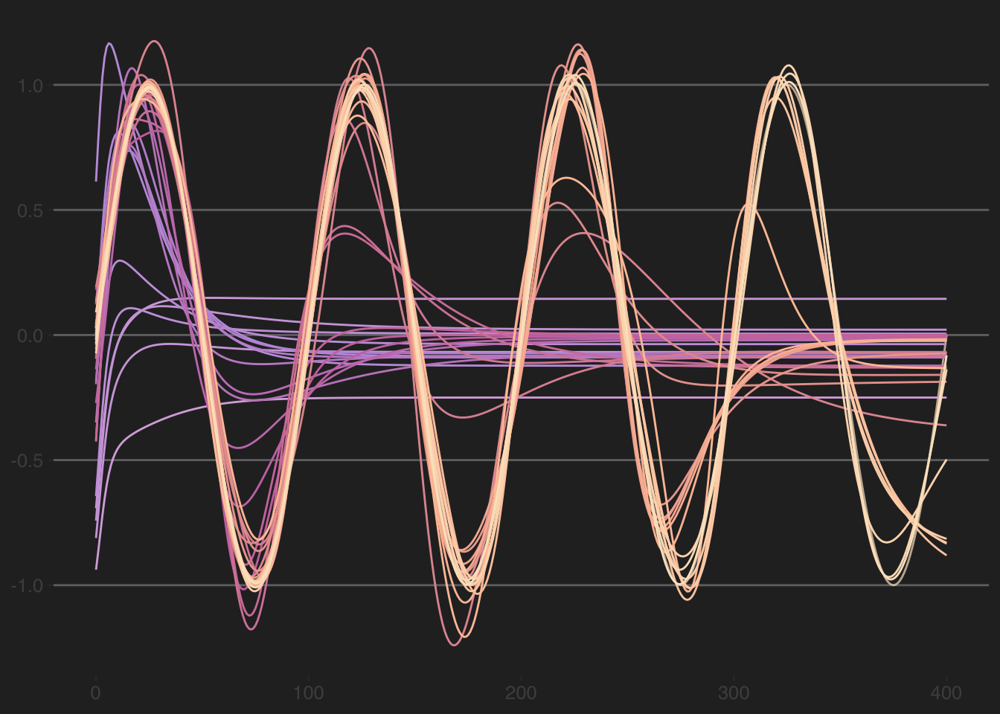

# Aside: Animate a NN


## Libraries

``` r
library(tidyverse)
```

```
## ── Attaching core tidyverse packages ──────────────────────── tidyverse 2.0.0 ──
## ✔ dplyr     1.1.4     ✔ readr     2.1.6
## ✔ forcats   1.0.1     ✔ stringr   1.6.0
## ✔ ggplot2   4.0.1     ✔ tibble    3.3.1
## ✔ lubridate 1.9.4     ✔ tidyr     1.3.2
## ✔ purrr     1.2.1     
## ── Conflicts ────────────────────────────────────────── tidyverse_conflicts() ──
## ✖ dplyr::filter() masks stats::filter()
## ✖ dplyr::lag()    masks stats::lag()
## ℹ Use the conflicted package (<http://conflicted.r-lib.org/>) to force all conflicts to become errors
```

``` r
library(nnet)
library(ggthemes)
library(gganimate)
library(av)
```

As usual we'll want `tidyverse`[@R-tidyverse]. The main function for the NN we will be using is in `nnet`[@R-nnet]. We'll be doing some animations and want `ggthemes`[@R-ggthemes], `gganimate`[@R-gganimate], and `av`[@R-av].

## The Data
Here is a quick demo of how a neural network successively iterates to improve fit. We will create a simple sine wave and then ask a neural net to try to predict it. We will animate that process by saving the prediction at each iteration. 

Here is the function and the data to fit.


``` r
n <- 400
dat <- tibble(x = seq(0,n),
              y = sin(2 * pi / 100 * seq(0,n)))
dat %>% ggplot(mapping = aes(x=x,y=y)) +
  geom_line(color="#fbe4c6", alpha=0.7) +
  labs(x=element_blank(),y=element_blank()) + 
  theme_hc(style = 'darkunica') +
  theme(legend.position = "none",
        text=element_text(size=12))
```

```
## Warning: `label` cannot be a <ggplot2::element_blank> object.
## `label` cannot be a <ggplot2::element_blank> object.
```


## Predicting

We will use a single-hidden-layer neural network to fit to the data. We do some cumbersome looping in order to save the predictions from each iteration. If the fit is really really good (r > 0.999) the loop will quit. With this simple sine function, that criteria is usually met.


``` r
nIter <- 100
fits <- as_tibble(matrix(0,nrow=length(dat$x),ncol=nIter))
gof <- tibble(Iter = 1:nIter, Correlation = numeric(nIter), RMSE = numeric(nIter)) 
for(i in 1:nIter){
  if(i==1) {
    # because i=1 we start without weights
    nn <- nnet(dat$x, dat$y, size=10, maxit=i-1, linout=TRUE, trace = FALSE)
  }
  else {
    # use prior weights to start the nnet once they exist (i>1)
    nn <- nnet(dat$x, dat$y, size=10, maxit=i-1, linout=TRUE, trace = FALSE, Wts = nn$wts)
  }
  yhat <- predict(nn)[,1]
  fits[,i] <- yhat
  gof$Correlation[i] <- cor(dat$y,yhat)
  gof$RMSE[i] <- sqrt(mean((dat$y-yhat)^2))
  # if fits are ~perfect, stop
  if(gof$Correlation[i] > 0.9995) { break }
}
# trim fits if loop stopped early
fits <- fits[,1:i]
fits2 <- as_tibble(cbind(dat$x,fits)) 
names(fits2)[1] <- "x"
names(fits2)[-1] <- formatC(1:i,digits = 1,flag=0)
gof <- gof[1:i,]
tail(gof)
```

```
## # A tibble: 6 × 3
##    Iter Correlation   RMSE
##   <int>       <dbl>  <dbl>
## 1    33       0.979 0.146 
## 2    34       0.980 0.142 
## 3    35       0.983 0.130 
## 4    36       0.993 0.0822
## 5    37       0.999 0.0338
## 6    38       1.000 0.0195
```

Above, the loop reached 38 iterations before the fit was essentially perfect. Let's see all the predictions.


``` r
fits2 <- fits2 %>% 
  pivot_longer(cols=-1,names_to = "IterChar", values_to = "yhat") %>%
  mutate(Iter = as.numeric(IterChar))

p1 <- ggplot(fits2,aes(x=x,y=yhat,color=IterChar)) +
  # original data
  geom_line(data=dat,aes(x=x,y=y),inherit.aes = FALSE, 
            color="#fbe4c6", alpha=0.7) +
  # nn fits
  geom_line() + 
  scale_color_manual(values=PNWColors::pnw_palette("Spring",i)) +
  labs(x=NULL,y=NULL) +
  theme_hc(style = 'darkunica') +
  theme(legend.position = "none",
        text=element_text(size=12))
p1
```



And the evolution of the RMSE and the correlation (r).


``` r
gof2 <- gof %>% pivot_longer(cols = -1)    
p2 <- ggplot(gof2,aes(x=Iter,y=value,color=Iter)) +
  geom_point() + geom_line() +
  scale_color_gradientn(colors=PNWColors::pnw_palette("Spring",i)) +
  labs(x="Iteration",y=NULL) +
  facet_wrap(~name) +
  theme_hc(style = 'darkunica') +
  theme(legend.position = "none",
        text=element_text(size=12))
p2
```


## Animate

Below is a combo of the fits and the skill in a GIF. Note that combining the two plots to have it all work side by side is a little more complicated than I'd like it to be and we have to use the `magick` library. See [here](https://github.com/thomasp85/gganimate/wiki/Animation-Composition). I hid the code because it's yucky and confusing. But it's on the repo in the Rmd file if you want to see it.

<!-- -->
