# Eigen Faces

## Big Idea

Facial recognition is a thing, right? Many of you unlock your phones with facial recognition. This is one way to implement a facial recognition scheme using PCA as a data reduction technique.

Note that we can use these techniques for cool environmental applications as well like species id, habitat classification, and so on.

## Packages


``` r
library(tidyverse)
```

```
## ── Attaching core tidyverse packages ──────────────────────── tidyverse 2.0.0 ──
## ✔ dplyr     1.1.4     ✔ readr     2.1.6
## ✔ forcats   1.0.1     ✔ stringr   1.6.0
## ✔ ggplot2   4.0.1     ✔ tibble    3.3.1
## ✔ lubridate 1.9.4     ✔ tidyr     1.3.2
## ✔ purrr     1.2.1     
## ── Conflicts ────────────────────────────────────────── tidyverse_conflicts() ──
## ✖ dplyr::filter() masks stats::filter()
## ✖ dplyr::lag()    masks stats::lag()
## ℹ Use the conflicted package (<http://conflicted.r-lib.org/>) to force all conflicts to become errors
```

``` r
library(ggrepel)
set.seed(650) # for reproducibility of test/train data sets
```

As usual we'll want `tidyverse`[@R-tidyverse]. And then just a little plotting help from `ggrepel`[@R-ggrepel].

## Reading

We are going to implement the so-called [eigenfaces](https://en.wikipedia.org/wiki/Eigenface) approach to [facial recognition](https://en.wikipedia.org/wiki/Facial_recognition_system). It's fascinating (and dystopian). I'd encourage you to read through these wikis and get a feel for what is out there.

## A bunch of mostly white guys

We are going to use the famous (even historic!) Olivetti data set assembled by AT&T Laboratories in the early 1990s. The data consists of 400 images of 40 distinct people. These are 64x64 gray-scale images. Thus, each one has 4096 (64$^2$) pixels. The values are 8-bit integers which range from black at zero to white at 255 (Note that 8-bit is $2^8=256$). The images are low resolution by today's standards but the data set is easy to work with. Here is the first image in the data.


At the AT&T lab 30 years ago, there were an awful lot of white guys walking the halls. So while these data are fantastic for learning purposes, it lacks quite a bit in capturing the diversity of human faces to say the very least! For other data sets that you can mess with, [do a little googling and you'll find plenty](http://www.interstellarengine.com/ai/dataset-face-recognition.html). I considered using the [Labeled Faces in the Wild data](https://www.kaggle.com/datasets/jessicali9530/lfw-dataset) but it's just a hair too complex for our purposes. I really should add an ancillary page with those data and an assignment, but not right now.

Anyways, here we go.I'll read the data in and give labels in `names`.


``` r
faces <- read_csv("data/faces.csv")
```

```
## Rows: 4096 Columns: 400
## ── Column specification ────────────────────────────────────────────────────────
## Delimiter: ","
## dbl (400): V1, V2, V3, V4, V5, V6, V7, V8, V9, V10, V11, V12, V13, V14, V15,...
## 
## ℹ Use `spec()` to retrieve the full column specification for this data.
## ℹ Specify the column types or set `show_col_types = FALSE` to quiet this message.
```

``` r
ids <- tibble(person = str_c("subject",
                             str_pad(rep(1:40,each=10), 2, pad = "0")),
              rep = str_c("v",
                          str_pad(rep(1:10,times=40), 2, pad = "0")))
names(faces) <- str_c(ids$person,ids$rep)
```

Each of the columns is an image. There are 10 pictures each of 40 different people. Each image is stored in a column -- we'll reshape it into a 2d matrix (or raster) in order to view it. E.g., here is the first subject.


``` r
longFaces <- faces %>% pivot_longer(cols = everything(), 
                                    names_to = "photo", values_to = "z")
longFaces <- longFaces %>% 
  add_column(x = rep(rep(seq(1,64),times=64),each = 400),
             y = rep(rep(seq(1,64),each=64),each = 400)) %>% 
  separate(col = photo, c("subject", "image"), sep = 9, remove = FALSE)
```

With all the data in a long format with `x` and `y` coordinates for plotting we can filter and plot subsets of the images. E.g., here is the first subject.


``` r
longFaces %>% filter(subject == "subject01") %>%
  ggplot(mapping = aes(x=y,y=x,fill=z)) + 
  geom_raster() +
  scale_fill_gradientn(colors = grey(seq(0, 1, length=256))) +
  coord_fixed() +
  theme_void() +
  theme(legend.position = "none") +
  facet_wrap(~image,nrow = 2)
```

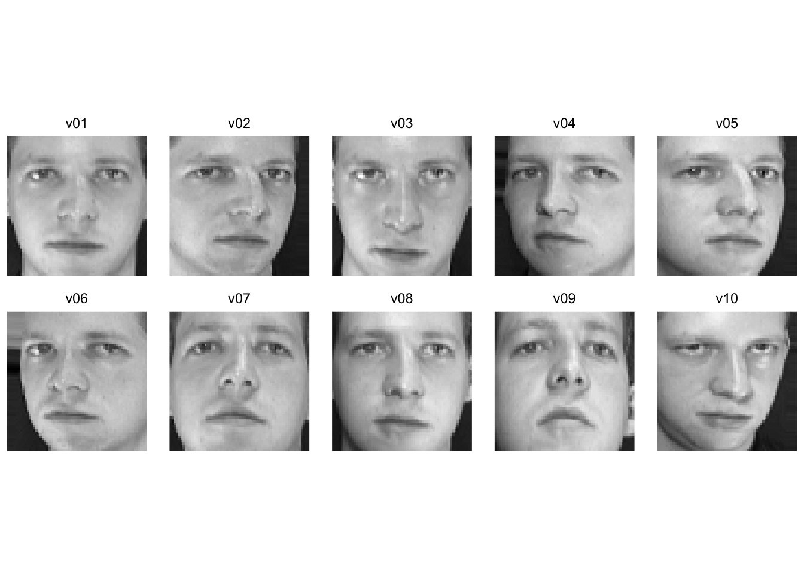

Walk through what we did in the last two chunks. We took the `faces` data and made it long like good `tidyverse` coders. We added `x` and `y` coordinates (both are sequences from one to 64 representing the length and width of the images) and pulled out the info on the subjects and the photos. Here is the 35th subject. One of the rare non-dudes in these classically non-diverse data!


``` r
longFaces %>% filter(subject == "subject35") %>%
  ggplot(mapping = aes(x=y,y=x,fill=z)) + 
  geom_raster() +
  scale_fill_gradientn(colors = grey(seq(0, 1, length=256))) +
  coord_fixed() +
  theme_void() +
  theme(legend.position = "none") +
  facet_wrap(~image,nrow = 2)
```

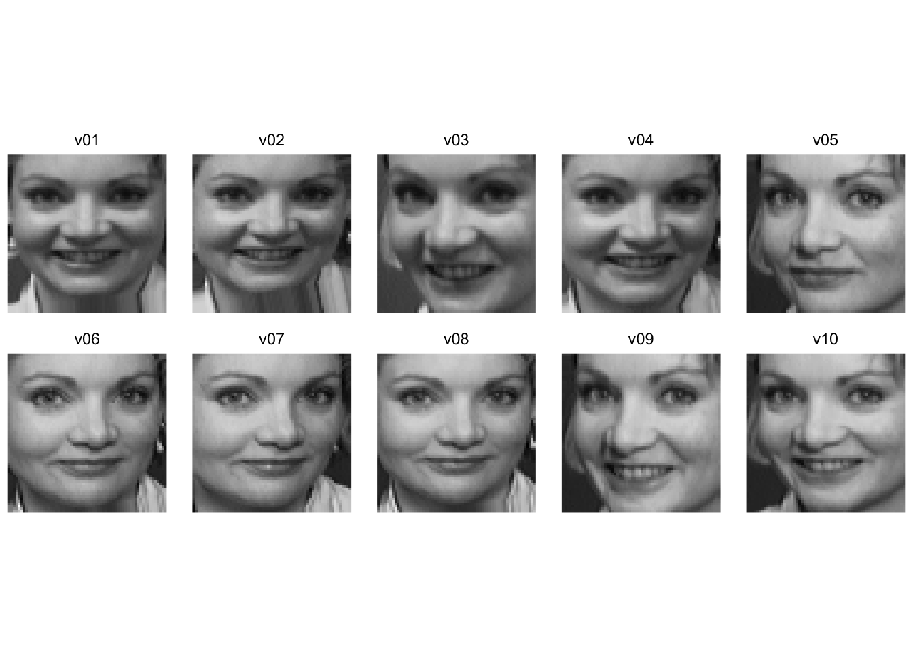

And here is the first image for each of the 40 subjects.


``` r
longFaces %>% filter(image == "v01") %>%
  ggplot(mapping = aes(x=y,y=x,fill=z)) + 
  geom_raster() +
  scale_fill_gradientn(colors = grey(seq(0, 1, length=256))) +
  coord_fixed() +
  theme_void() +
  theme(legend.position = "none") +
  facet_wrap(~subject, ncol=8)
```

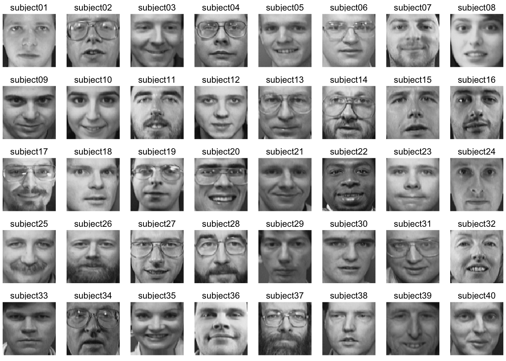

## Average face

Because we have all the faces as vectors of the same length we can manipulate them like any numbers. So here is a completely spooky average of all the faces.


``` r
avgFace <- faces %>%  reframe(z=rowMeans(.)) %>%
  add_column(x = rep(seq(1,64),times=64),
             y = rep(seq(1,64),each=64)) 
avgFace %>%
  ggplot(mapping = aes(x=y,y=x,fill=z)) + 
  geom_raster() +
  scale_fill_gradientn(colors = grey(seq(0, 1, length=256))) +
  coord_fixed() +
  theme_void() +
  theme(legend.position = "none")
```

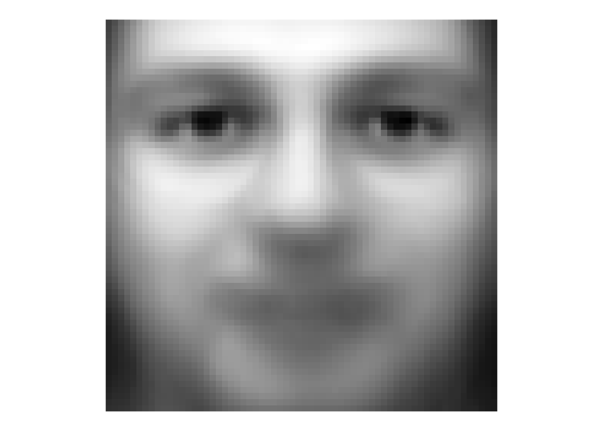

That's a bit of a dream haunter, huh? But it shows that we can aggregate and extract information about these faces and show common variance among the faces. 

We can look at how individual faces relate to the average face as well by subtraction. Here is the first picture of each subject substracted from the average face. That is each image is converted into a "difference from the average face."


``` r
facesCentered <- sweep(faces, 1, avgFace$z, "-")
longFacesCentered <- facesCentered %>% 
  pivot_longer(cols = everything(), 
               names_to = "photo", values_to = "z") %>% 
  add_column(x = rep(rep(seq(1,64),times=64),each = 400),
             y = rep(rep(seq(1,64),each=64),each = 400)) %>% 
  separate(col = photo, c("subject", "image"), 
           sep = 9, remove = FALSE)
longFacesCentered %>% filter(image == "v01") %>%
  ggplot(mapping = aes(x=y,y=x,fill=z)) + 
  geom_raster() +
  scale_fill_gradientn(colors = grey(seq(0, 1, length=256))) +
  coord_fixed() +
  theme_void() +
  theme(legend.position = "none") +
  facet_wrap(~subject, ncol=8)
```

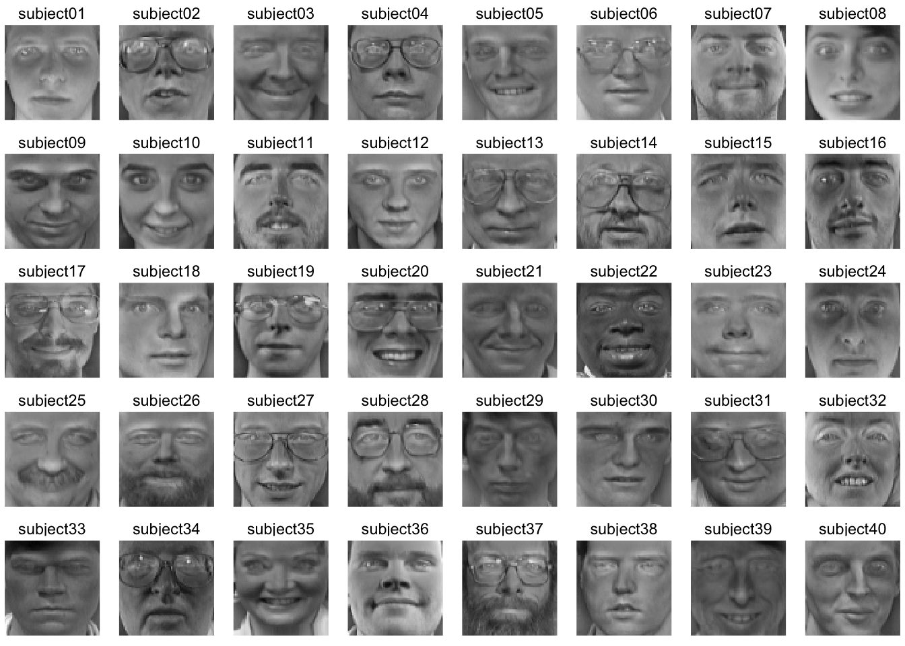

While averaging is one way to reduce the dimensionality of these data, we know that other methods have a lot more to offer.

## Principal Component Analysis

Go review your notes on PCA from ESCI 503 and watch this [great video](https://www.youtube.com/watch?v=FgakZw6K1QQ&ab_channel=StatQuestwithJoshStarmer) for a refresher.

We will use PCA for data reduction and find the commonality among the faces. Let's reduce the `faces` data into its constitute components with `prcomp`. Note that I'm transposing the data to get the 4096 pixels as columns and the 400 images as rows. This will decompose, therefore, as 399 (n-1) principal components.


``` r
facesPCA <- prcomp(t(faces), center = TRUE, scale. = FALSE)
```

We have the (square root) of the eigenvalues in the first element `facesPCA$sdev` with one value for each image (400). We have the eigenvectors in `facesPCA$rotation` with the same dimensions as the original data (4096 by 400) and the scores in `facesPCA$x` with each photo on each PC (400 by 400).

We can plot the cumulative variance explained via:


``` r
eigenvalues <- facesPCA$sdev^2
cumVar  <- cumsum(eigenvalues) / sum(eigenvalues)
ggplot() + 
  geom_line(mapping = aes(x=1:length(cumVar),y=cumVar)) +
  labs(x="PC",y="Cumulative variance explained")
```

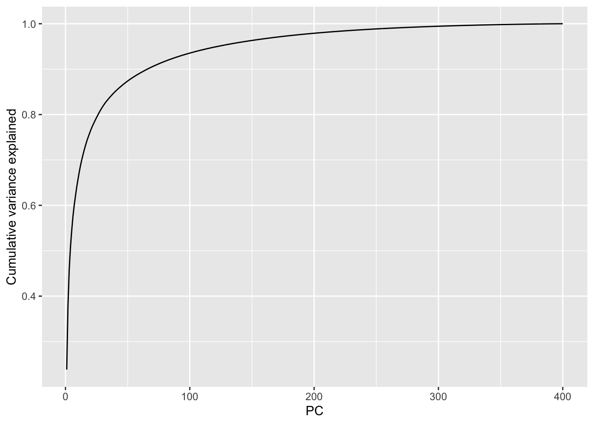

From this we can see that we get more than 90% of the variance explained with about the first 75 (out of 400) PCs and 95% explained with about 120 PCs. This indicates that these data are highly reducible.

Let's see what these "eigenfaces" look like.


``` r
eigenvectors <- facesPCA$rotation
# keep the first 9 vectors. why 9? because i'll make a 3x3 plot below
longEigenvectors <- as_tibble(eigenvectors[,1:9]) %>% 
  pivot_longer(cols = everything(), 
               names_to = "ev", values_to = "z") %>%
  add_column(x = rep(rep(seq(1,64),times=64),each = 9),
             y = rep(rep(seq(1,64),each=64),each = 9))

longEigenvectors %>% filter(ev == "PC1") %>%
  ggplot(mapping = aes(x=y,y=x,fill=z)) + 
  geom_raster() +
  scale_fill_gradientn(colors = grey(seq(1, 0, length=256))) +
  coord_fixed() +
  theme_void() +
  theme(legend.position = "none")
```

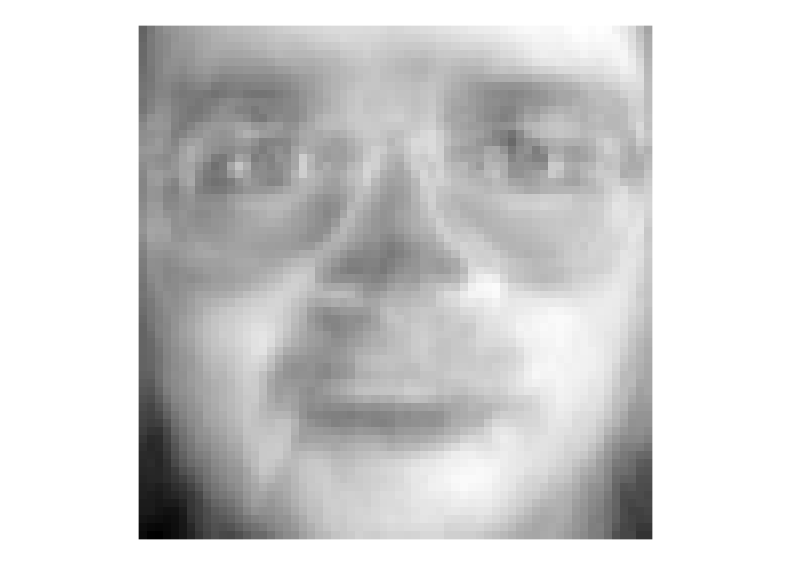

That image is the first PC -- here we can call it the first "eigenface." Terrifying, huh? But this single vector explains about 20% of the variance in the entire `faces` data of 400 images. It doesn't appear to map onto a specific facial feature (like "glasses" or "nose") but corresponds to the general brightness of the image. Let's look at the first nine PCs.


``` r
longEigenvectors %>%
  ggplot(mapping = aes(x=y,y=x,fill=z)) + 
  geom_raster() +
  scale_fill_gradientn(colors = grey(seq(1, 0, length=256))) +
  coord_fixed() +
  theme_void() +
  theme(legend.position = "none") +
  facet_wrap(~ev)
```

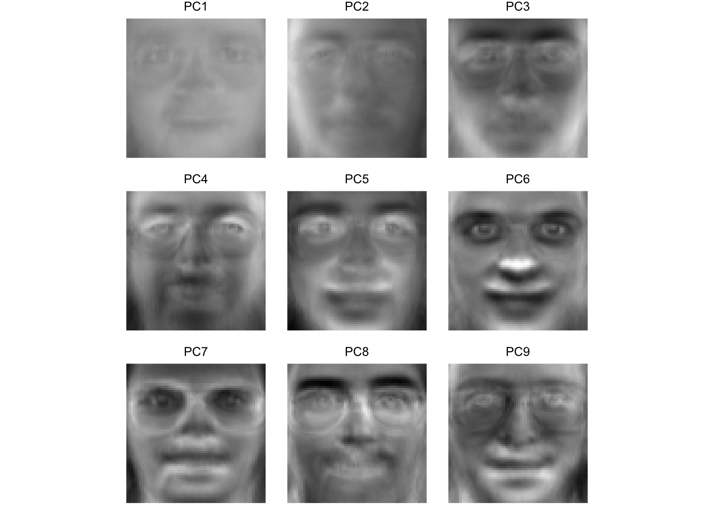

Here we see that some of these first few PCs (which explain \>60% of the variance in the entire data set) seem to correspond to facial features. For instance, PC four seems to be related to eye shape, PC six seems to be related to nose location, PC eight is particular to eye brows. The presence or absence of chunky 1990s glasses seems spread across many of the PCs.

## Mapping individuals

We can use the scores to see which faces are close together in the eigenspace and which are more distant. Below we will pull out the scores for each image and then average them by subject to get an average for each individual subject. We can then plot them in the eigenspace for the first two PCs. Photos that are far apart in the eigenspace should look pretty different from each other.


``` r
## plot subjects
scoresPCA <- data.frame(facesPCA$x)
scoresPCA <- rownames_to_column(scoresPCA, var = "photo") %>% 
  as_tibble() %>% 
  separate(col = photo, c("subject", "image"), 
           sep = 9, remove = FALSE)

avgScoresPCA <- scoresPCA %>% group_by(subject) %>% 
  summarise(PC1=mean(PC1),PC2=mean(PC2),
            PC3=mean(PC3),PC4=mean(PC4))

ggplot(data=avgScoresPCA,
       mapping=aes(x=PC1,y=PC2,label=subject)) + 
  geom_point() +
  geom_text_repel()
```

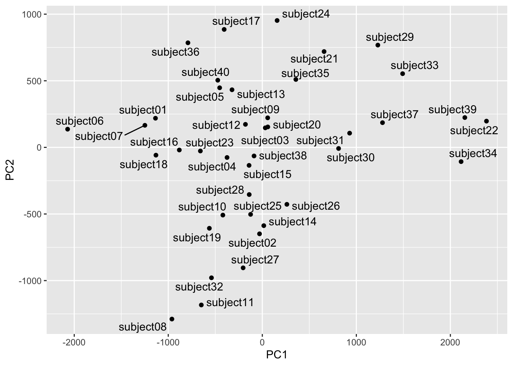

We can see that subject eight and subject 34 are separated well on the first two PCs. Let's see who they are.


``` r
longFaces %>% filter(subject == "subject08" | 
                       subject == "subject34") %>% 
  filter(image == "v01") %>%
  ggplot(mapping = aes(x=y,y=x,fill=z)) + 
  geom_raster() +
  scale_fill_gradientn(colors = grey(seq(0, 1, length=256))) +
  coord_fixed() +
  theme_void() +
  theme(legend.position = "none") +
  facet_wrap(~subject)
```

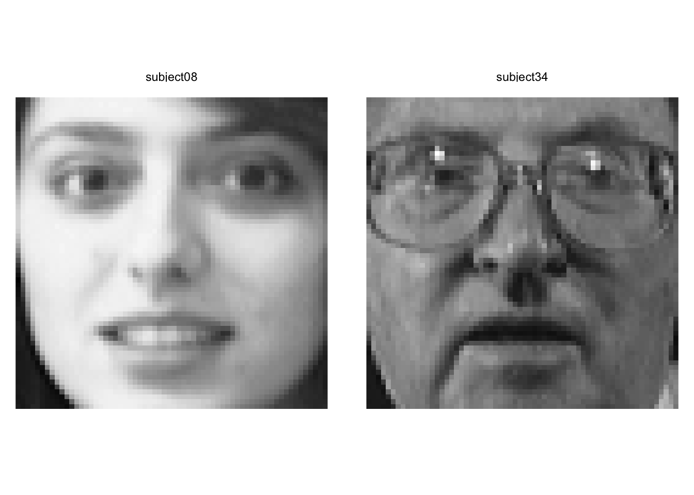

Yeah. We can see that these pictures are very different!

Out of curiosity let's see how the mapping looks on PC3 and PC4. These are further down in terms of explanatory power but still quite powerful.


``` r
ggplot(data=avgScoresPCA,
       mapping=aes(x=PC3,y=PC4,label=subject)) + 
  geom_point() +
  geom_text_repel()
```

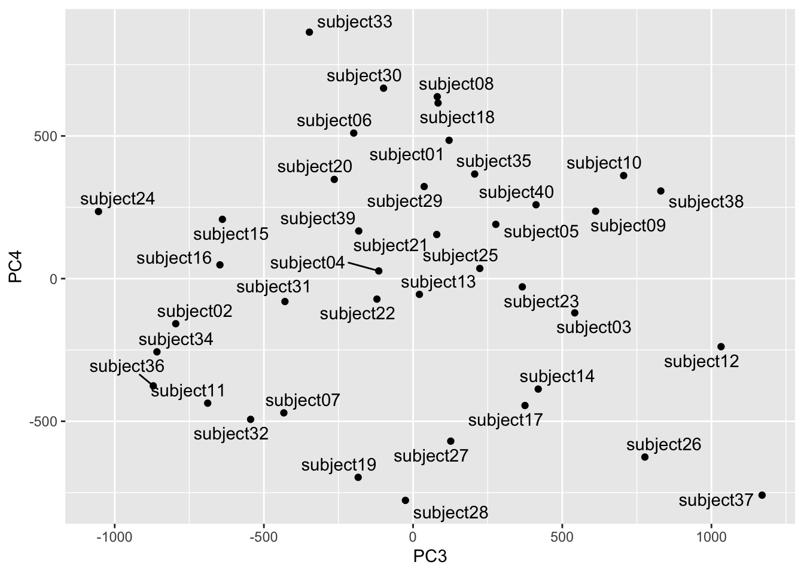

Looks subjects 24 and 37 are distinct in this part of the space. Let's take a look.


``` r
longFaces %>% filter(subject == "subject24" | 
                       subject == "subject37") %>% 
  filter(image == "v01") %>%
  ggplot(mapping = aes(x=y,y=x,fill=z)) + 
  geom_raster() +
  scale_fill_gradientn(colors = grey(seq(0, 1, length=256))) +
  coord_fixed() +
  theme_void() +
  theme(legend.position = "none") +
  facet_wrap(~subject)
```

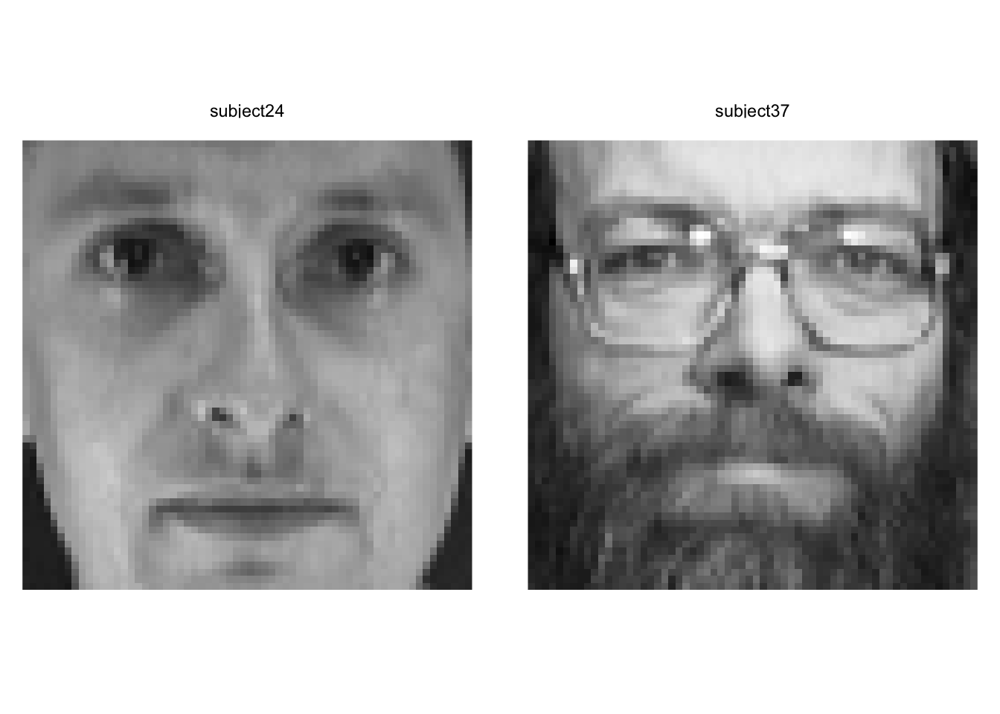

Yep. Wow. These are two very different looking people. We have to be careful about describing the PCs in terms of individual features (glasses, facial hair, etc.) but we can definitely see that they are extremely different looking.

Note that we can try other visualization methods although as always, our brains max out at 3D. We could use this to find similar or dissimilar faces in different parts of the eigenspace.


``` r
library(plotly)
```

```
## 
## Attaching package: 'plotly'
```

```
## The following object is masked from 'package:ggplot2':
## 
##     last_plot
```

```
## The following object is masked from 'package:stats':
## 
##     filter
```

```
## The following object is masked from 'package:graphics':
## 
##     layout
```

``` r
library(viridis)
```

```
## Loading required package: viridisLite
```

``` r
plot_ly(avgScoresPCA, 
        x = ~PC1, y = ~PC2, z = ~PC3, 
        color = ~subject,
        colors = viridis_pal(option = "D")(40)) %>% 
  add_markers() %>% layout(scene = list(xaxis = list(title = 'PC1'),
                                        yaxis = list(title = 'PC2'),
                                        zaxis = list(title = 'PC3'))) %>%
  layout(showlegend = FALSE)
```

```{=html}
<div class="plotly html-widget html-fill-item" id="htmlwidget-bebe8d4f91303f337dd8" style="width:672px;height:480px;"></div>
<script type="application/json" data-for="htmlwidget-bebe8d4f91303f337dd8">{"x":{"visdat":{"dfc056ee2bb7":["function () ","plotlyVisDat"]},"cur_data":"dfc056ee2bb7","attrs":{"dfc056ee2bb7":{"x":{},"y":{},"z":{},"color":{},"colors":["#440154FF","#460B5DFF","#481467FF","#481D6FFF","#482576FF","#472E7CFF","#453581FF","#433E85FF","#404588FF","#3D4D8AFF","#3A538BFF","#375B8DFF","#34618DFF","#31688EFF","#2E6F8EFF","#2B748EFF","#297B8EFF","#26818EFF","#24878EFF","#228D8DFF","#20938CFF","#1F998AFF","#1FA088FF","#21A585FF","#25AC82FF","#2DB17EFF","#35B779FF","#40BC72FF","#4CC26CFF","#59C864FF","#67CC5CFF","#76D153FF","#87D549FF","#97D83FFF","#A9DB33FF","#BADE28FF","#CBE11EFF","#DDE318FF","#EDE51BFF","#FDE725FF"],"alpha_stroke":1,"sizes":[10,100],"spans":[1,20],"type":"scatter3d","mode":"markers","inherit":true}},"layout":{"margin":{"b":40,"l":60,"t":25,"r":10},"scene":{"xaxis":{"title":"PC1"},"yaxis":{"title":"PC2"},"zaxis":{"title":"PC3"}},"showlegend":false,"hovermode":"closest"},"source":"A","config":{"modeBarButtonsToAdd":["hoverclosest","hovercompare"],"showSendToCloud":false},"data":[{"x":[-1135.9892952075706],"y":[218.80055346392518],"z":[120.68972940619365],"type":"scatter3d","mode":"markers","name":"subject01","marker":{"color":"rgba(68,1,84,1)","line":{"color":"rgba(68,1,84,1)"}},"textfont":{"color":"rgba(68,1,84,1)"},"error_y":{"color":"rgba(68,1,84,1)"},"error_x":{"color":"rgba(68,1,84,1)"},"line":{"color":"rgba(68,1,84,1)"},"frame":null},{"x":[-29.541135384239759],"y":[-648.91113820692044],"z":[-795.38161331584331],"type":"scatter3d","mode":"markers","name":"subject02","marker":{"color":"rgba(70,11,93,1)","line":{"color":"rgba(70,11,93,1)"}},"textfont":{"color":"rgba(70,11,93,1)"},"error_y":{"color":"rgba(70,11,93,1)"},"error_x":{"color":"rgba(70,11,93,1)"},"line":{"color":"rgba(70,11,93,1)"},"frame":null},{"x":[31.738526888742921],"y":[146.61107783017832],"z":[541.89214630399931],"type":"scatter3d","mode":"markers","name":"subject03","marker":{"color":"rgba(72,20,103,1)","line":{"color":"rgba(72,20,103,1)"}},"textfont":{"color":"rgba(72,20,103,1)"},"error_y":{"color":"rgba(72,20,103,1)"},"error_x":{"color":"rgba(72,20,103,1)"},"line":{"color":"rgba(72,20,103,1)"},"frame":null},{"x":[-374.98028599924965],"y":[-75.914583856313513],"z":[-114.96156484307819],"type":"scatter3d","mode":"markers","name":"subject04","marker":{"color":"rgba(72,29,111,1)","line":{"color":"rgba(72,29,111,1)"}},"textfont":{"color":"rgba(72,29,111,1)"},"error_y":{"color":"rgba(72,29,111,1)"},"error_x":{"color":"rgba(72,29,111,1)"},"line":{"color":"rgba(72,29,111,1)"},"frame":null},{"x":[-453.62236226222643],"y":[447.46464688540999],"z":[277.34677886377341],"type":"scatter3d","mode":"markers","name":"subject05","marker":{"color":"rgba(72,37,118,1)","line":{"color":"rgba(72,37,118,1)"}},"textfont":{"color":"rgba(72,37,118,1)"},"error_y":{"color":"rgba(72,37,118,1)"},"error_x":{"color":"rgba(72,37,118,1)"},"line":{"color":"rgba(72,37,118,1)"},"frame":null},{"x":[-2070.4404238273701],"y":[136.64254986841956],"z":[-198.90593208988273],"type":"scatter3d","mode":"markers","name":"subject06","marker":{"color":"rgba(71,46,124,1)","line":{"color":"rgba(71,46,124,1)"}},"textfont":{"color":"rgba(71,46,124,1)"},"error_y":{"color":"rgba(71,46,124,1)"},"error_x":{"color":"rgba(71,46,124,1)"},"line":{"color":"rgba(71,46,124,1)"},"frame":null},{"x":[-1248.6792837697121],"y":[165.67031409078552],"z":[-433.19550496342958],"type":"scatter3d","mode":"markers","name":"subject07","marker":{"color":"rgba(69,53,129,1)","line":{"color":"rgba(69,53,129,1)"}},"textfont":{"color":"rgba(69,53,129,1)"},"error_y":{"color":"rgba(69,53,129,1)"},"error_x":{"color":"rgba(69,53,129,1)"},"line":{"color":"rgba(69,53,129,1)"},"frame":null},{"x":[-961.28142448208769],"y":[-1288.7302949832135],"z":[81.088446335261992],"type":"scatter3d","mode":"markers","name":"subject08","marker":{"color":"rgba(67,62,133,1)","line":{"color":"rgba(67,62,133,1)"}},"textfont":{"color":"rgba(67,62,133,1)"},"error_y":{"color":"rgba(67,62,133,1)"},"error_x":{"color":"rgba(67,62,133,1)"},"line":{"color":"rgba(67,62,133,1)"},"frame":null},{"x":[57.239058746828128],"y":[221.85852729234111],"z":[611.75711182051339],"type":"scatter3d","mode":"markers","name":"subject09","marker":{"color":"rgba(64,69,136,1)","line":{"color":"rgba(64,69,136,1)"}},"textfont":{"color":"rgba(64,69,136,1)"},"error_y":{"color":"rgba(64,69,136,1)"},"error_x":{"color":"rgba(64,69,136,1)"},"line":{"color":"rgba(64,69,136,1)"},"frame":null},{"x":[-419.47086903312828],"y":[-508.22910508795115],"z":[705.69442917550089],"type":"scatter3d","mode":"markers","name":"subject10","marker":{"color":"rgba(61,77,138,1)","line":{"color":"rgba(61,77,138,1)"}},"textfont":{"color":"rgba(61,77,138,1)"},"error_y":{"color":"rgba(61,77,138,1)"},"error_x":{"color":"rgba(61,77,138,1)"},"line":{"color":"rgba(61,77,138,1)"},"frame":null},{"x":[-648.56868662479769],"y":[-1182.9692772168421],"z":[-688.33057424089236],"type":"scatter3d","mode":"markers","name":"subject11","marker":{"color":"rgba(58,83,139,1)","line":{"color":"rgba(58,83,139,1)"}},"textfont":{"color":"rgba(58,83,139,1)"},"error_y":{"color":"rgba(58,83,139,1)"},"error_x":{"color":"rgba(58,83,139,1)"},"line":{"color":"rgba(58,83,139,1)"},"frame":null},{"x":[-179.30863613589091],"y":[172.90170116784961],"z":[1032.2538284845907],"type":"scatter3d","mode":"markers","name":"subject12","marker":{"color":"rgba(55,91,141,1)","line":{"color":"rgba(55,91,141,1)"}},"textfont":{"color":"rgba(55,91,141,1)"},"error_y":{"color":"rgba(55,91,141,1)"},"error_x":{"color":"rgba(55,91,141,1)"},"line":{"color":"rgba(55,91,141,1)"},"frame":null},{"x":[-322.16776560489137],"y":[432.5415557422923],"z":[21.189337180178892],"type":"scatter3d","mode":"markers","name":"subject13","marker":{"color":"rgba(52,97,141,1)","line":{"color":"rgba(52,97,141,1)"}},"textfont":{"color":"rgba(52,97,141,1)"},"error_y":{"color":"rgba(52,97,141,1)"},"error_x":{"color":"rgba(52,97,141,1)"},"line":{"color":"rgba(52,97,141,1)"},"frame":null},{"x":[15.853433944359399],"y":[-587.548162363389],"z":[419.37784135461237],"type":"scatter3d","mode":"markers","name":"subject14","marker":{"color":"rgba(49,104,142,1)","line":{"color":"rgba(49,104,142,1)"}},"textfont":{"color":"rgba(49,104,142,1)"},"error_y":{"color":"rgba(49,104,142,1)"},"error_x":{"color":"rgba(49,104,142,1)"},"line":{"color":"rgba(49,104,142,1)"},"frame":null},{"x":[-140.78653313965921],"y":[-135.0397360637802],"z":[-639.05800054953056],"type":"scatter3d","mode":"markers","name":"subject15","marker":{"color":"rgba(46,111,142,1)","line":{"color":"rgba(46,111,142,1)"}},"textfont":{"color":"rgba(46,111,142,1)"},"error_y":{"color":"rgba(46,111,142,1)"},"error_x":{"color":"rgba(46,111,142,1)"},"line":{"color":"rgba(46,111,142,1)"},"frame":null},{"x":[-882.5543691659816],"y":[-19.666002742385444],"z":[-647.35995419027336],"type":"scatter3d","mode":"markers","name":"subject16","marker":{"color":"rgba(43,116,142,1)","line":{"color":"rgba(43,116,142,1)"}},"textfont":{"color":"rgba(43,116,142,1)"},"error_y":{"color":"rgba(43,116,142,1)"},"error_x":{"color":"rgba(43,116,142,1)"},"line":{"color":"rgba(43,116,142,1)"},"frame":null},{"x":[-405.51131313218696],"y":[885.44727577765627],"z":[375.05297475158494],"type":"scatter3d","mode":"markers","name":"subject17","marker":{"color":"rgba(41,123,142,1)","line":{"color":"rgba(41,123,142,1)"}},"textfont":{"color":"rgba(41,123,142,1)"},"error_y":{"color":"rgba(41,123,142,1)"},"error_x":{"color":"rgba(41,123,142,1)"},"line":{"color":"rgba(41,123,142,1)"},"frame":null},{"x":[-1131.1383664248333],"y":[-58.337744772869975],"z":[83.794849685435906],"type":"scatter3d","mode":"markers","name":"subject18","marker":{"color":"rgba(38,129,142,1)","line":{"color":"rgba(38,129,142,1)"}},"textfont":{"color":"rgba(38,129,142,1)"},"error_y":{"color":"rgba(38,129,142,1)"},"error_x":{"color":"rgba(38,129,142,1)"},"line":{"color":"rgba(38,129,142,1)"},"frame":null},{"x":[-562.96927320623831],"y":[-607.28639513485757],"z":[-184.02798879441158],"type":"scatter3d","mode":"markers","name":"subject19","marker":{"color":"rgba(36,135,142,1)","line":{"color":"rgba(36,135,142,1)"}},"textfont":{"color":"rgba(36,135,142,1)"},"error_y":{"color":"rgba(36,135,142,1)"},"error_x":{"color":"rgba(36,135,142,1)"},"line":{"color":"rgba(36,135,142,1)"},"frame":null},{"x":[58.395235146167472],"y":[153.60446690069887],"z":[-264.08490739098545],"type":"scatter3d","mode":"markers","name":"subject20","marker":{"color":"rgba(34,141,141,1)","line":{"color":"rgba(34,141,141,1)"}},"textfont":{"color":"rgba(34,141,141,1)"},"error_y":{"color":"rgba(34,141,141,1)"},"error_x":{"color":"rgba(34,141,141,1)"},"line":{"color":"rgba(34,141,141,1)"},"frame":null},{"x":[656.89377873153069],"y":[719.32065658418276],"z":[79.332581387387023],"type":"scatter3d","mode":"markers","name":"subject21","marker":{"color":"rgba(32,147,140,1)","line":{"color":"rgba(32,147,140,1)"}},"textfont":{"color":"rgba(32,147,140,1)"},"error_y":{"color":"rgba(32,147,140,1)"},"error_x":{"color":"rgba(32,147,140,1)"},"line":{"color":"rgba(32,147,140,1)"},"frame":null},{"x":[2383.9503485074733],"y":[197.05334923271965],"z":[-121.0994310653074],"type":"scatter3d","mode":"markers","name":"subject22","marker":{"color":"rgba(31,153,138,1)","line":{"color":"rgba(31,153,138,1)"}},"textfont":{"color":"rgba(31,153,138,1)"},"error_y":{"color":"rgba(31,153,138,1)"},"error_x":{"color":"rgba(31,153,138,1)"},"line":{"color":"rgba(31,153,138,1)"},"frame":null},{"x":[-658.52799753859381],"y":[-27.140617993045986],"z":[366.04360679658254],"type":"scatter3d","mode":"markers","name":"subject23","marker":{"color":"rgba(31,160,136,1)","line":{"color":"rgba(31,160,136,1)"}},"textfont":{"color":"rgba(31,160,136,1)"},"error_y":{"color":"rgba(31,160,136,1)"},"error_x":{"color":"rgba(31,160,136,1)"},"line":{"color":"rgba(31,160,136,1)"},"frame":null},{"x":[157.41620372051574],"y":[952.47355583564456],"z":[-1054.2805592974316],"type":"scatter3d","mode":"markers","name":"subject24","marker":{"color":"rgba(33,165,133,1)","line":{"color":"rgba(33,165,133,1)"}},"textfont":{"color":"rgba(33,165,133,1)"},"error_y":{"color":"rgba(33,165,133,1)"},"error_x":{"color":"rgba(33,165,133,1)"},"line":{"color":"rgba(33,165,133,1)"},"frame":null},{"x":[-124.52161109360695],"y":[-502.87976002612402],"z":[223.63028272650456],"type":"scatter3d","mode":"markers","name":"subject25","marker":{"color":"rgba(37,172,130,1)","line":{"color":"rgba(37,172,130,1)"}},"textfont":{"color":"rgba(37,172,130,1)"},"error_y":{"color":"rgba(37,172,130,1)"},"error_x":{"color":"rgba(37,172,130,1)"},"line":{"color":"rgba(37,172,130,1)"},"frame":null},{"x":[261.28822584335092],"y":[-427.50480486430536],"z":[776.88017348417134],"type":"scatter3d","mode":"markers","name":"subject26","marker":{"color":"rgba(45,177,126,1)","line":{"color":"rgba(45,177,126,1)"}},"textfont":{"color":"rgba(45,177,126,1)"},"error_y":{"color":"rgba(45,177,126,1)"},"error_x":{"color":"rgba(45,177,126,1)"},"line":{"color":"rgba(45,177,126,1)"},"frame":null},{"x":[-204.00983601356043],"y":[-904.24051339839207],"z":[126.24426134027267],"type":"scatter3d","mode":"markers","name":"subject27","marker":{"color":"rgba(53,183,121,1)","line":{"color":"rgba(53,183,121,1)"}},"textfont":{"color":"rgba(53,183,121,1)"},"error_y":{"color":"rgba(53,183,121,1)"},"error_x":{"color":"rgba(53,183,121,1)"},"line":{"color":"rgba(53,183,121,1)"},"frame":null},{"x":[-139.21561198263248],"y":[-354.04110281065033],"z":[-25.582681179347702],"type":"scatter3d","mode":"markers","name":"subject28","marker":{"color":"rgba(64,188,114,1)","line":{"color":"rgba(64,188,114,1)"}},"textfont":{"color":"rgba(64,188,114,1)"},"error_y":{"color":"rgba(64,188,114,1)"},"error_x":{"color":"rgba(64,188,114,1)"},"line":{"color":"rgba(64,188,114,1)"},"frame":null},{"x":[1228.7591719334248],"y":[767.78529477808308],"z":[37.169700168771186],"type":"scatter3d","mode":"markers","name":"subject29","marker":{"color":"rgba(76,194,108,1)","line":{"color":"rgba(76,194,108,1)"}},"textfont":{"color":"rgba(76,194,108,1)"},"error_y":{"color":"rgba(76,194,108,1)"},"error_x":{"color":"rgba(76,194,108,1)"},"line":{"color":"rgba(76,194,108,1)"},"frame":null},{"x":[811.17778235681385],"y":[-8.1787533309573934],"z":[-98.887673541408788],"type":"scatter3d","mode":"markers","name":"subject30","marker":{"color":"rgba(89,200,100,1)","line":{"color":"rgba(89,200,100,1)"}},"textfont":{"color":"rgba(89,200,100,1)"},"error_y":{"color":"rgba(89,200,100,1)"},"error_x":{"color":"rgba(89,200,100,1)"},"line":{"color":"rgba(89,200,100,1)"},"frame":null},{"x":[928.5729456361762],"y":[106.76876209010369],"z":[-429.45197499451075],"type":"scatter3d","mode":"markers","name":"subject31","marker":{"color":"rgba(103,204,92,1)","line":{"color":"rgba(103,204,92,1)"}},"textfont":{"color":"rgba(103,204,92,1)"},"error_y":{"color":"rgba(103,204,92,1)"},"error_x":{"color":"rgba(103,204,92,1)"},"line":{"color":"rgba(103,204,92,1)"},"frame":null},{"x":[-540.61165103568896],"y":[-978.94998345969964],"z":[-544.48011993303032],"type":"scatter3d","mode":"markers","name":"subject32","marker":{"color":"rgba(118,209,83,1)","line":{"color":"rgba(118,209,83,1)"}},"textfont":{"color":"rgba(118,209,83,1)"},"error_y":{"color":"rgba(118,209,83,1)"},"error_x":{"color":"rgba(118,209,83,1)"},"line":{"color":"rgba(118,209,83,1)"},"frame":null},{"x":[1492.1748309963689],"y":[553.30473000832933],"z":[-347.55245757108122],"type":"scatter3d","mode":"markers","name":"subject33","marker":{"color":"rgba(135,213,73,1)","line":{"color":"rgba(135,213,73,1)"}},"textfont":{"color":"rgba(135,213,73,1)"},"error_y":{"color":"rgba(135,213,73,1)"},"error_x":{"color":"rgba(135,213,73,1)"},"line":{"color":"rgba(135,213,73,1)"},"frame":null},{"x":[2114.0263642139776],"y":[-106.89904741399585],"z":[-858.40640693743262],"type":"scatter3d","mode":"markers","name":"subject34","marker":{"color":"rgba(151,216,63,1)","line":{"color":"rgba(151,216,63,1)"}},"textfont":{"color":"rgba(151,216,63,1)"},"error_y":{"color":"rgba(151,216,63,1)"},"error_x":{"color":"rgba(151,216,63,1)"},"line":{"color":"rgba(151,216,63,1)"},"frame":null},{"x":[356.84859516884637],"y":[509.8896072338261],"z":[206.49270163446249],"type":"scatter3d","mode":"markers","name":"subject35","marker":{"color":"rgba(169,219,51,1)","line":{"color":"rgba(169,219,51,1)"}},"textfont":{"color":"rgba(169,219,51,1)"},"error_y":{"color":"rgba(169,219,51,1)"},"error_x":{"color":"rgba(169,219,51,1)"},"line":{"color":"rgba(169,219,51,1)"},"frame":null},{"x":[-790.85197376379836],"y":[785.09580812368836],"z":[-870.78017026189502],"type":"scatter3d","mode":"markers","name":"subject36","marker":{"color":"rgba(186,222,40,1)","line":{"color":"rgba(186,222,40,1)"}},"textfont":{"color":"rgba(186,222,40,1)"},"error_y":{"color":"rgba(186,222,40,1)"},"error_x":{"color":"rgba(186,222,40,1)"},"line":{"color":"rgba(186,222,40,1)"},"frame":null},{"x":[1278.243834844099],"y":[185.53250529679789],"z":[1169.7027770031548],"type":"scatter3d","mode":"markers","name":"subject37","marker":{"color":"rgba(203,225,30,1)","line":{"color":"rgba(203,225,30,1)"}},"textfont":{"color":"rgba(203,225,30,1)"},"error_y":{"color":"rgba(203,225,30,1)"},"error_x":{"color":"rgba(203,225,30,1)"},"line":{"color":"rgba(203,225,30,1)"},"frame":null},{"x":[-87.911241945606932],"y":[-64.331068792979323],"z":[830.2917175463358],"type":"scatter3d","mode":"markers","name":"subject38","marker":{"color":"rgba(221,227,24,1)","line":{"color":"rgba(221,227,24,1)"}},"textfont":{"color":"rgba(221,227,24,1)"},"error_y":{"color":"rgba(221,227,24,1)"},"error_x":{"color":"rgba(221,227,24,1)"},"line":{"color":"rgba(221,227,24,1)"},"frame":null},{"x":[2153.6876763454757],"y":[223.89386860419617],"z":[-182.15357856271621],"type":"scatter3d","mode":"markers","name":"subject39","marker":{"color":"rgba(237,229,27,1)","line":{"color":"rgba(237,229,27,1)"}},"textfont":{"color":"rgba(237,229,27,1)"},"error_y":{"color":"rgba(237,229,27,1)"},"error_x":{"color":"rgba(237,229,27,1)"},"line":{"color":"rgba(237,229,27,1)"},"frame":null},{"x":[-473.60606625059734],"y":[504.13728571154633],"z":[412.05581827319992],"type":"scatter3d","mode":"markers","name":"subject40","marker":{"color":"rgba(253,231,37,1)","line":{"color":"rgba(253,231,37,1)"}},"textfont":{"color":"rgba(253,231,37,1)"},"error_y":{"color":"rgba(253,231,37,1)"},"error_x":{"color":"rgba(253,231,37,1)"},"line":{"color":"rgba(253,231,37,1)"},"frame":null}],"highlight":{"on":"plotly_click","persistent":false,"dynamic":false,"selectize":false,"opacityDim":0.20000000000000001,"selected":{"opacity":1},"debounce":0},"shinyEvents":["plotly_hover","plotly_click","plotly_selected","plotly_relayout","plotly_brushed","plotly_brushing","plotly_clickannotation","plotly_doubleclick","plotly_deselect","plotly_afterplot","plotly_sunburstclick"],"base_url":"https://plot.ly"},"evals":[],"jsHooks":[]}</script>
```


## Facial recognition

Identifying new instances of known subjects (people, plants, types of coffee mugs, whatever) is really common task in machine learning. So, let's use the `faces` data and PCA to identify people with are known to the system but with pictures we haven't seen before. This is a classic train and test situation.

### Train/Test

We will start by pulling two random pix of each person for a test data set and leaving the other eight in for training.


``` r
testVec <- sample(1:10,2)
for(i in 1:39){
  base <- i*10
  testVec <- c(testVec,sample((base+1):(base+10),2))
}
# test images
ids[testVec,]
```

```
## # A tibble: 80 × 2
##    person    rep  
##    <chr>     <chr>
##  1 subject01 v02  
##  2 subject01 v01  
##  3 subject02 v04  
##  4 subject02 v09  
##  5 subject03 v07  
##  6 subject03 v06  
##  7 subject04 v05  
##  8 subject04 v01  
##  9 subject05 v07  
## 10 subject05 v01  
## # ℹ 70 more rows
```

``` r
# train images
ids[-testVec,]
```

```
## # A tibble: 320 × 2
##    person    rep  
##    <chr>     <chr>
##  1 subject01 v03  
##  2 subject01 v04  
##  3 subject01 v05  
##  4 subject01 v06  
##  5 subject01 v07  
##  6 subject01 v08  
##  7 subject01 v09  
##  8 subject01 v10  
##  9 subject02 v01  
## 10 subject02 v02  
## # ℹ 310 more rows
```

``` r
facesTest <- faces[,testVec]
facesTrain <- faces[,-testVec]
```

### PCA on training

Let's run the PCA on the training data.


``` r
facesPCA <- prcomp(t(facesTrain), center = TRUE, scale. = FALSE)

eigenvalues <- facesPCA$sdev^2
eigenvectors <- facesPCA$rotation
scores <- facesPCA$x
```

To save space and computing time let's keep the PCs that explain 95% of the variance. This isn't really needed here since the data set is small, but if we have millions of images we'd want to do this for sure.


``` r
cumVar  <- cumsum(eigenvalues) / sum(eigenvalues)
thres95 <- min(which(cumVar > 0.95))
thres95
```

```
## [1] 110
```

``` r
# subset the PCs
eigenvectors <- eigenvectors[,1:thres95]
eigenvalues <- eigenvalues[1:thres95]
scores <- scores[,1:thres95]
```

### Project the test photos

Here we will project the test faces (the photos the PCA hasn't seen) into the PCA training space. Other than rescaling the new faces to match the old faces, this is just calculating the scores which we do with the eigenvectors.


``` r
# these are scores
testFaceProj <-scale(t(facesTest), 
                     scale = facesPCA$scale, 
                     center = facesPCA$center)  %*% eigenvectors
dim(testFaceProj) # PCs by samples
```

```
## [1]  80 110
```

### Distance

Now we can get the distance between the test scores and the average scores for each subject. I have [Euclidean distance](https://en.wikipedia.org/wiki/Euclidean_distance), [Manhattan distance](https://en.wikipedia.org/wiki/Taxicab_geometry), and [Mahalanobis distance](https://en.wikipedia.org/wiki/Mahalanobis_distance) in the code below. I'll use the taxicab (Manhattan) distance but if you want to change that just comment and uncomment the method you want. I could have written a function here to choose a method but this seemed like enough for one week.


``` r
subjects <- str_sub(rownames(scores),start=1,end=9)
subjectScores <- aggregate(scores,list(subjects),mean)

distMat <- matrix(data = NA, nrow = nrow(subjectScores), ncol = nrow(testFaceProj))
colnames(distMat) <- rownames(testFaceProj)
rownames(distMat) <- subjectScores$Group.1
for (j in 1:ncol(distMat)) {
  x1 <- testFaceProj[j,]
  for (i in 1:nrow(distMat)) {
    x2 <- as.numeric(subjectScores[i,-1])
    # Euclidean distance
    #distMat[i,j] <- sqrt(sum((x1-x2)^2))
    # Manhattan
    #distMat[i,j] <- sum(abs(x1 - t(x2)))
    # Mahalanobis
    m <- x1/sqrt(eigenvalues[1:length(x1)])
    n <- x2/sqrt(eigenvalues[1:length(x1)])
    distMat[i,j] <- sqrt(t(m - n)%*%(m - n))
  }
}
```

The object `distMat` has the known subjects on the rows and the unknown photos in columns. Thus, the values in the matrix is the distance between the unknown photo and the known subjects.

Let's look at the first test photo. You and I know this is one of the pictures of subject one and that the PCA space was built without it. In fact, `names(facesTest)[1]` is the image subject01v02. But the classification algorithm doesn't know who this is. We can plot the distance between this unknown photo and all the known subjects.


``` r
tmp <- tibble(distances = distMat[,1], subjects=rownames(distMat))
ggplot(data = tmp) + 
  geom_point(mapping= aes(x=distances,y=reorder(subjects,distances))) +
  labs(x="Distance", y="Known Subjects", 
       title = "Distance in eigenspace for unkown photo:",
       subtitle = names(facesTest)[1])
```

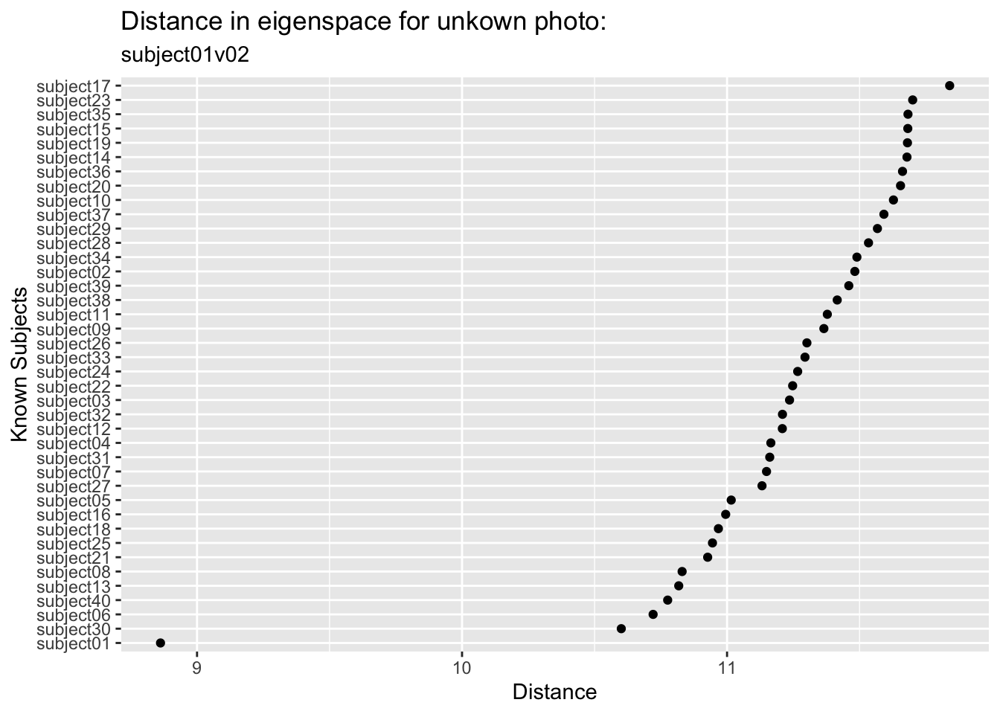

We can see that this image is closest in the eigenspace to `subject01` followed by `subject30` and `subject06` who are a good step away (and subject 17 is the most distant). So we did in fact find the right subject from this unknown photo. Kind of amazing.

### Classify

We can look at all the test photos and pull out the minimum distance for each one and match it up in an error matrix. This is a very simple classification algorithm. We could set up other criteria and get a probabilistic understanding if we were feeling up to it. But again, since this module is just for fun, I'll leave it simple for now.


``` r
colnames(distMat) <- ids$person[testVec]
accVec <- logical(ncol(distMat))
names(accVec) <- colnames(distMat)
for(i in 1:ncol(distMat)){
  closestSubject <- rownames(distMat)[which.min(distMat[,i])]
  accVec[i] <- closestSubject == colnames(distMat)[i]
}
accVec
```

```
## subject01 subject01 subject02 subject02 subject03 subject03 subject04 subject04 
##      TRUE      TRUE      TRUE      TRUE     FALSE      TRUE      TRUE      TRUE 
## subject05 subject05 subject06 subject06 subject07 subject07 subject08 subject08 
##      TRUE      TRUE      TRUE      TRUE      TRUE      TRUE     FALSE      TRUE 
## subject09 subject09 subject10 subject10 subject11 subject11 subject12 subject12 
##      TRUE      TRUE      TRUE      TRUE      TRUE      TRUE      TRUE      TRUE 
## subject13 subject13 subject14 subject14 subject15 subject15 subject16 subject16 
##      TRUE      TRUE      TRUE      TRUE      TRUE      TRUE      TRUE      TRUE 
## subject17 subject17 subject18 subject18 subject19 subject19 subject20 subject20 
##      TRUE      TRUE      TRUE      TRUE      TRUE      TRUE      TRUE      TRUE 
## subject21 subject21 subject22 subject22 subject23 subject23 subject24 subject24 
##      TRUE      TRUE      TRUE      TRUE      TRUE      TRUE      TRUE      TRUE 
## subject25 subject25 subject26 subject26 subject27 subject27 subject28 subject28 
##      TRUE      TRUE      TRUE      TRUE      TRUE      TRUE      TRUE      TRUE 
## subject29 subject29 subject30 subject30 subject31 subject31 subject32 subject32 
##      TRUE      TRUE      TRUE      TRUE      TRUE     FALSE      TRUE      TRUE 
## subject33 subject33 subject34 subject34 subject35 subject35 subject36 subject36 
##      TRUE      TRUE      TRUE      TRUE      TRUE      TRUE      TRUE      TRUE 
## subject37 subject37 subject38 subject38 subject39 subject39 subject40 subject40 
##      TRUE      TRUE      TRUE      TRUE      TRUE      TRUE      TRUE      TRUE
```

``` r
table(accVec)/length(accVec)
```

```
## accVec
##  FALSE   TRUE 
## 0.0375 0.9625
```

Astoundingly we classified almost all of them correctly (96.25%)!

## Environmental applications

I find the human facial recognition to be a little scary to be honest. It creeps me out. But I wanted you to see this kind of machine learning application in action and this is a classic example.

There are more benign applications for sure. The iNaturalist app and database are being used for [automated species identification](https://www.inaturalist.org/pages/computer_vision_demo) using machine learning and there is a rich literature out there on this kind of work. E.g., [Wäldchen and Mäder (2018)](https://besjournals.onlinelibrary.wiley.com/doi/full/10.1111/2041-210X.13075), [Villon et al. (2020)](https://www.nature.com/articles/s41598-020-67573-7) and [many more](https://scholar.google.com/scholar?q=species+identification+machine+learning+with+iNaturalist&hl=en&as_sdt=0&as_vis=1&oi=scholart). In fact image processing and machine learning are showing up environmental research world all over the place (camera traps, illegal wildlife trade from social media posts, habitat classification from remote sensing, carbon budgets, etc.).

Some of the techniques and methods used differ (e.g., neural nets are often combined with data reduction) but if you are interested and want to learn more this basic walk through will get you rolling.

## Your work

Nothing! It's a busy week in the quarter and I know you have other pressing tasks. Go through and follow what we did above. Imagine how you could do this with birds, or plants.
